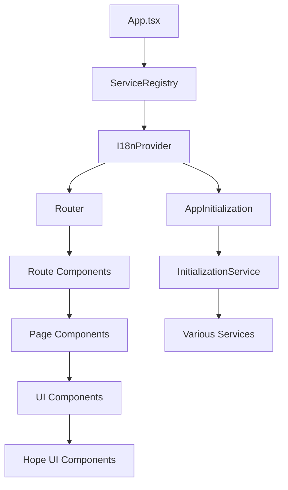

# Frontend Architecture

PianoRhythm's frontend is built with SolidJS, providing a reactive, high-performance user interface with server-side rendering capabilities. The architecture emphasizes modularity, type safety, and real-time responsiveness.

## Technology Stack

### Core Framework
- **SolidJS 1.9.7**: Reactive UI framework with fine-grained reactivity
- **TypeScript 5.7.3**: Type-safe development with strict mode
- **Vinxi 0.5.1**: Build system and SSR framework
- **Hope UI**: Custom fork of Hope UI component library

### State Management
- **Solid Services 4.3.2**: Dependency injection and service management
- **Solid Immer 0.1.1**: Immutable state updates with Immer
- **RxJS 7.8.1**: Reactive programming for complex async operations

### Routing & Navigation
- **SolidJS Router 0.15.3**: File-based routing with SSR support
- **SolidJS Start 1.0.11**: Full-stack SolidJS framework

## Project Structure

```
src/
├── app.tsx                 # Root application component
├── entry-client.tsx        # Client-side entry point
├── entry-server.tsx        # Server-side entry point
├── components/             # Reusable UI components
├── contexts/               # React-style contexts (legacy)
├── directives/             # SolidJS directives
├── hooks/                  # Custom hooks and utilities
├── i18n/                   # Internationalization
├── lib/                    # Core business logic
├── models/                 # Data models and types
├── packages/               # Internal packages
├── proto/                  # Protocol Buffer definitions
├── routes/                 # File-based routing
├── sass/                   # Styling and themes
├── server/                 # Server-side utilities
├── services/               # Application services
├── types/                  # TypeScript type definitions
├── util/                   # Utility functions
├── workers/                # Web Workers
└── worklet.d.ts           # Audio Worklet types
```

## Service Architecture

### Service Registry Pattern

The frontend uses a service-oriented architecture with dependency injection:

```typescript
// Service registration and injection
export default function App() {
  return (
    <ServiceRegistry>
      <I18nProvider>
        <AppInitialization />
        <Router>{/* routes */}</Router>
      </I18nProvider>
    </ServiceRegistry>
  );
}

// Service usage in components
const MyComponent = () => {
  const appService = useService(AppService);
  const audioService = useService(AudioService);
  
  return <div>{/* component content */}</div>;
};
```

### Core Services

#### 1. AppService (`src/services/app.service.ts`)

Central application state management:

```typescript
export default function AppService() {
  const [clientLoaded, _setClientLoaded] = createSignal(false);
  const [sceneMode, setSceneMode] = createSignal(PianoRhythmSceneMode.THREE_D);
  const [client, _setClient] = createSignal<UserClientDomain>(new UserClientDomain());
  const [roomID, setRoomID] = createSignal<string>();
  const [currentPage, setCurrentPage] = createSignal<CurrentPage>(CurrentPage.Home);
  
  // Event buses for cross-service communication
  const appStateEvents = createEventBus<AppStateEvents>();
  const appStateEffects = createEventBus<AppStateEffects>();
  
  return {
    // State accessors
    clientLoaded, client, roomID, currentPage,
    // State mutators
    setClient, setRoomID, setCurrentPage,
    // Event buses
    appStateEvents, appStateEffects,
    // Core service integration
    coreService: () => coreWasmService?.getWasmInstance(),
    // ... additional methods
  };
}
```

#### 2. AudioService (`src/services/audio.service.ts`)

Audio processing and synthesis management:

```typescript
export default function AudioService() {
  const [initialized, setInitialized] = createSignal(false);
  const [clientAdded, setClientAdded] = createSignal(false);
  const [loadedSoundfontName, setLoadedSoundfontName] = createSignal<string>();
  
  const initialize = async () => {
    // Initialize audio context and synthesizer
    await initializeAudioContext();
    await createSynthesizer();
    setInitialized(true);
  };
  
  return {
    initialized, clientAdded, loadedSoundfontName,
    initialize,
    playNote, stopNote,
    loadSoundfont,
    // ... additional audio methods
  };
}
```

#### 3. WebsocketService (`src/services/websocket.service.ts`)

Real-time communication management:

```typescript
export default function WebsocketService() {
  const [connected, setConnected] = createSignal(false);
  const [initialized, setInitialized] = createSignal(false);
  
  const websocketEvents = createEventBus<"connected" | "closed" | "error">();
  
  const connect = async (wsIdentity: string) => {
    const apiServer = await getApiServerHost();
    const webSocketURL = `${apiServer.replace("http", "ws")}/api/websocket`;
    
    await appService().coreService()?.websocket_connect(
      `${webSocketURL}/${wsIdentity}`,
      onConnect,
      onError,
      onClose
    );
  };
  
  return {
    connected, initialize, connect, disconnect,
    emitServerCommand, emitChatMessage,
    websocketEvents,
    // ... additional websocket methods
  };
}
```

## Component Architecture

### Component Hierarchy



### Component Patterns

#### 1. Service-Aware Components

```typescript
const RoomComponent = () => {
  const appService = useService(AppService);
  const roomsService = useService(RoomsService);
  const websocketService = useService(WebsocketService);
  
  const currentRoom = createMemo(() => appService().currentRoom());
  
  createEffect(() => {
    if (currentRoom()) {
      // React to room changes
    }
  });
  
  return (
    <VStack>
      <Show when={currentRoom()}>
        <RoomHeader room={currentRoom()!} />
        <RoomContent room={currentRoom()!} />
      </Show>
    </VStack>
  );
};
```

#### 2. Reactive State Management

```typescript
const UserList = () => {
  const usersService = useService(UsersService);
  
  // Reactive derived state
  const onlineUsers = createMemo(() => 
    usersService().users().filter(user => user.status === UserStatus.Online)
  );
  
  const userCount = createMemo(() => onlineUsers().length);
  
  return (
    <VStack>
      <Text>Online Users: {userCount()}</Text>
      <For each={onlineUsers()}>
        {(user) => <UserCard user={user} />}
      </For>
    </VStack>
  );
};
```

#### 3. Event-Driven Communication

```typescript
const ChatComponent = () => {
  const chatService = useService(ChatService);
  const appService = useService(AppService);
  
  // Listen to chat events
  createEffect(() => {
    const unsubscribe = chatService().addedMessagesEvents.subscribe((message) => {
      // Handle new message
      if (message.isSystemMessage) {
        appService().showNotification(message.content);
      }
    });
    
    onCleanup(unsubscribe);
  });
  
  return <ChatInterface />;
};
```

## State Management Patterns

### 1. Immutable Updates with Immer

```typescript
const [users, setUsers] = createImmerSignal<UserClientDomain[]>([]);

// Immutable state updates
setUsers(users => {
  const existingUser = users.find(u => u.socketID === newUser.socketID);
  if (existingUser) {
    Object.assign(existingUser, newUser);
  } else {
    users.push(newUser);
  }
});
```

### 2. Reactive Derived State

```typescript
const AppService = () => {
  const [users, setUsers] = createSignal<UserClientDomain[]>([]);
  const [currentRoomID, setCurrentRoomID] = createSignal<string>();
  
  // Derived state
  const currentRoomUsers = createMemo(() => 
    users().filter(user => user.currentRoomID === currentRoomID())
  );
  
  const isRoomEmpty = createMemo(() => currentRoomUsers().length === 0);
  
  return { users, currentRoomUsers, isRoomEmpty };
};
```

### 3. Cross-Service Communication

```typescript
// Event bus pattern for loose coupling
const appStateEvents = createEventBus<AppStateEvents>();

// Service A emits event
appStateEvents.emit(AppStateEvents.UserJoined, userData);

// Service B listens to event
appStateEvents.listen((event, data) => {
  if (event === AppStateEvents.UserJoined) {
    handleUserJoined(data);
  }
});
```

## Routing Architecture

### File-Based Routing

```
src/routes/
├── index.tsx               # Home page (/)
├── login.tsx              # Login page (/login)
├── app-loading.tsx        # App loading (/app-loading)
├── room/
│   └── [name].tsx         # Dynamic room routes (/room/[name])
├── sheet-music/
│   └── [[id]].tsx         # Optional dynamic routes (/sheet-music/[id?])
└── api/
    └── v1/
        └── *.ts           # API endpoints
```

### Route Components

```typescript
// Route with data loading
export const route = {
  async preload(props) {
    if (props.intent == "initial") {
      await onSessionRestore();
    } else {
      await getMemberSessionInfo();
    }
  }
} satisfies RouteDefinition;

export default function AppLoading(): JSX.Element {
  const navigate = useNavigate();
  const [searchParams] = useSearchParams();
  
  // Component implementation
  return <LoadingInterface />;
}
```

### Navigation Patterns

```typescript
// Programmatic navigation
const navigate = useNavigate();
navigate(`/room/${roomName}`, { replace: true });

// Route parameters
const params = useParams();
const roomName = params.name;

// Search parameters
const [searchParams] = useSearchParams();
const roomId = searchParams.roomId;
```

## Styling Architecture

### SASS Module System

```scss
// Component-specific styles
.room-container {
  display: flex;
  flex-direction: column;
  height: 100vh;
  
  .room-header {
    background: var(--hope-colors-primary-500);
    padding: 1rem;
  }
  
  .room-content {
    flex: 1;
    overflow: auto;
  }
}
```

### Theme System

```typescript
// Theme configuration
const ThemeConfig: HopeThemeConfig = {
  initialColorMode: "dark",
  useSystemColorMode: true,
  components: {
    Button: {
      baseStyle: {
        borderRadius: "md",
      },
      variants: {
        primary: {
          bg: "primary.500",
          color: "white",
        },
      },
    },
  },
};
```

## Performance Optimizations

### 1. Fine-Grained Reactivity

```typescript
// SolidJS automatically optimizes updates
const UserCard = (props: { user: UserClientDomain }) => {
  // Only re-renders when user.name changes
  return <Text>{props.user.name}</Text>;
};
```

### 2. Lazy Loading

```typescript
// Lazy load heavy components
const PianoRenderer = lazy(() => import('~/components/piano-renderer'));

const RoomComponent = () => {
  return (
    <Suspense fallback={<LoadingSpinner />}>
      <PianoRenderer />
    </Suspense>
  );
};
```

### 3. Web Workers

```typescript
// Offload heavy computations to workers
const audioWorker = new Worker('/workers/audio-processor.js');

audioWorker.postMessage({
  type: 'process-audio',
  data: audioBuffer
});

audioWorker.onmessage = (event) => {
  const processedAudio = event.data;
  // Handle processed audio
};
```

## Error Handling

### Error Boundaries

```typescript
const App = () => {
  return (
    <ErrorBoundary fallback={(err) => <FailedToLoadApp error={err} />}>
      <Router>
        <Routes />
      </Router>
    </ErrorBoundary>
  );
};
```

### Service Error Handling

```typescript
const AudioService = () => {
  const handleAudioError = (error: Error) => {
    console.error('[AudioService] Error:', error);
    toast.error('Audio initialization failed');
    
    // Attempt recovery
    setTimeout(() => {
      initialize().catch(console.error);
    }, 5000);
  };
  
  return { handleAudioError };
};
```

## Testing Strategy

### Component Testing

```typescript
import { render } from '@solidjs/testing-library';
import { ServiceRegistry } from 'solid-services';
import UserCard from './UserCard';

test('renders user information', () => {
  const mockUser = { name: 'Test User', status: UserStatus.Online };
  
  const { getByText } = render(() => (
    <ServiceRegistry>
      <UserCard user={mockUser} />
    </ServiceRegistry>
  ));
  
  expect(getByText('Test User')).toBeInTheDocument();
});
```

### Service Testing

```typescript
import { createRoot } from 'solid-js';
import AppService from './app.service';

test('app service manages client state', () => {
  createRoot(() => {
    const service = AppService();
    
    expect(service.clientLoaded()).toBe(false);
    
    service.setClientLoaded(true);
    expect(service.clientLoaded()).toBe(true);
  });
});
```

## Next Steps

- **[Audio System](./audio-system.md)** - Audio processing and synthesis
- **[UI Components](./ui-components.md)** - Component library and design system
- **[Testing Guide](./testing-guide.md)** - Comprehensive testing strategies
