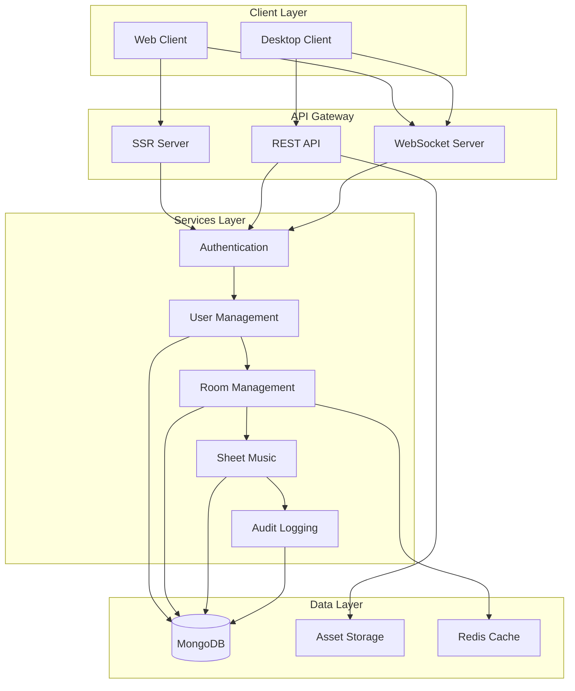

# Backend Services

PianoRhythm's backend architecture provides a robust foundation for real-time musical collaboration, featuring RESTful APIs, WebSocket communication, MongoDB integration, and OAuth authentication.

## Architecture Overview



## Core Services

### 1. Authentication Service

OAuth-based authentication with JWT token management:

```typescript
// Authentication middleware
export class UserSessionHelper {
  static validateTokens(sessionData: SessionData): void {
    if (!sessionData.accessToken) {
      throw new Error("No access token");
    }
    
    try {
      const decoded = jwt.decode(sessionData.accessToken);
      if (!decoded || typeof decoded === 'string') {
        throw new Error("Invalid token format");
      }
      
      const now = Math.floor(Date.now() / 1000);
      if (decoded.exp && decoded.exp < now) {
        throw new Error("Token expired");
      }
    } catch (error) {
      throw new Error(`Token validation failed: ${error.message}`);
    }
  }
  
  static getHeaders(sessionData: SessionData): Record<string, string> {
    return {
      "Authorization": `Bearer ${sessionData.accessToken}`,
      "X-Refresh-Token": sessionData.refreshToken || "",
    };
  }
}
```

**Authentication Flow:**
1. OAuth redirect to Discord/GitHub
2. Server exchanges code for tokens
3. JWT tokens stored in secure cookies
4. Token validation on each request
5. Automatic token refresh

### 2. User Management Service

```typescript
// User service with MongoDB integration
export class UsersService {
  async getUserByUsertag(usertag: string): Promise<UserDto | null> {
    const collection = Database.getInstance().getDb().collection('users');
    
    const user = await collection.findOne({
      usertag: { $regex: new RegExp(`^${usertag}$`, 'i') }
    });
    
    return user ? this.mapToUserDto(user) : null;
  }
  
  async updateUserProfile(usertag: string, updates: Partial<UserDto>): Promise<boolean> {
    const collection = Database.getInstance().getDb().collection('users');
    
    const result = await collection.updateOne(
      { usertag },
      { 
        $set: {
          ...updates,
          updatedAt: new Date()
        }
      }
    );
    
    return result.modifiedCount > 0;
  }
}
```

### 3. Room Management Service

Real-time room state management with WebSocket integration:

```typescript
// Room service with real-time updates
export class RoomsService {
  async createRoom(roomData: CreateRoomParam): Promise<RoomDto> {
    const collection = Database.getInstance().getDb().collection('rooms');
    
    const room: RoomDto = {
      id: generateRoomId(),
      name: roomData.name,
      type: roomData.type || RoomType.Public,
      settings: roomData.settings || {},
      createdAt: new Date(),
      updatedAt: new Date(),
      activeUsers: [],
      maxUsers: roomData.maxUsers || 16
    };
    
    await collection.insertOne(room);
    
    // Broadcast room creation
    this.broadcastRoomUpdate(room);
    
    return room;
  }
  
  async joinRoom(roomId: string, userId: string): Promise<JoinRoomResult> {
    const room = await this.getRoomById(roomId);
    
    if (!room) {
      return { success: false, error: JoinRoomFailType.RoomNotFound };
    }
    
    if (room.activeUsers.length >= room.maxUsers) {
      return { success: false, error: JoinRoomFailType.RoomFull };
    }
    
    // Add user to room
    await this.addUserToRoom(roomId, userId);
    
    // Broadcast user joined
    this.broadcastUserJoined(roomId, userId);
    
    return { success: true, room };
  }
}
```

### 4. Sheet Music Service

```typescript
// Sheet music management with search capabilities
export class SheetMusicDBService implements IBaseDBService<SheetMusicDbo> {
  async searchSheetMusic(query: SearchQuery): Promise<SearchResult<SheetMusicDto>> {
    const pipeline = [
      {
        $match: {
          $or: [
            { title: { $regex: query.text, $options: 'i' } },
            { creatorUsername: { $regex: query.text, $options: 'i' } },
            { tags: { $in: [new RegExp(query.text, 'i')] } }
          ]
        }
      },
      {
        $facet: {
          data: [
            { $skip: query.skip || 0 },
            { $limit: query.limit || 20 },
            { $sort: { createdAt: -1 } }
          ],
          totalCount: [
            { $count: "count" }
          ]
        }
      }
    ];
    
    const results = await this.aggregateData(pipeline);
    
    return {
      data: results[0].data.map(this.mapToDto),
      totalCount: results[0].totalCount[0]?.count || 0
    };
  }
}
```

## API Endpoints

### 1. RESTful API Structure

```typescript
// API route structure
src/routes/api/
├── v1/
│   ├── auth/
│   │   ├── login.ts
│   │   ├── logout.ts
│   │   └── refresh.ts
│   ├── users/
│   │   ├── profile.ts
│   │   ├── settings.ts
│   │   └── [id].ts
│   ├── rooms/
│   │   ├── active.ts
│   │   ├── create.ts
│   │   └── [id]/
│   │       ├── join.ts
│   │       └── leave.ts
│   └── sheet_music/
│       ├── search.ts
│       ├── upload.ts
│       └── [id]/
│           ├── favorite.ts
│           └── download.ts
```

### 2. API Helper Functions

```typescript
// Standardized API response handling
export const POST_API = async <TInput, TOutput>(
  event: APIEvent,
  options: {
    schema: z.ZodSchema<TInput>;
    process: (input: TInput) => Promise<TOutput>;
    requireAuth?: boolean;
  }
): Promise<Response> => {
  try {
    // Validate request body
    const body = await event.request.json();
    const input = options.schema.parse(body);
    
    // Check authentication if required
    if (options.requireAuth) {
      const session = await getSession();
      UserSessionHelper.validateTokens(session.data);
    }
    
    // Process request
    const result = await options.process(input);
    
    return new Response(JSON.stringify(result), {
      status: 200,
      headers: { "Content-Type": "application/json" }
    });
    
  } catch (error) {
    console.error("API Error:", error);
    
    return new Response(JSON.stringify({
      error: error.message || "Internal server error"
    }), {
      status: error.status || 500,
      headers: { "Content-Type": "application/json" }
    });
  }
};
```

### 3. Example API Endpoint

```typescript
// Sheet music search endpoint
const SearchInputSchema = z.object({
  query: z.string().min(1),
  category: z.string().optional(),
  difficulty: z.string().optional(),
  limit: z.number().min(1).max(100).default(20),
  skip: z.number().min(0).default(0)
});

export const POST = (event: APIEvent) =>
  POST_API<z.infer<typeof SearchInputSchema>, SearchResult>(event, {
    schema: SearchInputSchema,
    process: async (input) => {
      const dbService = SheetMusicDBService.getInstance();
      return await dbService.searchSheetMusic(input);
    }
  });
```

## Database Integration

### 1. MongoDB Connection

```typescript
// Database singleton with connection management
export class Database {
  private db?: Db;
  private static instance: Database;
  
  private constructor() {}
  
  init(url: string = process.env.PIANORHYTHM_MONGODB_URI, database: string = "pianorhythm") {
    const client = new MongoClient(url ?? `mongodb://localhost:27017`);
    this.db = client.db(database);
    
    if (process.env.DEBUG) {
      console.log(`✅ Database connected: ${database}`);
    }
  }
  
  public static getInstance(): Database {
    if (!Database.instance) {
      Database.instance = new Database();
    }
    return Database.instance;
  }
  
  getDb(): Db {
    if (!this.db) {
      throw new Error("Database not initialized");
    }
    return this.db;
  }
}
```

### 2. Data Models

```typescript
// User data model
export interface UserDbo {
  _id?: ObjectId;
  usertag: string;
  username: string;
  email: string;
  roles: string[];
  profile: {
    avatar?: string;
    bio?: string;
    location?: string;
  };
  settings: {
    theme: string;
    notifications: boolean;
    privacy: string;
  };
  createdAt: Date;
  updatedAt: Date;
}

// Room data model
export interface RoomDbo {
  _id?: ObjectId;
  name: string;
  type: RoomType;
  settings: RoomSettings;
  activeUsers: string[];
  maxUsers: number;
  createdBy: string;
  createdAt: Date;
  updatedAt: Date;
}
```

### 3. Database Services

```typescript
// Base database service interface
export interface IBaseDBService<T> {
  aggregateData<R = any>(pipeline: object[]): Promise<R[]>;
  getById(id: string): Promise<T | null>;
  create(data: Omit<T, '_id'>): Promise<T>;
  update(id: string, data: Partial<T>): Promise<boolean>;
  delete(id: string): Promise<boolean>;
}

// Implementation example
export class UserDBService implements IBaseDBService<UserDbo> {
  private collection = Database.getInstance().getDb().collection<UserDbo>('users');
  
  async getById(id: string): Promise<UserDbo | null> {
    return await this.collection.findOne({ _id: new ObjectId(id) });
  }
  
  async aggregateData<R = any>(pipeline: object[]): Promise<R[]> {
    return await this.collection.aggregate<R>(pipeline).toArray();
  }
}
```

## WebSocket Communication

### 1. WebSocket Server Setup

```typescript
// WebSocket server with crossws
import { createCrossWS } from 'crossws';

const websocket = createCrossWS({
  hooks: {
    open(peer) {
      console.log('WebSocket connected:', peer.id);
    },
    
    message(peer, message) {
      try {
        const data = JSON.parse(message.text());
        handleWebSocketMessage(peer, data);
      } catch (error) {
        console.error('Invalid WebSocket message:', error);
      }
    },
    
    close(peer) {
      console.log('WebSocket disconnected:', peer.id);
      handleUserDisconnect(peer.id);
    },
    
    error(peer, error) {
      console.error('WebSocket error:', error);
    }
  }
});
```

### 2. Message Handling

```typescript
// WebSocket message routing
const handleWebSocketMessage = async (peer: Peer, message: any) => {
  switch (message.type) {
    case 'join-room':
      await handleJoinRoom(peer, message.data);
      break;
      
    case 'chat-message':
      await handleChatMessage(peer, message.data);
      break;
      
    case 'midi-event':
      await handleMidiEvent(peer, message.data);
      break;
      
    case 'user-update':
      await handleUserUpdate(peer, message.data);
      break;
      
    default:
      console.warn('Unknown message type:', message.type);
  }
};
```

### 3. Real-time Broadcasting

```typescript
// Room-based message broadcasting
export class WebSocketManager {
  private rooms = new Map<string, Set<string>>();
  private peers = new Map<string, Peer>();
  
  joinRoom(peerId: string, roomId: string) {
    if (!this.rooms.has(roomId)) {
      this.rooms.set(roomId, new Set());
    }
    
    this.rooms.get(roomId)!.add(peerId);
    
    // Broadcast user joined to room
    this.broadcastToRoom(roomId, {
      type: 'user-joined',
      data: { peerId, roomId }
    }, peerId);
  }
  
  broadcastToRoom(roomId: string, message: any, excludePeer?: string) {
    const roomPeers = this.rooms.get(roomId);
    
    if (roomPeers) {
      for (const peerId of roomPeers) {
        if (peerId !== excludePeer) {
          const peer = this.peers.get(peerId);
          if (peer) {
            peer.send(JSON.stringify(message));
          }
        }
      }
    }
  }
}
```

## Security & Validation

### 1. Input Validation

```typescript
// Zod schemas for API validation
export const CreateRoomSchema = z.object({
  name: z.string().min(1).max(50),
  type: z.nativeEnum(RoomType),
  maxUsers: z.number().min(1).max(50).default(16),
  settings: z.object({
    isPrivate: z.boolean().default(false),
    requirePassword: z.boolean().default(false),
    password: z.string().optional()
  }).default({})
});

export const ChatMessageSchema = z.object({
  content: z.string().min(1).max(500),
  roomId: z.string().min(1),
  type: z.enum(['text', 'system', 'command']).default('text')
});
```

### 2. Rate Limiting

```typescript
// Rate limiting middleware
const rateLimitMap = new Map<string, { count: number; resetTime: number }>();

export const rateLimit = (maxRequests: number, windowMs: number) => {
  return (req: Request, res: Response, next: NextFunction) => {
    const clientId = req.ip || 'unknown';
    const now = Date.now();
    
    const clientData = rateLimitMap.get(clientId);
    
    if (!clientData || now > clientData.resetTime) {
      rateLimitMap.set(clientId, {
        count: 1,
        resetTime: now + windowMs
      });
      return next();
    }
    
    if (clientData.count >= maxRequests) {
      return res.status(429).json({
        error: 'Too many requests'
      });
    }
    
    clientData.count++;
    next();
  };
};
```

### 3. CORS Configuration

```typescript
// CORS middleware for API security
export const corsMiddleware = createMiddleware({
  onBeforeResponse: [
    (event) => {
      setResponseHeader("Access-Control-Allow-Origin", "*");
      setResponseHeader("Access-Control-Allow-Methods", "GET, POST, PUT, DELETE, OPTIONS");
      setResponseHeader("Access-Control-Allow-Headers", "Content-Type, Authorization");
      setResponseHeader("Cross-Origin-Embedder-Policy", "require-corp");
      setResponseHeader("Cross-Origin-Opener-Policy", "same-origin");
    }
  ]
});
```

## Error Handling & Logging

### 1. Centralized Error Handling

```typescript
// Global error handler
export class ErrorHandler {
  static handle(error: Error, context: string): void {
    console.error(`[${context}] Error:`, error);
    
    // Log to external service in production
    if (process.env.NODE_ENV === 'production') {
      this.logToService(error, context);
    }
  }
  
  static async logToService(error: Error, context: string): Promise<void> {
    try {
      await fetch(process.env.ERROR_LOGGING_URL!, {
        method: 'POST',
        headers: { 'Content-Type': 'application/json' },
        body: JSON.stringify({
          error: error.message,
          stack: error.stack,
          context,
          timestamp: new Date().toISOString()
        })
      });
    } catch (logError) {
      console.error('Failed to log error:', logError);
    }
  }
}
```

### 2. Audit Logging

```typescript
// Audit logging service
export class AuditLogger {
  static async log(action: string, userId: string, details: any): Promise<void> {
    const auditLog = {
      action,
      userId,
      details,
      timestamp: new Date(),
      ip: this.getCurrentIP(),
      userAgent: this.getCurrentUserAgent()
    };
    
    const collection = Database.getInstance().getDb().collection('audit_logs');
    await collection.insertOne(auditLog);
  }
}
```

## Performance Optimization

### 1. Database Indexing

```typescript
// Database indexes for performance
export const createIndexes = async () => {
  const db = Database.getInstance().getDb();
  
  // User indexes
  await db.collection('users').createIndex({ usertag: 1 }, { unique: true });
  await db.collection('users').createIndex({ email: 1 }, { unique: true });
  
  // Room indexes
  await db.collection('rooms').createIndex({ name: 1 });
  await db.collection('rooms').createIndex({ type: 1 });
  await db.collection('rooms').createIndex({ createdAt: -1 });
  
  // Sheet music indexes
  await db.collection('sheet_music').createIndex({ title: 'text', tags: 'text' });
  await db.collection('sheet_music').createIndex({ category: 1 });
  await db.collection('sheet_music').createIndex({ difficulty: 1 });
};
```

### 2. Caching Strategy

```typescript
// Redis caching for frequently accessed data
export class CacheService {
  private static redis = new Redis(process.env.REDIS_URL);
  
  static async get<T>(key: string): Promise<T | null> {
    const cached = await this.redis.get(key);
    return cached ? JSON.parse(cached) : null;
  }
  
  static async set(key: string, value: any, ttl: number = 3600): Promise<void> {
    await this.redis.setex(key, ttl, JSON.stringify(value));
  }
  
  static async invalidate(pattern: string): Promise<void> {
    const keys = await this.redis.keys(pattern);
    if (keys.length > 0) {
      await this.redis.del(...keys);
    }
  }
}
```

## Next Steps

- **[WebSocket Communication](websocket-communication.md)** - Real-time communication details
- **[Deployment Guide](deployment-guide.md)** - Production deployment strategies
- **[Testing Guide](testing-guide.md)** - Backend testing strategies
