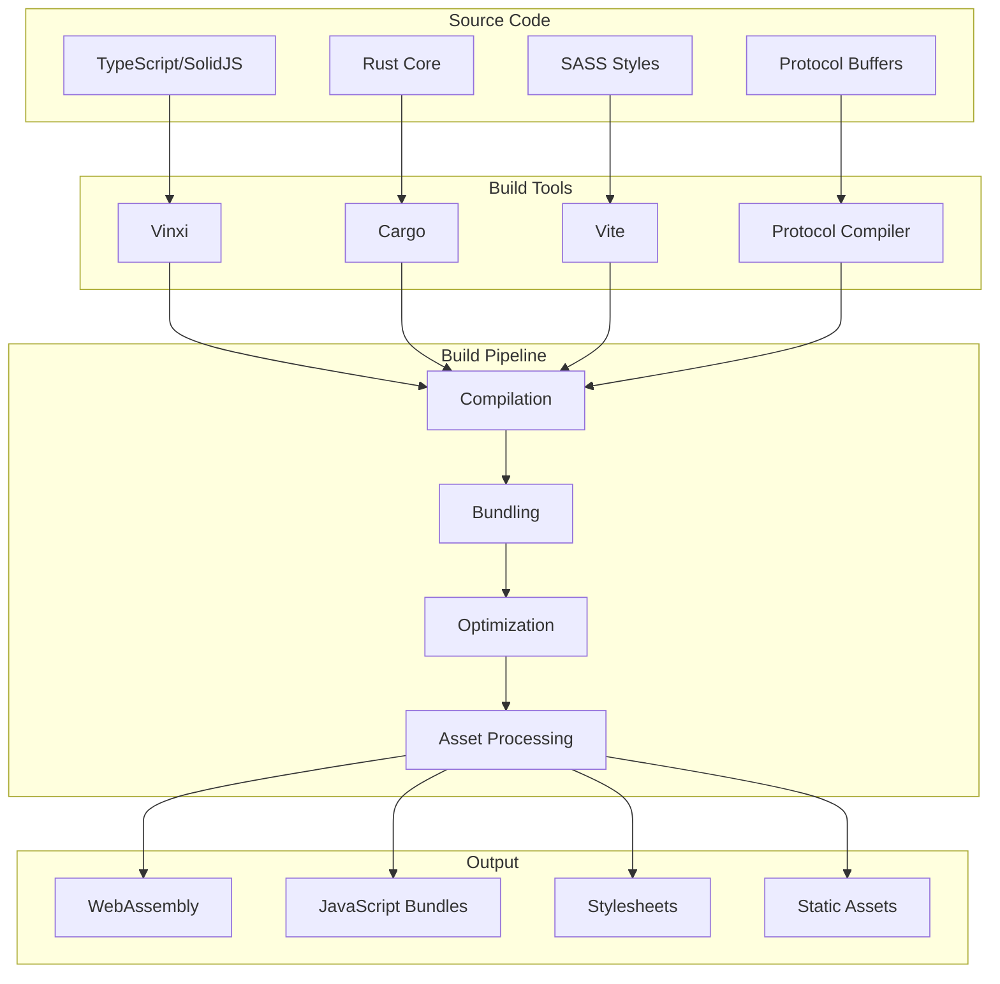

# Build System

PianoRhythm uses a sophisticated build system based on Vinxi and Vite, with custom configurations for different environments and specialized handling for Rust/WebAssembly components.

## Build Architecture



## Core Build Configuration

### 1. Vinxi Configuration (`app.config.ts`)

The main build orchestrator that coordinates all build processes:

```typescript
export default defineConfig({
  server: {
    preset: "./preset",
    minify: isProduction,
    sourceMap: !isProduction,
    routeRules: {
      "/": { prerender: isProduction },
      "/*": {
        cors: true,
        headers: {
          "Cross-Origin-Opener-Policy": "same-origin",
          "Cross-Origin-Embedder-Policy": "require-corp",
          "Cross-Origin-Resource-Policy": "cross-origin"
        }
      }
    }
  },
  vite: {
    plugins: [
      // Protocol buffer compilation
      !isProduction && !isCI && run([
        {
          name: 'build proto',
          run: [`node ${path.resolve(__dirname, "./build-protobuf-ts.cjs")}`],
          pattern: ['./pianorhythm_core/proto/raw/**.proto']
        }
      ]),
      
      // Copy WASM artifacts
      !isTestMode && viteStaticCopy({
        targets: [
          {
            src: './pianorhythm_core/pkg/**',
            dest: 'pianorhythm_core/pkg'
          }
        ]
      }),
      
      // Environment variable replacement
      replace({
        preventAssignment: true,
        __DATE__: Date.now(),
        __APP_VERSION__: APP_VERSION,
        __BUILD_ENV__: mode
      })
    ]
  }
});
```

### 2. Environment-Specific Builds

```typescript
// Build configurations for different environments
const buildConfigs = {
  'local-dev': {
    minify: false,
    sourceMap: true,
    prerender: false,
    optimizeDeps: true
  },
  'development': {
    minify: false,
    sourceMap: true,
    prerender: false,
    optimizeDeps: true
  },
  'staging': {
    minify: true,
    sourceMap: true,
    prerender: true,
    optimizeDeps: false
  },
  'production': {
    minify: true,
    sourceMap: false,
    prerender: true,
    optimizeDeps: false
  }
};
```

### 3. Custom Preset (`preset/nitro.config.ts`)

```typescript
export default defineNitroConfig({
  compatibilityDate: "2025-02-05",
  preset: process.env.NODE_ENV === "production" ? "github-pages" : "node-server",
  
  prerender: {
    routes: ["/", "/login"],
    crawlLinks: true
  },
  
  nitro: {
    output: {
      publicDir: "dist"
    }
  },
  
  runtimeConfig: {
    public: {
      clientVersion: process.env.PR_CLIENT_VERSION,
      assetsUrl: process.env.PR_ASSETS_URL
    }
  }
});
```

## Rust/WebAssembly Build

### 1. Core Engine Build Scripts

```bash
#!/bin/bash
# pianorhythm_core/build-core-release.sh

echo "Building PianoRhythm Core (Release)..."

# Set Rust flags for optimization
export RUSTFLAGS="-C target-feature=+simd128"

# Build the core library
cargo build --release --target wasm32-unknown-unknown

# Generate WebAssembly bindings
wasm-bindgen \
  --target web \
  --typescript \
  --out-dir pkg \
  --out-name pianorhythm_core \
  target/wasm32-unknown-unknown/release/pianorhythm_core.wasm

# Optimize WASM file size
wasm-opt -Oz -o pkg/pianorhythm_core_bg.wasm pkg/pianorhythm_core_bg.wasm

echo "✅ Core build complete"
```

### 2. Audio Synthesizer Build

```bash
#!/bin/bash
# pianorhythm_core/build-synth-wasm-release.cmd

echo "Building Audio Synthesizer..."

cd synth

# Build with audio optimizations
cargo build --release --target wasm32-unknown-unknown --features "wasm-audio"

# Generate bindings for audio worklet
wasm-bindgen \
  --target no-modules \
  --out-dir ../pkg/synth \
  target/wasm32-unknown-unknown/release/pianorhythm_synth.wasm

echo "✅ Synthesizer build complete"
```

### 3. 3D Renderer Build

```bash
#!/bin/bash
# pianorhythm_core/build-bevy-renderer-wasm-webgpu.sh

echo "Building Bevy 3D Renderer..."

cd bevy_renderer

# Build with WebGPU support
cargo build --release --target wasm32-unknown-unknown --features "webgpu"

# Generate renderer bindings
wasm-bindgen \
  --target web \
  --out-dir ../pkg/renderer \
  target/wasm32-unknown-unknown/release/bevy_renderer.wasm

echo "✅ Renderer build complete"
```

## Protocol Buffer Compilation

### 1. Protocol Buffer Build Script

```javascript
// build-protobuf-ts.cjs
const { execSync } = require('child_process');
const fs = require('fs');
const path = require('path');

const PROTO_DIR = './pianorhythm_core/proto/raw';
const OUTPUT_DIR = './src/proto';

function buildProtocolBuffers() {
  console.log('🔧 Building Protocol Buffers...');
  
  // Find all .proto files
  const protoFiles = fs.readdirSync(PROTO_DIR)
    .filter(file => file.endsWith('.proto'))
    .map(file => path.join(PROTO_DIR, file));
  
  if (protoFiles.length === 0) {
    console.log('No .proto files found');
    return;
  }
  
  // Generate TypeScript definitions
  for (const protoFile of protoFiles) {
    const outputFile = path.join(OUTPUT_DIR, 
      path.basename(protoFile, '.proto') + '.ts'
    );
    
    try {
      execSync(`protoc \
        --plugin=protoc-gen-ts=./node_modules/.bin/protoc-gen-ts \
        --ts_out=${OUTPUT_DIR} \
        --proto_path=${PROTO_DIR} \
        ${protoFile}`, 
        { stdio: 'inherit' }
      );
      
      console.log(`✅ Generated ${outputFile}`);
    } catch (error) {
      console.error(`❌ Failed to generate ${outputFile}:`, error.message);
    }
  }
  
  console.log('✅ Protocol Buffers build complete');
}

buildProtocolBuffers();
```

### 2. Protocol Buffer Integration

```typescript
// Protocol buffer usage in TypeScript
import { AppStateActions, AppStateActions_Action } from '~/proto/pianorhythm-actions';
import { AudioSynthActions, AudioSynthActions_Action } from '~/proto/pianorhythm-actions';

// Create protocol buffer messages
const action = AppStateActions.create({
  action: AppStateActions_Action.SynthAction,
  audioSynthAction: AudioSynthActions.create({
    action: AudioSynthActions_Action.NoteOn,
    note: 60,
    velocity: 127
  })
});

// Serialize to binary
const bytes = AppStateActions.encode(action).finish();

// Send over WebSocket
websocket.send(bytes);
```

## Asset Processing

### 1. Static Asset Copying

```typescript
// Vite plugin for copying static assets
viteStaticCopy({
  targets: [
    {
      src: './pianorhythm_core/pkg/**',
      dest: 'pianorhythm_core/pkg'
    },
    {
      src: './public/soundfonts/**',
      dest: 'soundfonts'
    },
    {
      src: './public/models/**',
      dest: 'models'
    }
  ]
})
```

### 2. Asset Optimization

```typescript
// Asset optimization configuration
export default defineConfig({
  build: {
    rollupOptions: {
      output: {
        assetFileNames: (assetInfo) => {
          const info = assetInfo.name.split('.');
          const ext = info[info.length - 1];
          
          // Special handling for WASM and audio files
          if (/\.(wasm|sf2|wav|mp3)$/.test(assetInfo.name)) {
            return `assets/[name]-[hash][extname]`;
          }
          
          return `assets/[name]-[hash][extname]`;
        }
      }
    },
    assetsInlineLimit: 0, // Don't inline large assets
    chunkSizeWarningLimit: 1000
  }
});
```

## Code Splitting and Bundling

### 1. Manual Chunk Configuration

```typescript
// Optimized code splitting
export default defineConfig({
  build: {
    rollupOptions: {
      output: {
        manualChunks: {
          // Core framework
          'solid': ['solid-js', '@solidjs/router', '@solidjs/meta'],
          
          // UI library
          'ui': ['@hope-ui/solid', 'solid-icons'],
          
          // Audio and core
          'audio': ['@core/pkg'],
          
          // Protocol buffers
          'proto': ['protobufjs'],
          
          // Utilities
          'utils': ['lodash-es', 'luxon', 'animejs'],
          
          // Vendor libraries
          'vendor': ['rxjs', 'sweetalert2', 'abcjs']
        }
      }
    }
  }
});
```

### 2. Dynamic Imports

```typescript
// Lazy loading for performance
const PianoRenderer = lazy(() => import('~/components/piano-renderer'));
const AudioVisualizer = lazy(() => import('~/components/audio-visualizer'));
const SheetMusicEditor = lazy(() => import('~/components/sheet-music-editor'));

// Conditional loading based on features
const load3DRenderer = async () => {
  if (appSettings.enable3D) {
    return import('~/components/3d-renderer');
  }
  return import('~/components/2d-renderer');
};
```

## Development vs Production Builds

### 1. Development Optimizations

```typescript
// Development-specific configuration
const developmentConfig = {
  build: {
    sourcemap: true,
    minify: false,
    rollupOptions: {
      treeshake: false // Faster builds
    }
  },
  server: {
    hmr: true,
    watch: {
      ignored: ['**/pianorhythm_core/target/**']
    }
  },
  optimizeDeps: {
    include: [
      '@hope-ui/solid',
      'solid-js',
      'protobufjs'
    ]
  }
};
```

### 2. Production Optimizations

```typescript
// Production-specific configuration
const productionConfig = {
  build: {
    sourcemap: false,
    minify: 'esbuild',
    rollupOptions: {
      treeshake: true,
      output: {
        compact: true
      }
    }
  },
  esbuild: {
    drop: ['console', 'debugger'],
    legalComments: 'none'
  }
};
```

## Build Performance

### 1. Caching Strategies

```typescript
// Build caching configuration
export default defineConfig({
  cacheDir: '.vite',
  build: {
    cache: {
      type: 'filesystem',
      buildDependencies: {
        config: [__filename]
      }
    }
  }
});
```

### 2. Parallel Processing

```bash
# Parallel build script
#!/bin/bash

echo "Starting parallel build process..."

# Build Rust components in parallel
(cd pianorhythm_core && ./build-core-release.sh) &
CORE_PID=$!

(cd pianorhythm_core && ./build-synth-wasm-release.cmd) &
SYNTH_PID=$!

(cd pianorhythm_core && ./build-bevy-renderer-wasm-webgpu.sh) &
RENDERER_PID=$!

# Wait for all Rust builds to complete
wait $CORE_PID
wait $SYNTH_PID
wait $RENDERER_PID

echo "✅ Rust builds complete"

# Build frontend
pnpm run build:production

echo "✅ Build process complete"
```

## Build Monitoring

### 1. Build Analytics

```typescript
// Build performance monitoring
const buildStartTime = Date.now();

export default defineConfig({
  plugins: [
    {
      name: 'build-monitor',
      buildStart() {
        console.log('🚀 Build started');
      },
      buildEnd() {
        const duration = Date.now() - buildStartTime;
        console.log(`✅ Build completed in ${duration}ms`);
        
        if (duration > 60000) {
          console.warn(`⚠️ Slow build detected: ${duration}ms`);
        }
      }
    }
  ]
});
```

### 2. Bundle Analysis

```bash
# Bundle analysis script
#!/bin/bash

echo "Analyzing bundle size..."

# Build with bundle analyzer
pnpm run build:production --analyze

# Generate bundle report
npx vite-bundle-analyzer dist

echo "📊 Bundle analysis complete"
```

## Troubleshooting

### 1. Common Build Issues

```bash
# Clear build cache
rm -rf .vite
rm -rf dist
rm -rf pianorhythm_core/target
rm -rf pianorhythm_core/pkg

# Rebuild from scratch
pnpm run build:production
```

### 2. WASM Build Issues

```bash
# Update Rust toolchain
rustup update nightly
rustup target add wasm32-unknown-unknown

# Update wasm-bindgen
cargo install wasm-bindgen-cli --force

# Rebuild WASM components
cd pianorhythm_core
./build-core-release.sh
```

### 3. Memory Issues

```bash
# Increase Node.js memory limit
export NODE_OPTIONS="--max-old-space-size=8192"

# Use faster build mode for development
export VITE_BUILD_MODE="fast"
```

## Next Steps

- **[Development Setup](development-setup.md)** - Setting up the build environment
- **[Deployment Guide](deployment-guide.md)** - Production build deployment
- **[Core Business Logic](core-business-logic.md)** - Understanding Rust components
