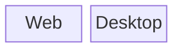

# Client Architecture

---

Welcome to the Client Architecture guide. In this document, we will explore the key aspects of the build and designing of the PianoRhythm client. Let's dive in!

---

## Overview

The frontend for PianoRhythm is made up of a variety of moving parts and pieces. The primary UI is done using HTML/CSS, while the interactivity is done with JavaScript (transpiled from Typescript). The primary JavaScript framework for the UI used is [SolidJS](https://solidjs.com) for solid reactivity. A lot of the business logic has been translated into Rust and invoked via [WebAssembly/WASM](https://webassembly.org/).

## Platforms

As of now, there are two primary platforms for the PianoRhythm app: **Web** and **Desktop**.
The desktop app is the preferred platform since it should offer the most stability and performance. Many of the core components are ran natively in the desktop environment.

The web app browser is not too bad but the synthesizer may be limited due to current WebAudio technology. The desktop app actually uses the machine's native audio driver for rendering audio.

### Desktop

The desktop app is hosted via [Tauri](https://tauri.app/). It uses the OS's native web renderer to display the frontend, while the backend process is written with Rust.

## Components

### Graphics Engine

The primary graphics engine used to use [Babylon.js](https://babylonjs.com). A pretty powerful 3D web rendering engine. It has support for using WebGL2 and even WebGPU. But now with version `0.10.0`, the graphics engined used is [Bevy](https://bevyengine.org/).

### Audio Synth Engine

The audio synthesizer is written in Rust. It's a modified version of a synthesizer called [OxiSynth](https://github.com/PolyMeilex/OxiSynth) (which was inspired by `FluidSynth`).