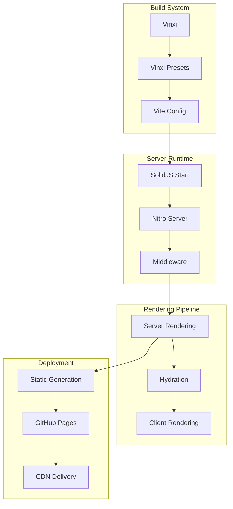
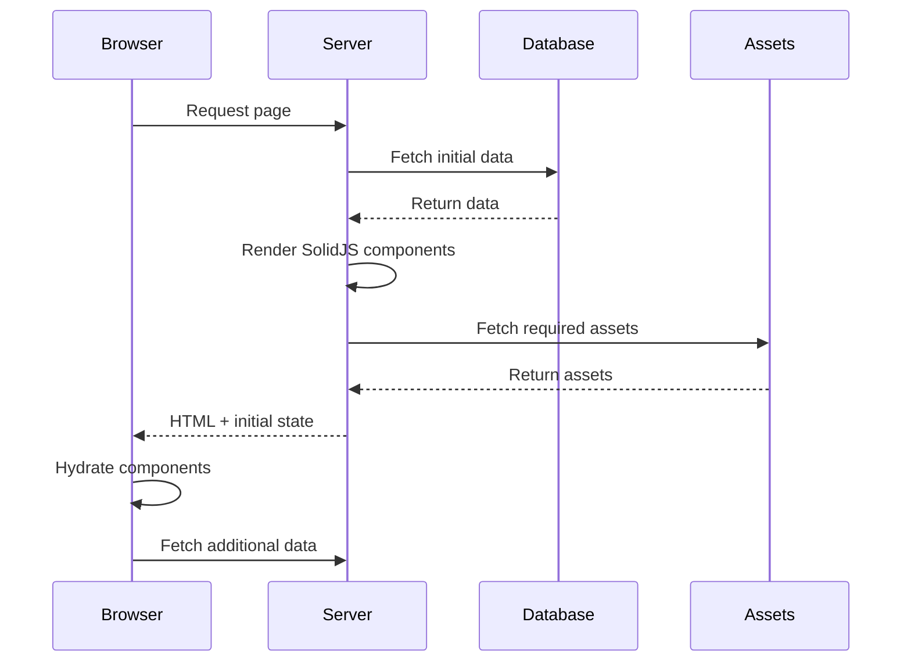

# Server-Side Rendering (SSR) Implementation

PianoRhythm uses a sophisticated SSR setup built on SolidJS Start and Vinxi, providing fast initial page loads, SEO optimization, and seamless client-side hydration for a real-time musical collaboration platform.

## Architecture Overview



## Core Components

### 1. Vinxi Configuration (`app.config.ts`)

The main build configuration that orchestrates the entire SSR setup:

```typescript
export default defineConfig({
  server: {
    preset: "./preset",
    minify: false,
    sourceMap: true,
    routeRules: {
      "/": {
        prerender: isProduction
      },
      "/*": {
        cors: true,
        headers: {
          "Cross-Origin-Opener-Policy": "same-origin",
          "Cross-Origin-Embedder-Policy": "require-corp",
          "Cross-Origin-Resource-Policy": "cross-origin",
          "x-pianorhythm-client-version": APP_VERSION ?? "0.0.0"
        }
      }
    },
    prerender: {
      crawlLinks: isProduction
    }
  },
  middleware: "./src/server/middleware",
  vite: {
    // Vite configuration for SSR
    ssr: {
      noExternal: [
        "@hope-ui/solid",
        "solid-dismiss"
      ]
    },
    // ... additional config
  }
});
```

**Key Features:**
- **Environment-specific builds**: Different configurations for development, staging, and production
- **Prerendering**: Static generation for production builds
- **CORS headers**: Required for WebAssembly and audio worklets
- **Custom presets**: Tailored build configurations

### 2. Custom Preset (`preset/nitro.config.ts`)

Nitro server configuration for different deployment targets:

```typescript
import { defineNitroConfig } from "nitropack/config";

export default defineNitroConfig({
  compatibilityDate: "2025-02-05",
  
  // GitHub Pages deployment
  preset: process.env.NODE_ENV === "production" ? "github-pages" : "node-server",
  
  // Static site generation
  prerender: {
    routes: ["/", "/login"],
    crawlLinks: true
  },
  
  // Server middleware
  serverHandlers: [
    {
      route: "/api/**",
      handler: "~/server/api/index.ts"
    }
  ],
  
  // Build optimizations
  minify: process.env.NODE_ENV === "production",
  sourceMap: process.env.NODE_ENV !== "production",
  
  // Runtime configuration
  runtimeConfig: {
    public: {
      clientVersion: process.env.PR_CLIENT_VERSION,
      assetsUrl: process.env.PR_ASSETS_URL
    }
  }
});
```

### 3. Server Entry Point (`src/entry-server.tsx`)

The server-side rendering entry point:

```typescript
import { createHandler, StartServer } from "@solidjs/start/server";
import dns from 'node:dns';
import { COMMON } from "./util/const.common";
import { Database } from "./lib/db/db-store";

// Optimize DNS resolution for server environments
dns.setDefaultResultOrder('ipv4first');

console.log("🚀 Starting server with env:", process.env.BUILD_ENV ?? process.env.NODE_ENV);
console.log("✔ API Server:", process.env.PIANORHYTHM_SERVER_URL);
console.log("✔ Assets Server:", process.env.PR_ASSETS_URL);
console.log("✔ Client Version:", process.env.PR_CLIENT_VERSION);

// Initialize database connection
Database.getInstance().init();

export default createHandler(() => (
  <StartServer
    document={({ assets, children, scripts }) => (
      <html lang="en">
        <head>
          <meta charset="utf-8" />
          <meta name="viewport" content="width=device-width, initial-scale=1" />
          <link rel="icon" href="/favicon.ico" />
          {assets}
        </head>
        <body>
          <div id="app">{children}</div>
          {scripts}
        </body>
      </html>
    )}
  />
));
```

### 4. Client Entry Point (`src/entry-client.tsx`)

The client-side hydration entry point:

```typescript
import { mount, StartClient } from "@solidjs/start/client";

// Mount the application for client-side hydration
mount(() => <StartClient />, document.getElementById("app")!);
```

## Rendering Pipeline

### 1. Server-Side Rendering Process



### 2. Route-Level Data Loading

```typescript
// Route with server-side data loading
export const route = {
  async preload(props) {
    // Server-side data loading
    if (props.intent == "initial") {
      await onSessionRestore();
    } else {
      await getMemberSessionInfo();
    }
  }
} satisfies RouteDefinition;

export default function AppLoading(): JSX.Element {
  // Component receives preloaded data
  const navigate = useNavigate();
  const [searchParams] = useSearchParams();
  
  return <LoadingInterface />;
}
```

### 3. Progressive Enhancement

```typescript
// Components that work with and without JavaScript
const InteractiveButton = () => {
  const [clicked, setClicked] = createSignal(false);
  
  return (
    <button
      onClick={() => setClicked(true)}
      class={clicked() ? "clicked" : ""}
    >
      {clicked() ? "Clicked!" : "Click me"}
    </button>
  );
};
```

## Static Site Generation

### 1. Prerendering Configuration

```typescript
// Route rules for static generation
const routeRules = {
  "/": { prerender: true },
  "/login": { prerender: true },
  "/room/*": { prerender: false }, // Dynamic routes
  "/api/*": { prerender: false }   // API routes
};
```

### 2. Build-Time Data Fetching

```typescript
// Static data fetching during build
export const getStaticData = async () => {
  const rooms = await fetchPublicRooms();
  const stats = await fetchSiteStatistics();
  
  return {
    rooms,
    stats,
    generatedAt: new Date().toISOString()
  };
};
```

### 3. Asset Optimization

```typescript
// Vite configuration for asset optimization
const viteConfig = {
  build: {
    rollupOptions: {
      output: {
        manualChunks: {
          vendor: ['solid-js', '@solidjs/router'],
          audio: ['@core/pkg'],
          ui: ['@hope-ui/solid']
        }
      }
    }
  }
};
```

## Server Middleware

### 1. Custom Middleware (`src/server/middleware.ts`)

```typescript
import { createMiddleware } from "@solidjs/start/middleware";
import { setResponseHeader } from "vinxi/http";

export default createMiddleware({
  onRequest: [
    _event => {
      // Request processing
    }
  ],
  onBeforeResponse: [
    _event => {
      // Set security headers required for WebAssembly
      setResponseHeader("Cross-Origin-Embedder-Policy", "require-corp");
      setResponseHeader("Cross-Origin-Opener-Policy", "same-origin");
      setResponseHeader("Cross-Origin-Resource-Policy", "cross-origin");
    }
  ]
});
```

### 2. API Route Handling

```typescript
// API route example
export const POST = (event: APIEvent) =>
  POST_API<InputDto, OutputDto>(event, {
    schema: InputSchema,
    process: async (input) => {
      const dbService = SheetMusicDBService.getInstance();
      const result = await dbService.aggregateData([
        { $match: { uuid: input.sheetMusicID } }
      ]);
      return result;
    }
  });
```

### 3. Session Management

```typescript
// Server-side session handling
export async function getSession() {
  "use server";
  
  return getRequestEvent()!.locals.session || {
    data: {
      accessToken: undefined,
      refreshToken: undefined
    }
  };
}

export async function getMemberSessionInfo() {
  "use server";
  
  const session = await getSession();
  
  try {
    UserSessionHelper.validateTokens(session.data);
    return session.data;
  } catch {
    // Handle invalid session
    return null;
  }
}
```

## Environment Configuration

### 1. Environment Variables

```typescript
// Server environment configuration
const envVariables = z.object({
  DEBUG: z.string().default("false"),
  NODE_ENV: z.string().default("dev"),
  PR_CLIENT_VERSION: z.string().default("0.0.0"),
  PR_ASSETS_URL: z.string().default("https://assets.pianorhythm.io"),
  PIANORHYTHM_MONGODB_URI: z.string().default("mongodb://localhost:27017"),
  PIANORHYTHM_SERVER_URL: z.string().default("http://localhost:7000"),
  // ... additional environment variables
});
```

### 2. Runtime Configuration

```typescript
// Runtime configuration based on environment
const getRuntimeConfig = () => {
  const env = process.env.NODE_ENV;
  
  return {
    development: {
      apiUrl: "http://localhost:7000",
      assetsUrl: "http://localhost:3000",
      debug: true
    },
    staging: {
      apiUrl: "https://staging-api.pianorhythm.io",
      assetsUrl: "https://staging-assets.pianorhythm.io",
      debug: true
    },
    production: {
      apiUrl: "https://api.pianorhythm.io",
      assetsUrl: "https://assets.pianorhythm.io",
      debug: false
    }
  }[env] || {};
};
```

## Performance Optimizations

### 1. Code Splitting

```typescript
// Automatic code splitting with lazy loading
const PianoRenderer = lazy(() => import('~/components/piano-renderer'));
const AudioVisualizer = lazy(() => import('~/components/audio-visualizer'));

const RoomComponent = () => {
  return (
    <Suspense fallback={<LoadingSpinner />}>
      <PianoRenderer />
      <AudioVisualizer />
    </Suspense>
  );
};
```

### 2. Resource Preloading

```typescript
// Preload critical resources
const preloadCriticalResources = () => {
  // Preload WASM modules
  const wasmLink = document.createElement('link');
  wasmLink.rel = 'preload';
  wasmLink.href = '/pianorhythm_core/pkg/pianorhythm_core.wasm';
  wasmLink.as = 'fetch';
  wasmLink.crossOrigin = 'anonymous';
  document.head.appendChild(wasmLink);
  
  // Preload default soundfont
  const soundfontLink = document.createElement('link');
  soundfontLink.rel = 'preload';
  soundfontLink.href = '/soundfonts/default.sf2';
  soundfontLink.as = 'fetch';
  document.head.appendChild(soundfontLink);
};
```

### 3. Caching Strategy

```typescript
// Service worker for aggressive caching
const CACHE_NAME = 'pianorhythm-v1';
const STATIC_ASSETS = [
  '/',
  '/login',
  '/pianorhythm_core/pkg/pianorhythm_core.wasm',
  '/soundfonts/default.sf2'
];

self.addEventListener('install', (event) => {
  event.waitUntil(
    caches.open(CACHE_NAME)
      .then(cache => cache.addAll(STATIC_ASSETS))
  );
});
```

## Deployment Strategies

### 1. GitHub Pages Deployment

```yaml
# GitHub Actions workflow
name: Deploy to GitHub Pages
on:
  push:
    branches: [main]

jobs:
  deploy:
    runs-on: ubuntu-latest
    steps:
      - uses: actions/checkout@v3
      - name: Setup Node.js
        uses: actions/setup-node@v3
        with:
          node-version: '19'
      - name: Install dependencies
        run: pnpm install
      - name: Build for production
        run: pnpm run build:production
      - name: Deploy to GitHub Pages
        uses: peaceiris/actions-gh-pages@v3
        with:
          github_token: ${{ secrets.GITHUB_TOKEN }}
          publish_dir: ./dist
```

### 2. Container Deployment

```dockerfile
# Multi-stage Docker build
FROM node:19-alpine AS builder
WORKDIR /app
COPY package*.json ./
RUN npm ci --only=production

FROM node:19-alpine AS runtime
WORKDIR /app
COPY --from=builder /app/node_modules ./node_modules
COPY . .
RUN npm run build:production

EXPOSE 3000
CMD ["npm", "start"]
```

### 3. Edge Deployment

```typescript
// Edge runtime configuration
export const config = {
  runtime: 'edge',
  regions: ['iad1', 'sfo1', 'fra1'] // Multiple regions for low latency
};

export default async function handler(request: Request) {
  // Edge-optimized request handling
  return new Response(await renderPage(request), {
    headers: {
      'Content-Type': 'text/html',
      'Cache-Control': 'public, max-age=3600'
    }
  });
}
```

## Debugging & Monitoring

### 1. Server-Side Debugging

```typescript
// Development server with debugging
if (process.env.NODE_ENV === 'development') {
  console.log('🔧 Development mode enabled');
  console.log('📊 Memory usage:', process.memoryUsage());
  console.log('🌐 Environment variables:', {
    NODE_ENV: process.env.NODE_ENV,
    PORT: process.env.PORT,
    API_URL: process.env.PIANORHYTHM_SERVER_URL
  });
}
```

### 2. Performance Monitoring

```typescript
// Server-side performance monitoring
const monitorSSRPerformance = (req: Request) => {
  const startTime = Date.now();
  
  return {
    end: () => {
      const duration = Date.now() - startTime;
      console.log(`SSR rendered in ${duration}ms for ${req.url}`);
      
      if (duration > 1000) {
        console.warn(`Slow SSR render: ${duration}ms for ${req.url}`);
      }
    }
  };
};
```

### 3. Error Tracking

```typescript
// Server-side error handling
process.on('unhandledRejection', (reason, promise) => {
  console.error('Unhandled Rejection at:', promise, 'reason:', reason);
  // Send to error tracking service
});

process.on('uncaughtException', (error) => {
  console.error('Uncaught Exception:', error);
  // Graceful shutdown
  process.exit(1);
});
```

## Next Steps

- **[Backend Services](./backend-services)** - API endpoints and database integration
- **[Deployment Guide](./deployment-guide)** - Production deployment strategies
- **[Build System](./build-system)** - Detailed build configuration
