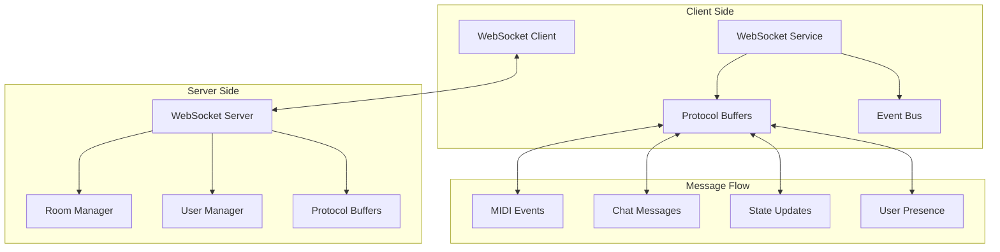

# WebSocket Communication

PianoRhythm's real-time communication system is built on WebSockets, enabling low-latency musical collaboration, chat messaging, and synchronized room state management across multiple users.

## Architecture Overview



## Client-Side WebSocket Implementation

### 1. WebSocket Service (`src/services/websocket.service.ts`)

The main service that manages WebSocket connections and message handling:

```typescript
export default function WebsocketService() {
  const [connected, setConnected] = createSignal(false);
  const [initialized, setInitialized] = createSignal(false);
  const [connectionAttempts, setConnectionAttempts] = createSignal(0);
  
  const websocketEvents = createEventBus<"connected" | "closed" | "error">();
  
  const connect = async (wsIdentity: string) => {
    try {
      const apiServer = await getApiServerHost();
      const webSocketURL = `${apiServer.replace("http", "ws")}/api/websocket`;
      
      console.log(`[WebsocketService] Connecting to: ${webSocketURL}/${wsIdentity}`);
      
      await appService().coreService()?.websocket_connect(
        `${webSocketURL}/${wsIdentity}`,
        onConnect,
        onError,
        onClose
      );
      
    } catch (error) {
      console.error("[WebsocketService] Connection failed:", error);
      throw error;
    }
  };
  
  const onConnect = () => {
    console.log("[WebsocketService] Connected successfully");
    setConnected(true);
    setConnectionAttempts(0);
    websocketEvents.emit("connected");
  };
  
  const onError = (error: string) => {
    console.error("[WebsocketService] Error:", error);
    websocketEvents.emit("error", error);
    
    // Implement exponential backoff for reconnection
    const attempts = connectionAttempts();
    if (attempts < MAX_RECONNECTION_ATTEMPTS) {
      const delay = Math.min(1000 * Math.pow(2, attempts), 30000);
      setTimeout(() => {
        setConnectionAttempts(attempts + 1);
        // Retry connection logic
      }, delay);
    }
  };
  
  const onClose = () => {
    console.log("[WebsocketService] Connection closed");
    setConnected(false);
    websocketEvents.emit("closed");
  };
  
  return {
    connected, initialized, connect, disconnect,
    emitServerCommand, emitChatMessage,
    websocketEvents
  };
}
```

### 2. Message Serialization

Protocol Buffers are used for efficient binary message serialization:

```typescript
// Sending server commands
const emitServerCommand = (command: ServerCommand) => {
  const serverCommandAction = ServerCommandActions.create({
    action: ServerCommandActions_Action.ServerCommand,
    serverCommand: command
  });
  
  const appAction = AppStateActions.create({
    action: AppStateActions_Action.ServerCommandAction,
    serverCommandAction: serverCommandAction
  });
  
  const bytes = AppStateActions.encode(appAction).finish();
  appService().coreService()?.websocket_send_binary(bytes);
};

// Sending chat messages
const emitChatMessage = (content: string, roomId: string) => {
  const chatAction = ChatActions.create({
    action: ChatActions_Action.SendMessage,
    content: content,
    roomId: roomId,
    timestamp: Date.now()
  });
  
  const appAction = AppStateActions.create({
    action: AppStateActions_Action.ChatAction,
    chatAction: chatAction
  });
  
  const bytes = AppStateActions.encode(appAction).finish();
  appService().coreService()?.websocket_send_binary(bytes);
};
```

### 3. Message Handling

Incoming messages are processed through the core engine and dispatched to appropriate services:

```typescript
// Core engine message handler (Rust)
#[wasm_bindgen]
pub fn handle_websocket_message(data: &[u8]) {
    if let Ok(action) = AppStateActions::decode(data) {
        match action.action() {
            AppStateActions_Action::ChatAction => {
                handle_chat_action(action.get_chatAction());
            }
            AppStateActions_Action::UserAction => {
                handle_user_action(action.get_userAction());
            }
            AppStateActions_Action::RoomAction => {
                handle_room_action(action.get_roomAction());
            }
            AppStateActions_Action::SynthAction => {
                handle_synth_action(action.get_audioSynthAction());
            }
            _ => {
                log::warn!("Unknown action type: {:?}", action.action());
            }
        }
    }
}
```

## Server-Side WebSocket Implementation

### 1. WebSocket Server Setup

```typescript
// Server WebSocket handler
import { createCrossWS } from 'crossws';

const websocket = createCrossWS({
  hooks: {
    open(peer) {
      console.log(`[WebSocket] Client connected: ${peer.id}`);
      
      // Initialize user session
      const userSession = {
        peerId: peer.id,
        userId: null,
        roomId: null,
        lastActivity: Date.now()
      };
      
      userSessions.set(peer.id, userSession);
    },
    
    message(peer, message) {
      try {
        const data = new Uint8Array(message.rawData());
        handleWebSocketMessage(peer, data);
      } catch (error) {
        console.error(`[WebSocket] Message handling error:`, error);
        peer.send(JSON.stringify({
          type: 'error',
          message: 'Invalid message format'
        }));
      }
    },
    
    close(peer, details) {
      console.log(`[WebSocket] Client disconnected: ${peer.id}`);
      handleUserDisconnect(peer.id);
    },
    
    error(peer, error) {
      console.error(`[WebSocket] Error for peer ${peer.id}:`, error);
    }
  }
});
```

### 2. Message Routing

```typescript
// Server-side message routing
const handleWebSocketMessage = async (peer: Peer, data: Uint8Array) => {
  try {
    const action = AppStateActions.decode(data);
    
    switch (action.action) {
      case AppStateActions_Action.ServerCommandAction:
        await handleServerCommand(peer, action.serverCommandAction);
        break;
        
      case AppStateActions_Action.ChatAction:
        await handleChatAction(peer, action.chatAction);
        break;
        
      case AppStateActions_Action.SynthAction:
        await handleSynthAction(peer, action.audioSynthAction);
        break;
        
      case AppStateActions_Action.UserAction:
        await handleUserAction(peer, action.userAction);
        break;
        
      default:
        console.warn(`Unknown action type: ${action.action}`);
    }
  } catch (error) {
    console.error('Message processing error:', error);
    sendErrorMessage(peer, 'Failed to process message');
  }
};
```

### 3. Room Management

```typescript
// Room-based message broadcasting
class RoomManager {
  private rooms = new Map<string, Set<string>>();
  private userRooms = new Map<string, string>();
  
  joinRoom(peerId: string, roomId: string): boolean {
    // Leave current room if any
    this.leaveCurrentRoom(peerId);
    
    // Join new room
    if (!this.rooms.has(roomId)) {
      this.rooms.set(roomId, new Set());
    }
    
    this.rooms.get(roomId)!.add(peerId);
    this.userRooms.set(peerId, roomId);
    
    // Broadcast user joined to room
    this.broadcastToRoom(roomId, {
      type: 'user-joined',
      userId: peerId,
      timestamp: Date.now()
    }, peerId);
    
    return true;
  }
  
  leaveRoom(peerId: string, roomId: string): void {
    const room = this.rooms.get(roomId);
    if (room) {
      room.delete(peerId);
      
      // Clean up empty rooms
      if (room.size === 0) {
        this.rooms.delete(roomId);
      } else {
        // Broadcast user left
        this.broadcastToRoom(roomId, {
          type: 'user-left',
          userId: peerId,
          timestamp: Date.now()
        });
      }
    }
    
    this.userRooms.delete(peerId);
  }
  
  broadcastToRoom(roomId: string, message: any, excludePeer?: string): void {
    const room = this.rooms.get(roomId);
    if (!room) return;
    
    const messageBytes = this.serializeMessage(message);
    
    for (const peerId of room) {
      if (peerId !== excludePeer) {
        const peer = peers.get(peerId);
        if (peer && peer.readyState === 1) {
          peer.send(messageBytes);
        }
      }
    }
  }
}
```

## Real-Time Features

### 1. MIDI Event Synchronization

```typescript
// Real-time MIDI event handling
const handleSynthAction = async (peer: Peer, synthAction: AudioSynthActions) => {
  const session = userSessions.get(peer.id);
  if (!session || !session.roomId) return;
  
  switch (synthAction.action) {
    case AudioSynthActions_Action.NoteOn:
      // Broadcast note event to room
      roomManager.broadcastToRoom(session.roomId, {
        type: 'midi-event',
        event: 'note-on',
        note: synthAction.note,
        velocity: synthAction.velocity,
        userId: session.userId,
        timestamp: Date.now()
      }, peer.id);
      break;
      
    case AudioSynthActions_Action.NoteOff:
      roomManager.broadcastToRoom(session.roomId, {
        type: 'midi-event',
        event: 'note-off',
        note: synthAction.note,
        userId: session.userId,
        timestamp: Date.now()
      }, peer.id);
      break;
  }
};
```

### 2. Chat System

```typescript
// Real-time chat messaging
const handleChatAction = async (peer: Peer, chatAction: ChatActions) => {
  const session = userSessions.get(peer.id);
  if (!session || !session.roomId) return;
  
  switch (chatAction.action) {
    case ChatActions_Action.SendMessage:
      // Validate message
      if (!chatAction.content || chatAction.content.length > 500) {
        sendErrorMessage(peer, 'Invalid message content');
        return;
      }
      
      // Store message in database
      const messageId = await chatService.saveMessage({
        content: chatAction.content,
        roomId: session.roomId,
        userId: session.userId,
        timestamp: Date.now()
      });
      
      // Broadcast to room
      roomManager.broadcastToRoom(session.roomId, {
        type: 'chat-message',
        id: messageId,
        content: chatAction.content,
        userId: session.userId,
        timestamp: Date.now()
      });
      break;
      
    case ChatActions_Action.TypingStart:
      roomManager.broadcastToRoom(session.roomId, {
        type: 'user-typing',
        userId: session.userId,
        isTyping: true
      }, peer.id);
      break;
      
    case ChatActions_Action.TypingStop:
      roomManager.broadcastToRoom(session.roomId, {
        type: 'user-typing',
        userId: session.userId,
        isTyping: false
      }, peer.id);
      break;
  }
};
```

### 3. User Presence

```typescript
// User presence management
const handleUserAction = async (peer: Peer, userAction: UserActions) => {
  const session = userSessions.get(peer.id);
  if (!session) return;
  
  switch (userAction.action) {
    case UserActions_Action.UpdateStatus:
      // Update user status
      await userService.updateUserStatus(session.userId, userAction.status);
      
      // Broadcast status change to room
      if (session.roomId) {
        roomManager.broadcastToRoom(session.roomId, {
          type: 'user-status-changed',
          userId: session.userId,
          status: userAction.status,
          timestamp: Date.now()
        });
      }
      break;
      
    case UserActions_Action.UpdatePosition:
      // Update user position in 3D space
      if (session.roomId) {
        roomManager.broadcastToRoom(session.roomId, {
          type: 'user-position-changed',
          userId: session.userId,
          position: {
            x: userAction.positionX,
            y: userAction.positionY,
            z: userAction.positionZ
          },
          timestamp: Date.now()
        }, peer.id);
      }
      break;
  }
};
```

## Connection Management

### 1. Connection Health Monitoring

```typescript
// Heartbeat system for connection health
class ConnectionHealthMonitor {
  private heartbeatInterval = 30000; // 30 seconds
  private timeoutThreshold = 60000;  // 60 seconds
  
  startMonitoring(): void {
    setInterval(() => {
      this.checkConnections();
    }, this.heartbeatInterval);
  }
  
  checkConnections(): void {
    const now = Date.now();
    
    for (const [peerId, session] of userSessions) {
      const timeSinceLastActivity = now - session.lastActivity;
      
      if (timeSinceLastActivity > this.timeoutThreshold) {
        console.log(`[WebSocket] Timeout detected for peer: ${peerId}`);
        this.handleTimeout(peerId);
      } else if (timeSinceLastActivity > this.heartbeatInterval) {
        // Send ping
        const peer = peers.get(peerId);
        if (peer) {
          peer.ping();
        }
      }
    }
  }
  
  handleTimeout(peerId: string): void {
    const peer = peers.get(peerId);
    if (peer) {
      peer.close();
    }
    this.cleanupSession(peerId);
  }
}
```

### 2. Reconnection Logic

```typescript
// Client-side reconnection handling
const handleReconnection = async () => {
  let attempts = 0;
  const maxAttempts = 5;
  
  while (attempts < maxAttempts && !connected()) {
    try {
      const delay = Math.min(1000 * Math.pow(2, attempts), 30000);
      console.log(`[WebSocket] Reconnection attempt ${attempts + 1} in ${delay}ms`);
      
      await new Promise(resolve => setTimeout(resolve, delay));
      await connect(lastUsedIdentity);
      
      console.log('[WebSocket] Reconnection successful');
      break;
      
    } catch (error) {
      attempts++;
      console.error(`[WebSocket] Reconnection attempt ${attempts} failed:`, error);
      
      if (attempts >= maxAttempts) {
        console.error('[WebSocket] Max reconnection attempts reached');
        // Show user notification about connection failure
        showConnectionFailureNotification();
      }
    }
  }
};
```

## Performance Optimization

### 1. Message Batching

```typescript
// Batch multiple messages for efficiency
class MessageBatcher {
  private batch: Uint8Array[] = [];
  private batchTimeout: number | null = null;
  private maxBatchSize = 10;
  private batchDelay = 16; // ~60fps
  
  addMessage(message: Uint8Array): void {
    this.batch.push(message);
    
    if (this.batch.length >= this.maxBatchSize) {
      this.flushBatch();
    } else if (!this.batchTimeout) {
      this.batchTimeout = setTimeout(() => {
        this.flushBatch();
      }, this.batchDelay);
    }
  }
  
  flushBatch(): void {
    if (this.batch.length === 0) return;
    
    // Create batched message
    const batchedMessage = this.createBatchedMessage(this.batch);
    
    // Send batched message
    this.sendMessage(batchedMessage);
    
    // Clear batch
    this.batch = [];
    if (this.batchTimeout) {
      clearTimeout(this.batchTimeout);
      this.batchTimeout = null;
    }
  }
}
```

### 2. Message Compression

```typescript
// Optional message compression for large payloads
import { compress, decompress } from 'lz4js';

const sendCompressedMessage = (message: Uint8Array): void => {
  if (message.length > COMPRESSION_THRESHOLD) {
    const compressed = compress(message);
    const header = new Uint8Array([1]); // Compression flag
    const fullMessage = new Uint8Array(header.length + compressed.length);
    fullMessage.set(header);
    fullMessage.set(compressed, header.length);
    
    websocket.send(fullMessage);
  } else {
    const header = new Uint8Array([0]); // No compression
    const fullMessage = new Uint8Array(header.length + message.length);
    fullMessage.set(header);
    fullMessage.set(message, header.length);
    
    websocket.send(fullMessage);
  }
};
```

## Security Considerations

### 1. Message Validation

```typescript
// Server-side message validation
const validateMessage = (action: AppStateActions, peer: Peer): boolean => {
  const session = userSessions.get(peer.id);
  
  // Check authentication
  if (!session || !session.userId) {
    sendErrorMessage(peer, 'Authentication required');
    return false;
  }
  
  // Rate limiting
  if (isRateLimited(peer.id)) {
    sendErrorMessage(peer, 'Rate limit exceeded');
    return false;
  }
  
  // Message size validation
  if (action.toBuffer().length > MAX_MESSAGE_SIZE) {
    sendErrorMessage(peer, 'Message too large');
    return false;
  }
  
  return true;
};
```

### 2. Rate Limiting

```typescript
// Rate limiting implementation
class RateLimiter {
  private requests = new Map<string, number[]>();
  private maxRequests = 100; // per minute
  private windowMs = 60000;
  
  isAllowed(peerId: string): boolean {
    const now = Date.now();
    const requests = this.requests.get(peerId) || [];
    
    // Remove old requests outside the window
    const validRequests = requests.filter(time => now - time < this.windowMs);
    
    if (validRequests.length >= this.maxRequests) {
      return false;
    }
    
    validRequests.push(now);
    this.requests.set(peerId, validRequests);
    
    return true;
  }
}
```

## Next Steps

- **[Backend Services](./backend-services.md)** - Server architecture and APIs
- **[Audio System](./audio-system.md)** - Real-time audio synchronization
- **[Testing Guide](./testing-guide.md)** - WebSocket testing strategies
