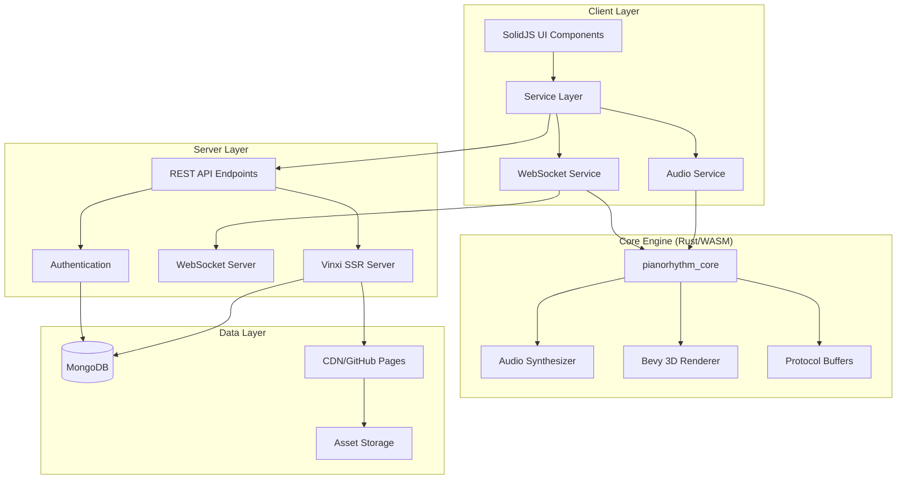

# Architecture Overview

PianoRhythm is a sophisticated multiplayer musical collaboration platform built with a modern, multi-layered architecture designed for real-time performance and scalability.

## System Architecture Diagram



## Core Components

### 1. Frontend Layer (SolidJS)

**Technology Stack:**
- **Framework**: SolidJS with Server-Side Rendering
- **Language**: TypeScript
- **UI Library**: Hope UI (custom fork)
- **State Management**: Solid Services + Immer
- **Build System**: Vinxi

**Key Responsibilities:**
- User interface rendering and interaction
- Real-time state management
- Service orchestration
- Audio visualization
- 3D scene management

### 2. Core Engine (Rust/WebAssembly)

**Technology Stack:**
- **Language**: Rust (Nightly toolchain)
- **Integration**: WebAssembly with wasm-bindgen
- **Serialization**: Protocol Buffers
- **3D Engine**: Bevy Engine 0.16

**Key Responsibilities:**
- High-performance audio synthesis
- 3D rendering (WebGPU/WebGL2)
- MIDI processing
- Real-time audio effects
- Cross-platform compatibility

### 3. Server Layer

**Technology Stack:**
- **Runtime**: Bun (production), Node.js (development)
- **Framework**: Vinxi with custom presets
- **WebSocket**: crossws adapter
- **Database**: MongoDB with Data API

**Key Responsibilities:**
- Server-side rendering
- API endpoint management
- Real-time communication
- User authentication
- Room management

### 4. Data Layer

**Technology Stack:**
- **Database**: MongoDB Atlas
- **Assets**: GitHub Pages / CDN
- **Authentication**: OAuth (Discord, GitHub) + JWT

**Key Responsibilities:**
- User data persistence
- Room state management
- Asset delivery
- Session management

## Communication Patterns

### 1. Frontend ↔ Core Engine

```typescript
// Service Layer communicates with Rust core via WASM
const coreService = appService().coreService();
coreService?.send_app_action(action);

// Core engine emits events back to frontend
window.addEventListener("app_events", (event) => {
  handleCoreEvent(event.detail);
});
```

### 2. Client ↔ Server

```typescript
// WebSocket for real-time communication
websocketService().connect(wsIdentity);
websocketService().emitServerCommand(["JoinRoom", roomName]);

// REST API for data operations
const response = await fetch("/api/v1/rooms", {
  method: "POST",
  body: JSON.stringify(roomData)
});
```

### 3. Protocol Buffer Serialization

```typescript
// Efficient binary serialization for real-time data
const action = AppStateActions.create({
  action: AppStateActions_Action.SynthAction,
  audioSynthAction: AudioSynthActions.create({
    action: AudioSynthActions_Action.NoteOn,
    // ... note data
  })
});
```

## Key Architectural Patterns

### 1. Service-Oriented Architecture

The frontend uses a service layer pattern with dependency injection:

```typescript
// Services are registered and injected via solid-services
const appService = useService(AppService);
const audioService = useService(AudioService);
const websocketService = useService(WebsocketService);
```

### 2. Event-Driven Communication

```typescript
// Event buses for loose coupling
const appStateEvents = createEventBus<AppStateEvents>();
appStateEvents.emit(AppStateEvents.UserJoined);
```

### 3. Dependency-Based Initialization

```typescript
// Robust initialization system prevents race conditions
await initializationService().executeStep(InitializationStep.AudioService, {
  execute: async () => {
    await audioService().initialize();
  }
});
```

### 4. Reactive State Management

```typescript
// SolidJS reactive primitives with Immer for immutability
const [users, setUsers] = createImmerSignal<UserClientDomain[]>([]);
setUsers(users => {
  users.push(newUser);
});
```

## Performance Considerations

### 1. WebAssembly Optimization

- **Rust Core**: High-performance audio processing in Rust compiled to WASM
- **Memory Management**: Shared memory between JS and WASM for audio buffers
- **Threading**: Web Workers for non-blocking WASM operations

### 2. Real-time Audio

- **Low Latency**: Sub-100ms audio synchronization
- **Buffer Management**: Efficient audio buffer handling
- **Audio Worklets**: Dedicated audio processing thread

### 3. 3D Rendering

- **Bevy Engine**: ECS-based 3D rendering
- **WebGPU/WebGL2**: Hardware-accelerated graphics
- **LOD System**: Level-of-detail for performance scaling

### 4. Network Optimization

- **Protocol Buffers**: Compact binary serialization
- **WebSocket**: Persistent connections for real-time data
- **CDN**: Asset delivery optimization

## Scalability Features

### 1. Horizontal Scaling

- **Stateless Services**: Server components designed for horizontal scaling
- **Load Balancing**: Multiple server instances behind load balancer
- **Database Sharding**: MongoDB sharding for data distribution

### 2. Caching Strategy

- **Client-Side**: Service worker caching for assets
- **CDN**: Global content delivery network
- **Database**: MongoDB query optimization and indexing

### 3. Resource Management

- **Memory Pools**: Efficient memory allocation in Rust core
- **Connection Pooling**: Database connection management
- **Asset Bundling**: Optimized asset delivery

## Security Architecture

### 1. Authentication & Authorization

- **OAuth Integration**: Discord and GitHub OAuth providers
- **JWT Tokens**: Secure session management
- **Role-Based Access**: User permissions and roles

### 2. Data Protection

- **Input Validation**: Comprehensive input sanitization
- **CORS Configuration**: Cross-origin resource sharing
- **Content Security Policy**: XSS protection

### 3. Real-time Security

- **WebSocket Authentication**: Secure WebSocket connections
- **Rate Limiting**: Protection against abuse
- **Message Validation**: Protocol buffer validation

## Cross-Platform Support

### 1. Web Application

- **Primary Platform**: Progressive Web App
- **Browser Support**: Modern browsers with WebAssembly
- **Mobile Responsive**: Touch-optimized interface

### 2. Desktop Application

- **Tauri Framework**: Native desktop wrapper
- **Platform Integration**: OS-specific features
- **Performance**: Native performance benefits

### 3. Environment Detection

```typescript
// Adaptive features based on platform
const COMMON = {
  IS_WEB_APP: !IS_DESKTOP_APP,
  IS_DESKTOP_APP: self["__TAURI__"] != null,
  IS_MOBILE: /android|ios/.test(navigator.userAgent)
};
```

## Next Steps

- **[Frontend Architecture](./frontend-architecture.md)** - Detailed SolidJS structure
- **[Core Business Logic](./core-business-logic.md)** - Rust engine deep dive
- **[Development Setup](./development-setup.md)** - Getting started guide
