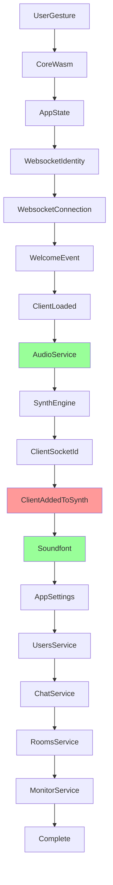

# Initialization System

The PianoRhythm initialization system is a sophisticated dependency-based state machine designed to eliminate race conditions and ensure reliable application startup across different environments and network conditions.

> **🚀 Quick Reference**: See [Initialization Quick Reference](./initialization-quick-reference) for common development tasks.

## Problem Statement

### Original Race Condition Issues

The original initialization process suffered from several critical race conditions:

1. **Synth Engine vs Client Socket ID**: The synth engine was created before the client socket ID was available, causing the error: `"Synth engine created but client socket ID not set, yet."`

2. **Async Operation Coordination**: Multiple async operations (WebSocket connection, audio initialization, core WASM loading) ran in parallel without proper coordination

3. **Service Dependencies**: Services were initialized without considering their dependencies on other services

4. **Error Recovery**: Limited retry mechanisms and timeout handling for transient failures

### Impact

These race conditions led to:
- Inconsistent application startup behavior
- Failed audio initialization
- User experience degradation
- Difficult debugging and maintenance

## Solution Architecture

### Core Components

#### 1. Initialization Service (`src/services/initialization.service.ts`)

The central coordinator that manages the entire initialization process:

```typescript
interface InitializationService {
  executeStep(step: InitializationStep, executor: StepExecutor): Promise<void>
  waitForStep(step: InitializationStep, timeout?: number): Promise<void>
  getStepStatus(step: InitializationStep): InitializationStatus
  isStepCompleted(step: InitializationStep): boolean
  reset(): void
  getNextReadyStep(): InitializationStep | null
}
```

**Key Features:**
- **Dependency Management**: Ensures steps execute only when dependencies are met
- **Retry Logic**: Configurable retry attempts with exponential backoff
- **Timeout Handling**: Prevents hanging operations with configurable timeouts
- **Progress Tracking**: Real-time progress calculation and status updates
- **Error Recovery**: Graceful handling of failures with detailed error reporting

#### 2. Initialization Types (`src/types/initialization.types.ts`)

Comprehensive type definitions for the initialization system:

```typescript
enum InitializationStep {
  UserGesture = "user-gesture",
  CoreWasm = "core-wasm",
  AppState = "app-state",
  WebsocketIdentity = "websocket-identity",
  WebsocketConnection = "websocket-connection",
  WelcomeEvent = "welcome-event",
  ClientLoaded = "client-loaded",
  AudioService = "audio-service",
  SynthEngine = "synth-engine",
  ClientSocketId = "client-socket-id",
  ClientAddedToSynth = "client-added-to-synth",
  Soundfont = "soundfont",
  AppSettings = "app-settings",
  UsersService = "users-service",
  ChatService = "chat-service",
  RoomsService = "rooms-service",
  MonitorService = "monitor-service",
  Complete = "complete"
}
```

#### 3. Step Executor Interface

Each initialization step implements the `StepExecutor` interface:

```typescript
interface StepExecutor {
  execute: () => Promise<void>
  validate?: () => Promise<boolean>
  cleanup?: () => Promise<void>
}
```

### Dependency Graph

The initialization follows a strict dependency graph (refactored for proper audio/soundfont order):



### Critical Synchronization Points

#### Audio Service Before Soundfont (NEW)

**Key Refactoring**: The audio service now initializes completely before soundfont loading begins:

```typescript
// Step 8: Audio Service (initializes synth engine and audio context)
await initializationService().executeStep(InitializationStep.AudioService, {
  execute: async () => {
    if (!audioService().initialized()) {
      await audioService().initialize();
      await raceTimeout(until(audioService().initialized), DEFAULT_SERVICE_TIMEOUT, true, "Audio service never initialized.");
    }
  }
});

// Step 10: Soundfont (loads after audio service is ready)
await initializationService().executeStep(InitializationStep.Soundfont, {
  execute: async () => {
    let soundfontLoaded = await onLoadClientSoundfont();
    // ... soundfont loading logic with fallback to default
  },
  validate: async () => {
    return !!audioService().loadedSoundfontName();
  }
});
```

**Benefits**:
- Prevents audio context initialization issues
- Ensures synth engine is ready before soundfont data is loaded
- Provides proper error handling and fallback mechanisms
- Allows other services to depend on both audio AND soundfont being ready

#### Client Added to Synth Step

This is the most critical step that resolves the original race condition:

```typescript
await initializationService().executeStep(InitializationStep.ClientAddedToSynth, {
  execute: async () => {
    // Wait for ALL required conditions
    await raceTimeout(until(() => {
      return appService().clientLoaded() && 
             appService().getSocketID() && 
             audioService().clientAdded();
    }), DEFAULT_SERVICE_TIMEOUT, true, "Client never properly added to synth.");
  },
  validate: async () => {
    return appService().clientLoaded() && 
           !!appService().getSocketID() && 
           audioService().clientAdded();
  }
});
```

This step ensures:
1. Client is loaded from WebSocket welcome event
2. Socket ID is available and set
3. Audio service has successfully added the client to the synth engine

## Implementation Details

### Enhanced Audio Service

The audio service was updated to handle proper sequencing:

```typescript
// Wait for both client to be loaded AND socket ID to be available
await until(() => {
  const clientLoaded = appService().clientLoaded();
  const socketId = appService().getSocketID();
  const workletReady = !appSettingsService().getSetting("AUDIO_USE_WORKLET") || 
                       !canCreateSharedArrayBuffer() || 
                       audioWorkletNode();
  
  return clientLoaded && socketId && workletReady;
});

const socketId = appService().getSocketID();
if (!socketId) {
  logError("[AudioService] Client loaded but socket ID is not available");
  return;
}

// Now safely add client to synth
appService().coreService()?.send_app_action(AppStateActions.create({
  action: AppStateActions_Action.SynthAction,
  audioSynthAction: AudioSynthActions.create({
    action: AudioSynthActions_Action.AddClient,
    socketId: socketId,
  })
}));
```

### Core Middleware Improvements

The Rust core middleware was enhanced with better error handling:

```rust
AudioSynthActions_Action::AddClient if synth_action.has_socketId() => {
    let socket_id_str = synth_action.get_socketId();
    log::info!("Adding client to synth with socket ID: {}", socket_id_str);
    
    if let Some(socket_id) = add_synth_user(socket_id_str, true) {
        pianorhythm_synth::set_client_socket_id(socket_id);
        log::info!("Successfully added client to synth and set client socket ID: {}", socket_id);
    } else {
        log::warn!("Failed to add client to synth for socket ID: {}", socket_id_str);
    }
}
```

### Configuration Options

The initialization service supports comprehensive configuration:

```typescript
interface InitializationConfig {
  defaultTimeout: number;     // 30 seconds default
  maxRetries: number;         // 3 retries default
  retryDelay: number;         // 1 second delay
  enableLogging: boolean;     // Debug logging
}
```

## Testing Strategy

### Unit Tests

Comprehensive test coverage includes:

```typescript
describe('InitializationService', () => {
  it('should execute steps in dependency order')
  it('should prevent execution of steps with unmet dependencies')
  it('should retry failed steps up to max retries')
  it('should fail after max retries exceeded')
  it('should validate steps when validator is provided')
  it('should handle timeouts correctly')
  it('should calculate progress correctly')
  it('should reset state correctly')
  it('should identify next ready step correctly')
});
```

**Test Results**: ✅ All 10 tests passing

### Integration Testing

The refactored app loading process should be tested with:
- Network delays and failures
- Audio device availability issues
- WebSocket connection problems
- WASM loading failures

## Benefits

### 1. Eliminates Race Conditions
- Proper sequencing prevents the original "Synth engine created but client socket ID not set, yet" error
- Guaranteed order of operations eliminates timing-dependent failures

### 2. Robust Error Handling
- Retry mechanisms handle transient network and resource failures
- Timeout protection prevents hanging operations
- Graceful degradation for non-critical failures

### 3. Better Debugging
- Comprehensive logging at each step
- Progress tracking for user feedback
- Clear error messages with context

### 4. Maintainable Architecture
- Clear dependency structure makes it easy to add new initialization steps
- Separation of concerns between coordination and execution
- Type-safe implementation reduces runtime errors

### 5. Testable Design
- Each step can be tested independently
- Mock-friendly architecture for unit testing
- Deterministic behavior for reliable testing

## Migration Guide

### For Developers

When adding new initialization steps:

1. **Define the step** in `InitializationStep` enum
2. **Add dependencies** in the `stepDependencies` mapping
3. **Implement the executor** with proper error handling
4. **Add validation** if the step has verifiable outcomes
5. **Write tests** for the new step

### Example: Adding a New Step

```typescript
// 1. Add to enum
enum InitializationStep {
  // ... existing steps
  NewFeature = "new-feature"
}

// 2. Define dependencies
const stepDependencies = {
  // ... existing dependencies
  [InitializationStep.NewFeature]: [InitializationStep.AudioService]
}

// 3. Execute the step
await initializationService().executeStep(InitializationStep.NewFeature, {
  execute: async () => {
    // Implementation
  },
  validate: async () => {
    // Optional validation
    return true;
  }
});
```

## Future Enhancements

### Potential Improvements

1. **Parallel Execution**: Allow independent steps to run in parallel while respecting dependencies
2. **Step Prioritization**: Priority-based execution for critical vs. optional steps
3. **Dynamic Dependencies**: Runtime dependency resolution based on configuration
4. **Rollback Support**: Ability to rollback failed steps and retry from a clean state
5. **Metrics Collection**: Performance metrics and analytics for initialization timing

### Monitoring and Observability

Consider adding:
- Performance metrics for each step
- Error rate tracking
- User experience analytics
- A/B testing for initialization optimizations

## Conclusion

The initialization architecture refactoring successfully eliminates race conditions while providing a robust, maintainable foundation for application startup. The dependency-based approach ensures reliable operation across different environments and network conditions, significantly improving the user experience and developer productivity.

The comprehensive testing strategy and clear documentation make this system maintainable and extensible for future development needs.
