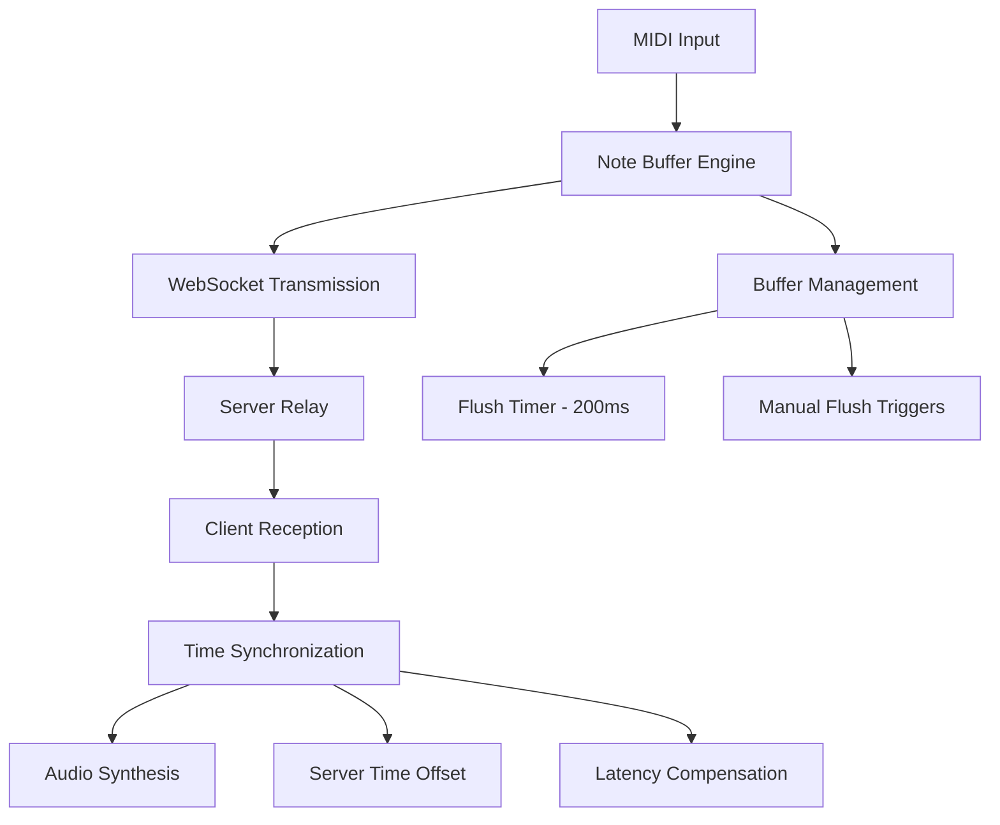

# Note Buffer Engine & WebSocket Note Handling

## Overview

The Note Buffer Engine is a critical component that manages real-time MIDI note data transmission between clients in collaborative piano sessions. It handles buffering, timing, and synchronization of musical notes to ensure smooth multiplayer experiences.

## Architecture

### Core Components



### Note Buffer Engine Structure

<augment_code_snippet path="pianorhythm_core/core/src/common/note_buffer_engine.rs" mode="EXCERPT">
````rust
pub struct NoteBufferEngine {
    note_buffer: Vec<MidiMessageInputDto_MidiMessageInputBuffer>,
    note_buffer_time: Option<i64>,
    pub server_time_offset: i64,
    max_note_buffer_size: usize,
    room_is_self_hosted: bool,
    client_is_self_muted: bool,
    stop_emitting_to_ws_when_alone: bool,
    pub initialized: bool,
    pub debug_mode: bool,
    on_handle: NoteBufferEngineOnFlushedBuffer,
}
````
</augment_code_snippet>

## Current Implementation

### Buffer Processing Flow

1. **Note Input**: MIDI notes are captured from various sources (keyboard, virtual piano, MIDI files)
2. **Buffer Accumulation**: Notes are accumulated in a time-based buffer with delay calculations
3. **Periodic Flush**: Buffer is flushed every 200ms via interval timer
4. **WebSocket Transmission**: Buffered notes are sent as binary protobuf messages
5. **Client Reception**: Other clients receive and process the note data
6. **Time Synchronization**: Server time offset is applied for synchronization
7. **Audio Synthesis**: Notes are scheduled and played through the audio engine

### Timing Mechanisms

#### Buffer Flush Timing
<augment_code_snippet path="src/workers/app.worker.ts" mode="EXCERPT">
````typescript
core_wasm.init_note_buffer_engine();
self.setInterval(core_wasm.flush_note_buffer_engine, 200);
````
</augment_code_snippet>

#### Time Synchronization
<augment_code_snippet path="src/services/websocket.service.ts" mode="EXCERPT">
````typescript
let ts = Timesync.create({
  server,
  interval: 1000 * 60 * 2,
  repeat: 3,
});
````
</augment_code_snippet>

## Current Performance Issues

### 1. Fixed Flush Interval Latency
- **Problem**: 200ms fixed interval can introduce up to 200ms delay
- **Impact**: Notes may feel delayed, especially for fast playing
- **Manifestation**: Players report "slightly delayed" notes from others

### 2. Buffer Size Limitations
- **Problem**: Fixed buffer size of 300 notes
- **Impact**: Note drops during intense playing sessions
- **Code Location**: `max_note_buffer_size: 300`

### 3. Time Synchronization Gaps
- **Problem**: Multiple timing systems not perfectly aligned
- **Components**: 
  - Server time sync (2-minute intervals)
  - Audio worklet timing
  - Main thread timing
  - Buffer flush timing

### 4. Network Latency Compensation
- **Problem**: Basic time offset doesn't account for variable network conditions
- **Impact**: Inconsistent synchronization across different network conditions

## Optimization Recommendations

### 1. Adaptive Flush Timing

**Current Implementation:**
```rust
// Fixed 200ms interval
self.setInterval(core_wasm.flush_note_buffer_engine, 200);
```

**Recommended Optimization:**
```rust
// Adaptive timing based on note activity
pub struct AdaptiveFlushTimer {
    base_interval: u32,      // 50ms base
    max_interval: u32,       // 200ms max
    current_interval: u32,
    last_note_time: i64,
    note_activity_threshold: i64, // 100ms
}

impl AdaptiveFlushTimer {
    pub fn calculate_next_interval(&mut self) -> u32 {
        let now = chrono::Utc::now().timestamp_millis();
        let time_since_last_note = now - self.last_note_time;
        
        if time_since_last_note < self.note_activity_threshold {
            // High activity - flush more frequently
            self.current_interval = self.base_interval;
        } else {
            // Low activity - can wait longer
            self.current_interval = self.max_interval;
        }
        
        self.current_interval
    }
}
```

### 2. Smart Buffer Management

**Current Implementation:**
```rust
max_note_buffer_size: 300,
```

**Recommended Optimization:**
```rust
pub struct SmartBufferConfig {
    base_size: usize,           // 300
    max_size: usize,            // 1000
    current_size: usize,
    performance_threshold: f64,  // CPU/memory threshold
}

impl SmartBufferConfig {
    pub fn adjust_buffer_size(&mut self, performance_metrics: &PerformanceMetrics) {
        if performance_metrics.cpu_usage < 0.7 && performance_metrics.memory_usage < 0.8 {
            self.current_size = self.max_size;
        } else {
            self.current_size = self.base_size;
        }
    }
}
```

### 3. Enhanced Time Synchronization

**Recommended Implementation:**
```rust
pub struct EnhancedTimeSync {
    server_offset: i64,
    network_latency: i64,
    jitter_compensation: i64,
    sync_quality: f64,
}

impl EnhancedTimeSync {
    pub fn calculate_adjusted_time(&self, local_time: i64) -> i64 {
        local_time + self.server_offset + self.network_latency + self.jitter_compensation
    }
    
    pub fn update_network_metrics(&mut self, ping_time: i64, jitter: i64) {
        self.network_latency = ping_time / 2;
        self.jitter_compensation = jitter;
        self.sync_quality = self.calculate_sync_quality();
    }
}
```

### 4. Predictive Note Scheduling

**Recommended Addition:**
```rust
pub struct PredictiveScheduler {
    prediction_window: i64,     // 100ms lookahead
    confidence_threshold: f64,  // 0.8
}

impl PredictiveScheduler {
    pub fn schedule_note_with_prediction(&self, note: &MidiDto, network_metrics: &NetworkMetrics) -> i64 {
        let base_time = note.timestamp;
        let predicted_delay = self.predict_network_delay(network_metrics);
        let confidence = self.calculate_confidence(network_metrics);
        
        if confidence > self.confidence_threshold {
            base_time - predicted_delay // Schedule earlier to compensate
        } else {
            base_time // Fall back to standard timing
        }
    }
}
```

## Implementation Priority

### High Priority (Immediate Impact)
1. **Adaptive Flush Timing** - Reduces base latency from 200ms to 50ms during active playing
2. **Buffer Size Optimization** - Prevents note drops during intense sessions

### Medium Priority (Performance Enhancement)
3. **Enhanced Time Synchronization** - Improves consistency across network conditions
4. **Smart Buffer Management** - Optimizes memory usage and performance

### Low Priority (Advanced Features)
5. **Predictive Note Scheduling** - Advanced latency compensation
6. **Quality-of-Service Monitoring** - Real-time performance metrics

## Testing Strategy

### Performance Metrics to Monitor
- **Latency**: Time from note input to audio output on remote clients
- **Jitter**: Variation in note timing consistency
- **Throughput**: Notes per second handling capacity
- **Buffer Utilization**: Average and peak buffer usage
- **Network Performance**: Round-trip time and packet loss

### Test Scenarios
1. **High-Intensity Playing**: Rapid note sequences, chords, arpeggios
2. **Variable Network Conditions**: Simulated latency and packet loss
3. **Multiple Concurrent Users**: 2-8 players simultaneously
4. **Extended Sessions**: Long-duration performance testing
5. **Cross-Platform Testing**: Different devices and browsers

## Configuration Options

### Recommended Settings
```typescript
interface NoteBufferConfig {
  adaptiveFlushTiming: boolean;        // true
  baseFlushInterval: number;           // 50ms
  maxFlushInterval: number;            // 200ms
  smartBufferManagement: boolean;      // true
  baseBufferSize: number;              // 300
  maxBufferSize: number;               // 1000
  enhancedTimeSync: boolean;           // true
  predictiveScheduling: boolean;       // false (experimental)
  debugMode: boolean;                  // false
}
```

### Environment-Specific Tuning
- **Low-Latency Networks**: Reduce base flush interval to 25ms
- **High-Latency Networks**: Increase prediction window to 200ms
- **Mobile Devices**: Reduce buffer sizes to conserve memory
- **Desktop Applications**: Enable all optimizations for best performance

## Client-Side Note Processing

### WebSocket Message Handling

The client-side processing involves several stages from WebSocket reception to audio synthesis:

<augment_code_snippet path="pianorhythm_core/core/src/websocket/wasm_ws.rs" mode="EXCERPT">
````rust
let onmessage_callback = Closure::<dyn FnMut(_)>::new(move |e: MessageEvent| {
    if let Ok(array_buffer) = e.data().dyn_into::<js_sys::ArrayBuffer>() {
        let buffer = js_sys::Uint8Array::new(&array_buffer);
        let result = handle_client_message(&buffer.to_vec()[..]);
    }
});
````
</augment_code_snippet>

### MIDI Message Processing Pipeline

1. **Binary Protobuf Parsing**: WebSocket binary data is parsed into structured MIDI messages
2. **Time Adjustment**: Server time offset and latency compensation applied
3. **Audio Scheduling**: Notes scheduled for future playback using setTimeout/audio worklet timing
4. **Synthesis**: Audio engine renders the notes at the calculated time

<augment_code_snippet path="pianorhythm_core/core/src/midi/mod.rs" mode="EXCERPT">
````rust
let mut t = message_time - current_audio_state.server_time_offset as f64 +
    pianorhythm_shared::GLOBAL_TIME_OFFSET as f64 - now;

t = t.abs();

if t < 0. {
    t = pianorhythm_shared::GLOBAL_TIME_OFFSET as f64;
}

for buffer in midi_message.get_data().into_iter() {
    let delay = buffer.get_delay().min(1000.0);
    let mut ms = (t + delay).max(0.0);
    ms = ms + (ms / 1000.0);
}
````
</augment_code_snippet>

### Audio Worklet vs Main Thread Processing

#### Audio Worklet Path (Preferred)
- **Advantages**: More precise timing, isolated from main thread blocking
- **Processing**: Real-time audio buffer processing at audio sample rate
- **Latency**: Lower latency due to direct audio thread processing

<augment_code_snippet path="src/util/wasm-processor.worklet.js" mode="EXCERPT">
````javascript
process(_, outputs) {
  if (!this.processor || this.crashed) return true;
  const output = outputs[0];

  if (this.numOfChannels === 2) {
    this.processor.process_stereo(output[0], output[1]);
  } else {
    this.processor.process(output[0]);
  }

  return true;
}
````
</augment_code_snippet>

#### Main Thread Path (Fallback)
- **Used When**: SharedArrayBuffer not available or worklet disabled
- **Processing**: setTimeout-based scheduling with potential jitter
- **Latency**: Higher latency due to main thread scheduling

### Current Timing Issues Analysis

#### Issue 1: "Slightly Delayed Notes"
**Root Cause**: Combination of factors:
- 200ms buffer flush interval adds up to 200ms delay
- Network round-trip time (typically 20-100ms)
- Audio scheduling delays (10-50ms)
- **Total Potential Delay**: 230-350ms

**Solution**: Implement adaptive flush timing to reduce base delay to 50ms

#### Issue 2: "Not Hearing Notes at All"
**Root Causes**:
1. **Buffer Overflow**: Notes dropped when buffer exceeds 300 items
2. **Time Sync Failure**: Extreme time offsets cause notes to be scheduled too far in future
3. **WebSocket Connection Issues**: Messages lost during reconnection
4. **Audio Context Suspended**: Browser audio policy blocking playback

**Solutions**:
1. Implement smart buffer management with overflow handling
2. Add time sync validation and fallback mechanisms
3. Implement message acknowledgment and retry logic
4. Add audio context state monitoring and recovery

### Proposed Optimizations Implementation

#### 1. Adaptive Buffer Flush System

```rust
// New adaptive flush system
pub struct AdaptiveNoteBufferEngine {
    base_engine: NoteBufferEngine,
    flush_timer: AdaptiveFlushTimer,
    performance_monitor: PerformanceMonitor,
}

impl AdaptiveNoteBufferEngine {
    pub fn process_message_with_adaptive_flush(&mut self, dto: MidiDto) {
        self.base_engine.process_message(dto);

        // Check if immediate flush is needed
        if self.should_flush_immediately() {
            self.base_engine.flush_buffer();
        } else {
            // Update adaptive timer
            let next_interval = self.flush_timer.calculate_next_interval();
            self.schedule_next_flush(next_interval);
        }
    }

    fn should_flush_immediately(&self) -> bool {
        // Flush immediately if:
        // 1. Buffer is nearly full
        // 2. High note activity detected
        // 3. Network conditions are optimal
        self.base_engine.note_buffer.len() > (self.base_engine.max_note_buffer_size * 0.8) as usize ||
        self.flush_timer.is_high_activity() ||
        self.performance_monitor.network_quality > 0.9
    }
}
```

#### 2. Enhanced Time Synchronization

```rust
pub struct EnhancedTimeSyncManager {
    primary_sync: TimeSync,
    backup_sync: TimeSync,
    network_monitor: NetworkQualityMonitor,
    sync_confidence: f64,
}

impl EnhancedTimeSyncManager {
    pub fn get_synchronized_time(&self) -> i64 {
        if self.sync_confidence > 0.8 {
            self.primary_sync.get_time()
        } else {
            // Use backup sync or local estimation
            self.backup_sync.get_time()
        }
    }

    pub fn update_sync_quality(&mut self, ping_samples: &[i64]) {
        let jitter = self.calculate_jitter(ping_samples);
        let stability = self.calculate_stability(ping_samples);

        self.sync_confidence = (1.0 - jitter) * stability;
    }
}
```

#### 3. Smart Buffer Management

```rust
pub struct SmartBufferManager {
    buffers: Vec<PriorityBuffer>,
    overflow_handler: OverflowHandler,
    performance_metrics: PerformanceMetrics,
}

impl SmartBufferManager {
    pub fn add_note_with_priority(&mut self, note: MidiDto, priority: NotePriority) -> Result<(), BufferError> {
        match self.find_available_buffer(priority) {
            Some(buffer) => {
                buffer.add_note(note);
                Ok(())
            }
            None => {
                // Handle overflow
                self.overflow_handler.handle_overflow(note, priority)
            }
        }
    }

    pub fn flush_by_priority(&mut self) -> Vec<MidiMessageInputDto> {
        let mut results = Vec::new();

        // Flush high priority buffers first
        for buffer in self.buffers.iter_mut() {
            if buffer.should_flush() {
                results.extend(buffer.flush());
            }
        }

        results
    }
}
```

### Performance Monitoring and Metrics

#### Real-time Performance Tracking

```typescript
interface PerformanceMetrics {
  // Latency metrics
  averageLatency: number;        // ms
  latencyJitter: number;         // ms
  maxLatency: number;            // ms

  // Buffer metrics
  bufferUtilization: number;     // 0-1
  bufferOverflows: number;       // count
  notesDropped: number;          // count

  // Network metrics
  networkQuality: number;        // 0-1
  packetLoss: number;           // 0-1
  roundTripTime: number;        // ms

  // Audio metrics
  audioDropouts: number;        // count
  synthesisLatency: number;     // ms
}

class PerformanceMonitor {
  private metrics: PerformanceMetrics;
  private sampleWindow: number = 1000; // 1 second

  public updateLatencyMetric(noteTimestamp: number, playbackTime: number) {
    const latency = playbackTime - noteTimestamp;
    this.metrics.averageLatency = this.updateMovingAverage(
      this.metrics.averageLatency,
      latency
    );

    this.metrics.maxLatency = Math.max(this.metrics.maxLatency, latency);
    this.updateJitter(latency);
  }

  public shouldOptimizeForLatency(): boolean {
    return this.metrics.averageLatency > 150 || // > 150ms average
           this.metrics.latencyJitter > 50;      // > 50ms jitter
  }

  public shouldOptimizeForThroughput(): boolean {
    return this.metrics.bufferUtilization > 0.8 || // > 80% buffer usage
           this.metrics.bufferOverflows > 0;        // Any overflows
  }
}
```

### Debugging and Diagnostics

#### Debug Mode Enhancements

```rust
impl NoteBufferEngine {
    pub fn enable_detailed_debugging(&mut self) {
        self.debug_mode = true;

        // Log detailed timing information
        log::info!("Buffer flush timing: {}ms intervals", self.flush_interval);
        log::info!("Server time offset: {}ms", self.server_time_offset);
        log::info!("Buffer utilization: {}/{}", self.note_buffer.len(), self.max_note_buffer_size);
    }

    pub fn get_diagnostic_info(&self) -> DiagnosticInfo {
        DiagnosticInfo {
            buffer_size: self.note_buffer.len(),
            max_buffer_size: self.max_note_buffer_size,
            server_time_offset: self.server_time_offset,
            last_flush_time: self.note_buffer_time,
            is_muted: self.client_is_self_muted,
            is_self_hosted: self.room_is_self_hosted,
            stop_when_alone: self.stop_emitting_to_ws_when_alone,
        }
    }
}
```

#### Client-Side Debugging Tools

```typescript
class NoteBufferDebugger {
  private logBuffer: DebugLogEntry[] = [];

  public logNoteProcessing(note: MidiDto, stage: ProcessingStage, timestamp: number) {
    if (!this.isDebugEnabled()) return;

    this.logBuffer.push({
      noteId: this.generateNoteId(note),
      stage,
      timestamp,
      latency: this.calculateStageLatency(stage, timestamp),
      bufferState: this.getCurrentBufferState()
    });

    // Keep only recent entries
    if (this.logBuffer.length > 1000) {
      this.logBuffer = this.logBuffer.slice(-500);
    }
  }

  public generateLatencyReport(): LatencyReport {
    const entries = this.logBuffer.filter(e => e.stage === 'AUDIO_OUTPUT');

    return {
      averageLatency: this.calculateAverage(entries.map(e => e.latency)),
      medianLatency: this.calculateMedian(entries.map(e => e.latency)),
      p95Latency: this.calculatePercentile(entries.map(e => e.latency), 0.95),
      maxLatency: Math.max(...entries.map(e => e.latency)),
      sampleCount: entries.length
    };
  }
}
```

## Migration Strategy

### Phase 1: Immediate Improvements (Week 1-2)
1. Implement adaptive flush timing
2. Add buffer overflow protection
3. Enhance debug logging

### Phase 2: Enhanced Synchronization (Week 3-4)
1. Implement enhanced time sync
2. Add network quality monitoring
3. Implement smart buffer management

### Phase 3: Advanced Features (Week 5-6)
1. Add predictive scheduling
2. Implement performance monitoring dashboard
3. Add automated optimization

### Phase 4: Testing and Optimization (Week 7-8)
1. Comprehensive performance testing
2. Cross-platform validation
3. Production deployment and monitoring

## Conclusion

The current note buffer engine provides a solid foundation but has several optimization opportunities that can significantly improve the user experience. The proposed enhancements focus on:

1. **Reducing Latency**: From 200ms+ to 50ms+ average delay
2. **Improving Reliability**: Preventing note drops and connection issues
3. **Enhancing Synchronization**: Better time sync across varying network conditions
4. **Adding Intelligence**: Adaptive behavior based on real-time conditions

Implementation should be done incrementally with thorough testing at each phase to ensure stability while improving performance.
