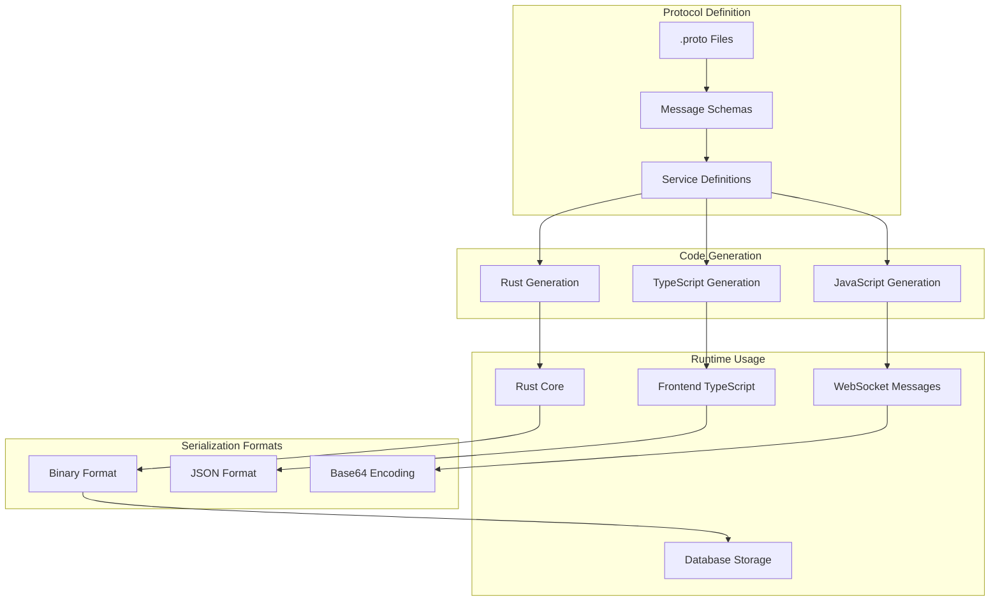

# Protocol Buffers

PianoRhythm uses Protocol Buffers (protobuf) for efficient, cross-platform message serialization between the Rust core engine, TypeScript frontend, and WebSocket communication layer. This ensures type-safe, compact, and fast data exchange across all system components.

## Architecture Overview



## Core Message Types

### 1. Audio Messages

#### MIDI Events
```protobuf
message MidiMessageOutputDto {
  string socketID = 1;
  repeated MidiMessageBuffer data = 2;
}

message MidiMessageBuffer {
  optional MidiMessageBufferData data = 1;
}

message MidiMessageBufferData {
  MidiDtoType messageType = 1;
  optional MidiNoteOnDto noteOn = 2;
  optional MidiNoteOffDto noteOff = 3;
  optional MidiControlChangeDto controlChange = 4;
}

enum MidiDtoType {
  NoteOn = 0;
  NoteOff = 1;
  ControlChange = 2;
  ProgramChange = 3;
  PitchBend = 4;
}
```

#### Audio Synthesis
```protobuf
message SynthEventDto {
  string socketId = 1;
  SynthEventType eventType = 2;
  optional NoteOnEvent noteOn = 3;
  optional NoteOffEvent noteOff = 4;
  optional VolumeChangeEvent volumeChange = 5;
}

message NoteOnEvent {
  uint32 note = 1;
  uint32 velocity = 2;
  uint32 channel = 3;
  optional uint32 program = 4;
  optional string deviceId = 5;
}
```

### 2. User & Session Messages

#### User Management
```protobuf
message UserDto {
  string id = 1;
  string username = 2;
  string email = 3;
  UserRole role = 4;
  optional string avatarUrl = 5;
  repeated string permissions = 6;
}

enum UserRole {
  GUEST = 0;
  MEMBER = 1;
  MODERATOR = 2;
  ADMIN = 3;
}
```

#### Session State
```protobuf
message SessionStateDto {
  string sessionId = 1;
  repeated UserDto connectedUsers = 2;
  AudioSettings audioSettings = 3;
  RoomSettings roomSettings = 4;
  optional string currentSong = 5;
}

message AudioSettings {
  float masterVolume = 1;
  uint32 sampleRate = 2;
  uint32 bufferSize = 3;
  bool enableReverb = 4;
  float reverbLevel = 5;
}
```

### 3. Application State Messages

#### Theme Configuration
```protobuf
message AppThemeColors {
  string primary = 1;
  string accent = 2;
  string tertiary = 3;
}

message AppSettings {
  AppThemes selectedTheme = 1;
  bool enableAnimations = 2;
  bool enableSoundEffects = 3;
  string language = 4;
  AppThemeColors themeColors = 5;
}

enum AppThemes {
  DEFAULT = 0;
  THEME_1 = 1;
  THEME_2 = 2;
  THEME_3 = 3;
  HALLOWEEN = 4;
  WHITE_AND_BLACK = 5;
  BLACK_AND_WHITE = 6;
}
```

## Code Generation

### 1. Rust Integration

#### Build Configuration
```toml
# Cargo.toml
[build-dependencies]
prost-build = "0.12"

[dependencies]
prost = "0.12"
prost-types = "0.12"
```

#### Build Script
```rust
// build.rs
fn main() {
    prost_build::Config::new()
        .out_dir("src/proto")
        .compile_protos(
            &[
                "proto/midi.proto",
                "proto/audio.proto", 
                "proto/user.proto",
                "proto/app.proto"
            ],
            &["proto/"]
        )
        .unwrap();
}
```

#### Usage in Rust
```rust
use crate::proto::{MidiMessageOutputDto, MidiDtoType, NoteOnEvent};

// Serialize message
let midi_event = MidiMessageOutputDto {
    socket_id: "user123".to_string(),
    data: vec![/* ... */],
};

let serialized = midi_event.encode_to_vec();

// Deserialize message
let deserialized = MidiMessageOutputDto::decode(&serialized[..])?;
```

### 2. TypeScript Integration

#### Package Configuration
```json
{
  "dependencies": {
    "protobufjs": "^7.4.0"
  },
  "devDependencies": {
    "@types/protobufjs": "^1.0.0"
  }
}
```

#### Code Generation Script
```typescript
// scripts/generate-proto.ts
import { load } from "protobufjs";

async function generateTypes() {
  const root = await load([
    "proto/midi.proto",
    "proto/audio.proto",
    "proto/user.proto", 
    "proto/app.proto"
  ]);
  
  // Generate TypeScript definitions
  const output = root.toJSON();
  // Write to src/proto/generated.ts
}
```

#### Usage in TypeScript
```typescript
import { MidiMessageOutputDto, MidiDtoType } from "~/proto/pianorhythm-midi";

// Create message
const midiMessage = MidiMessageOutputDto.create({
  socketID: "user123",
  data: [{
    data: {
      messageType: MidiDtoType.NoteOn,
      noteOn: {
        note: 60,
        velocity: 127,
        channel: 1
      }
    }
  }]
});

// Serialize to binary
const buffer = MidiMessageOutputDto.encode(midiMessage).finish();

// Serialize to JSON
const json = MidiMessageOutputDto.toObject(midiMessage);
```

## WebSocket Integration

### 1. Message Framing

```typescript
// WebSocket message wrapper
interface WebSocketMessage {
  type: string;
  data: Uint8Array;
  timestamp: number;
}

// Send protobuf message over WebSocket
function sendMidiEvent(ws: WebSocket, midiEvent: MidiMessageOutputDto) {
  const encoded = MidiMessageOutputDto.encode(midiEvent).finish();
  const message: WebSocketMessage = {
    type: "midi_event",
    data: encoded,
    timestamp: Date.now()
  };
  
  ws.send(JSON.stringify({
    ...message,
    data: Array.from(encoded) // Convert to array for JSON
  }));
}
```

### 2. Message Routing

```rust
// Rust WebSocket handler
use prost::Message;
use crate::proto::MidiMessageOutputDto;

pub fn handle_websocket_message(data: &[u8]) -> Result<(), Box<dyn std::error::Error>> {
    let midi_message = MidiMessageOutputDto::decode(data)?;
    
    match midi_message.data.first() {
        Some(buffer) if buffer.data.is_some() => {
            let buffer_data = buffer.data.as_ref().unwrap();
            match buffer_data.message_type() {
                MidiDtoType::NoteOn => handle_note_on(&midi_message),
                MidiDtoType::NoteOff => handle_note_off(&midi_message),
                _ => Ok(())
            }
        }
        _ => Ok(())
    }
}
```

## Performance Optimizations

### 1. Message Pooling

```typescript
// Object pooling for frequent messages
class MidiMessagePool {
  private pool: MidiMessageOutputDto[] = [];
  
  acquire(): MidiMessageOutputDto {
    return this.pool.pop() || MidiMessageOutputDto.create();
  }
  
  release(message: MidiMessageOutputDto) {
    // Reset message fields
    message.socketID = "";
    message.data = [];
    this.pool.push(message);
  }
}

const midiPool = new MidiMessagePool();
```

### 2. Batch Processing

```rust
// Batch multiple MIDI events
pub struct MidiBatch {
    events: Vec<MidiMessageOutputDto>,
    max_size: usize,
}

impl MidiBatch {
    pub fn add_event(&mut self, event: MidiMessageOutputDto) {
        self.events.push(event);
        
        if self.events.len() >= self.max_size {
            self.flush();
        }
    }
    
    pub fn flush(&mut self) {
        if !self.events.is_empty() {
            let batch = MidiBatchDto {
                events: std::mem::take(&mut self.events),
                timestamp: SystemTime::now().duration_since(UNIX_EPOCH).unwrap().as_millis() as u64,
            };
            
            self.send_batch(batch);
        }
    }
}
```

### 3. Compression

```typescript
// Optional compression for large messages
import { gzip, ungzip } from "pako";

function compressMessage(message: Uint8Array): Uint8Array {
  if (message.length > 1024) { // Only compress large messages
    return gzip(message);
  }
  return message;
}

function decompressMessage(data: Uint8Array, compressed: boolean): Uint8Array {
  return compressed ? ungzip(data) : data;
}
```

## Error Handling

### 1. Validation

```typescript
// Message validation
function validateMidiMessage(message: any): message is MidiMessageOutputDto {
  try {
    MidiMessageOutputDto.verify(message);
    return true;
  } catch (error) {
    console.error("Invalid MIDI message:", error);
    return false;
  }
}
```

### 2. Graceful Degradation

```rust
// Handle malformed messages gracefully
pub fn safe_decode_midi(data: &[u8]) -> Option<MidiMessageOutputDto> {
    match MidiMessageOutputDto::decode(data) {
        Ok(message) => Some(message),
        Err(e) => {
            log::warn!("Failed to decode MIDI message: {}", e);
            None
        }
    }
}
```

## Schema Evolution

### 1. Backward Compatibility

```protobuf
// Use field numbers consistently
message UserDto {
  string id = 1;
  string username = 2;
  string email = 3;
  
  // New fields use higher numbers
  optional string displayName = 10; // Added in v2
  optional int64 lastSeen = 11;     // Added in v2
}
```

### 2. Versioning Strategy

```protobuf
// Version information in messages
message MessageHeader {
  uint32 version = 1;
  string messageType = 2;
  uint64 timestamp = 3;
}

message VersionedMessage {
  MessageHeader header = 1;
  oneof payload {
    MidiMessageOutputDto midiMessage = 2;
    UserDto userMessage = 3;
    // Add new message types here
  }
}
```

## Testing

### 1. Message Validation Tests

```typescript
import { MidiMessageOutputDto, MidiDtoType } from "~/proto/pianorhythm-midi";

describe("MIDI Message Serialization", () => {
  test("should serialize and deserialize correctly", () => {
    const original = MidiMessageOutputDto.create({
      socketID: "test-user",
      data: [{
        data: {
          messageType: MidiDtoType.NoteOn,
          noteOn: { note: 60, velocity: 127, channel: 1 }
        }
      }]
    });
    
    const encoded = MidiMessageOutputDto.encode(original).finish();
    const decoded = MidiMessageOutputDto.decode(encoded);
    
    expect(decoded.socketID).toBe("test-user");
    expect(decoded.data[0].data?.noteOn?.note).toBe(60);
  });
});
```

### 2. Cross-Platform Compatibility

```rust
#[cfg(test)]
mod tests {
    use super::*;
    
    #[test]
    fn test_cross_platform_serialization() {
        let message = MidiMessageOutputDto {
            socket_id: "test".to_string(),
            data: vec![/* ... */],
        };
        
        let encoded = message.encode_to_vec();
        let decoded = MidiMessageOutputDto::decode(&encoded[..]).unwrap();
        
        assert_eq!(message.socket_id, decoded.socket_id);
    }
}
```

## Next Steps

- **[Core Business Logic](./core-business-logic)** - Rust engine implementation
- **[WebSocket Communication](../backend/websocket-communication)** - Real-time message handling
- **[Frontend Architecture](../frontend/frontend-architecture)** - TypeScript integration
