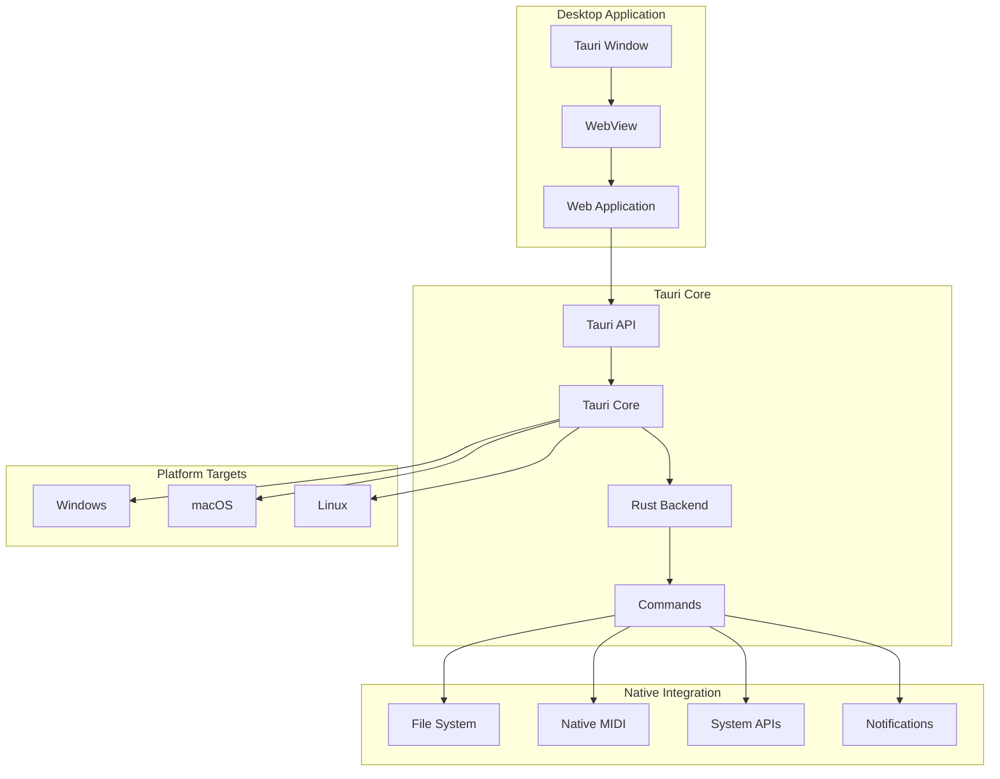

# Desktop Application

PianoRhythm's desktop application is built with Tauri, providing a native wrapper around the web application with enhanced performance, native system integration, and access to platform-specific features like native MIDI, file system access, and system notifications.

## Architecture Overview



## Tauri Configuration

### 1. Core Configuration

<augment_code_snippet path="src-tauri/tauri.conf.json" mode="EXCERPT">
````json
{
  "build": {
    "beforeDevCommand": "pnpm dev",
    "beforeBuildCommand": "pnpm build",
    "devPath": "http://localhost:3000",
    "distDir": "../dist/public"
  },
  "package": {
    "productName": "PianoRhythm",
    "version": "1.0.0"
  },
  "tauri": {
    "allowlist": {
      "all": false,
      "shell": {
        "all": false,
        "open": true
      },
      "fs": {
        "all": true,
        "scope": ["$APPDATA", "$DOCUMENT", "$DOWNLOAD", "$MUSIC"]
      },
      "notification": {
        "all": true
      },
      "window": {
        "all": false,
        "close": true,
        "hide": true,
        "show": true,
        "maximize": true,
        "minimize": true,
        "unmaximize": true,
        "unminimize": true,
        "startDragging": true
      }
    }
  }
}
````
</augment_code_snippet>

### 2. Window Configuration

```json
{
  "windows": [
    {
      "fullscreen": false,
      "resizable": true,
      "title": "PianoRhythm",
      "width": 1200,
      "height": 800,
      "minWidth": 800,
      "minHeight": 600,
      "center": true,
      "decorations": true,
      "alwaysOnTop": false,
      "skipTaskbar": false,
      "theme": "Dark"
    }
  ]
}
```

## Native MIDI Integration

### 1. MIDI Device Access

```rust
// src-tauri/src/midi.rs
use midir::{MidiInput, MidiInputConnection, MidiOutput};
use tauri::State;
use std::sync::Mutex;

pub struct MidiState {
    pub connections: Mutex<Vec<MidiInputConnection<()>>>,
}

#[tauri::command]
pub fn get_midi_inputs() -> Result<Vec<String>, String> {
    let midi_in = MidiInput::new("PianoRhythm Input")
        .map_err(|e| format!("Failed to create MIDI input: {}", e))?;
    
    let ports = midi_in.ports();
    let mut device_names = Vec::new();
    
    for (i, port) in ports.iter().enumerate() {
        match midi_in.port_name(port) {
            Ok(name) => device_names.push(format!("{}:{}", i, name)),
            Err(_) => device_names.push(format!("{}:Unknown Device", i)),
        }
    }
    
    Ok(device_names)
}

#[tauri::command]
pub fn open_midi_input_connection(
    midi_id: String,
    state: State<MidiState>
) -> Result<(), String> {
    let midi_in = MidiInput::new("PianoRhythm Input")
        .map_err(|e| format!("Failed to create MIDI input: {}", e))?;
    
    let ports = midi_in.ports();
    let port_index: usize = midi_id.parse()
        .map_err(|_| "Invalid MIDI device ID")?;
    
    let port = ports.get(port_index)
        .ok_or("MIDI port not found")?;
    
    let connection = midi_in.connect(
        port,
        "PianoRhythm",
        move |_timestamp, message, _| {
            // Process MIDI message
            unsafe {
                if let Some(synth) = SYNTH.get_mut() {
                    let _ = synth.parse_midi_data(
                        message, 
                        &None, 
                        Some(NoteSourceType::Midi.to_u8()), 
                        Some(hash_device_id(midi_id.clone()))
                    );
                }
            }
        },
        (),
    ).map_err(|e| format!("Failed to connect to MIDI device: {}", e))?;
    
    state.connections.lock().unwrap().push(connection);
    Ok(())
}
```

### 2. MIDI Output Support

```rust
#[tauri::command]
pub fn send_midi_message(
    device_id: String,
    message: Vec<u8>
) -> Result<(), String> {
    let midi_out = MidiOutput::new("PianoRhythm Output")
        .map_err(|e| format!("Failed to create MIDI output: {}", e))?;
    
    let ports = midi_out.ports();
    let port_index: usize = device_id.parse()
        .map_err(|_| "Invalid MIDI device ID")?;
    
    let port = ports.get(port_index)
        .ok_or("MIDI output port not found")?;
    
    let mut connection = midi_out.connect(port, "PianoRhythm Output")
        .map_err(|e| format!("Failed to connect to MIDI output: {}", e))?;
    
    connection.send(&message)
        .map_err(|e| format!("Failed to send MIDI message: {}", e))?;
    
    Ok(())
}
```

## File System Integration

### 1. Project File Management

```rust
// src-tauri/src/filesystem.rs
use tauri::api::path;
use std::fs;
use std::path::PathBuf;

#[tauri::command]
pub fn save_project_file(
    filename: String,
    content: String
) -> Result<String, String> {
    let app_data_dir = path::app_data_dir(&tauri::Config::default())
        .ok_or("Failed to get app data directory")?;
    
    let projects_dir = app_data_dir.join("projects");
    fs::create_dir_all(&projects_dir)
        .map_err(|e| format!("Failed to create projects directory: {}", e))?;
    
    let file_path = projects_dir.join(format!("{}.prj", filename));
    fs::write(&file_path, content)
        .map_err(|e| format!("Failed to write project file: {}", e))?;
    
    Ok(file_path.to_string_lossy().to_string())
}

#[tauri::command]
pub fn load_project_file(filepath: String) -> Result<String, String> {
    fs::read_to_string(&filepath)
        .map_err(|e| format!("Failed to read project file: {}", e))
}

#[tauri::command]
pub fn get_recent_projects() -> Result<Vec<String>, String> {
    let app_data_dir = path::app_data_dir(&tauri::Config::default())
        .ok_or("Failed to get app data directory")?;
    
    let projects_dir = app_data_dir.join("projects");
    
    if !projects_dir.exists() {
        return Ok(vec![]);
    }
    
    let mut projects = Vec::new();
    for entry in fs::read_dir(projects_dir)
        .map_err(|e| format!("Failed to read projects directory: {}", e))? {
        
        let entry = entry.map_err(|e| format!("Failed to read directory entry: {}", e))?;
        let path = entry.path();
        
        if path.extension().and_then(|s| s.to_str()) == Some("prj") {
            projects.push(path.to_string_lossy().to_string());
        }
    }
    
    Ok(projects)
}
```

### 2. Audio File Import

```rust
#[tauri::command]
pub fn import_audio_file(filepath: String) -> Result<Vec<u8>, String> {
    let audio_data = fs::read(&filepath)
        .map_err(|e| format!("Failed to read audio file: {}", e))?;
    
    // Validate audio file format
    let extension = std::path::Path::new(&filepath)
        .extension()
        .and_then(|s| s.to_str())
        .ok_or("Invalid file extension")?;
    
    match extension.to_lowercase().as_str() {
        "wav" | "mp3" | "flac" | "ogg" => Ok(audio_data),
        _ => Err("Unsupported audio format".to_string())
    }
}
```

## System Integration

### 1. Native Notifications

```rust
// src-tauri/src/notifications.rs
use tauri::api::notification::Notification;

#[tauri::command]
pub fn show_notification(
    title: String,
    body: String,
    icon: Option<String>
) -> Result<(), String> {
    let mut notification = Notification::new("com.pianorhythm.app")
        .title(&title)
        .body(&body);
    
    if let Some(icon_path) = icon {
        notification = notification.icon(&icon_path);
    }
    
    notification.show()
        .map_err(|e| format!("Failed to show notification: {}", e))?;
    
    Ok(())
}

#[tauri::command]
pub fn request_notification_permission() -> Result<bool, String> {
    // Platform-specific permission handling
    #[cfg(target_os = "macos")]
    {
        // macOS notification permission request
        Ok(true) // Simplified for example
    }
    
    #[cfg(not(target_os = "macos"))]
    {
        Ok(true) // Other platforms typically don't require explicit permission
    }
}
```

### 2. System Tray Integration

```rust
// src-tauri/src/tray.rs
use tauri::{CustomMenuItem, SystemTray, SystemTrayMenu, SystemTrayEvent};

pub fn create_system_tray() -> SystemTray {
    let quit = CustomMenuItem::new("quit".to_string(), "Quit");
    let show = CustomMenuItem::new("show".to_string(), "Show");
    let hide = CustomMenuItem::new("hide".to_string(), "Hide");
    
    let tray_menu = SystemTrayMenu::new()
        .add_item(show)
        .add_item(hide)
        .add_native_item(tauri::SystemTrayMenuItem::Separator)
        .add_item(quit);
    
    SystemTray::new().with_menu(tray_menu)
}

pub fn handle_system_tray_event(app: &tauri::AppHandle, event: SystemTrayEvent) {
    match event {
        SystemTrayEvent::LeftClick { .. } => {
            let window = app.get_window("main").unwrap();
            window.show().unwrap();
            window.set_focus().unwrap();
        }
        SystemTrayEvent::MenuItemClick { id, .. } => {
            match id.as_str() {
                "quit" => {
                    std::process::exit(0);
                }
                "show" => {
                    let window = app.get_window("main").unwrap();
                    window.show().unwrap();
                }
                "hide" => {
                    let window = app.get_window("main").unwrap();
                    window.hide().unwrap();
                }
                _ => {}
            }
        }
        _ => {}
    }
}
```

## Frontend Integration

### 1. Tauri API Usage

```typescript
// src/services/desktop.service.ts
import { invoke } from "@tauri-apps/api/tauri";
import { listen } from "@tauri-apps/api/event";

export default function DesktopService() {
  const getMidiInputs = async (): Promise<string[]> => {
    try {
      return await invoke("get_midi_inputs");
    } catch (error) {
      console.error("Failed to get MIDI inputs:", error);
      return [];
    }
  };
  
  const openMidiConnection = async (deviceId: string): Promise<void> => {
    try {
      await invoke("open_midi_input_connection", { midiId: deviceId });
    } catch (error) {
      console.error("Failed to open MIDI connection:", error);
      throw error;
    }
  };
  
  const saveProject = async (filename: string, content: string): Promise<string> => {
    try {
      return await invoke("save_project_file", { filename, content });
    } catch (error) {
      console.error("Failed to save project:", error);
      throw error;
    }
  };
  
  const showNotification = async (title: string, body: string): Promise<void> => {
    try {
      await invoke("show_notification", { title, body });
    } catch (error) {
      console.error("Failed to show notification:", error);
    }
  };
  
  return {
    getMidiInputs,
    openMidiConnection,
    saveProject,
    showNotification
  };
}
```

### 2. Platform Detection

```typescript
// src/util/platform.ts
import { platform } from "@tauri-apps/api/os";

export const COMMON = {
  IS_DESKTOP_APP: typeof window !== "undefined" && "__TAURI__" in window,
  IS_WEB_APP: typeof window !== "undefined" && !("__TAURI__" in window),
  IS_SERVER: typeof window === "undefined"
};

export async function getPlatformInfo() {
  if (COMMON.IS_DESKTOP_APP) {
    const platformName = await platform();
    return {
      platform: platformName,
      isDesktop: true,
      isWeb: false
    };
  }
  
  return {
    platform: "web",
    isDesktop: false,
    isWeb: true
  };
}
```

## Build Configuration

### 1. Development Build

```bash
# Start development server
pnpm tauri dev

# Build for development with debug symbols
pnpm tauri build --debug
```

### 2. Production Build

```bash
# Build optimized production version
pnpm tauri build

# Build for specific target
pnpm tauri build --target x86_64-pc-windows-msvc
pnpm tauri build --target x86_64-apple-darwin
pnpm tauri build --target x86_64-unknown-linux-gnu
```

### 3. Code Signing

```json
// tauri.conf.json
{
  "tauri": {
    "bundle": {
      "active": true,
      "targets": "all",
      "identifier": "com.pianorhythm.app",
      "icon": [
        "icons/32x32.png",
        "icons/128x128.png",
        "icons/icon.icns",
        "icons/icon.ico"
      ],
      "windows": {
        "certificateThumbprint": null,
        "digestAlgorithm": "sha256",
        "timestampUrl": ""
      },
      "macOS": {
        "frameworks": [],
        "minimumSystemVersion": "10.13",
        "exceptionDomain": "",
        "signingIdentity": null,
        "providerShortName": null,
        "entitlements": null
      }
    }
  }
}
```

## Performance Optimizations

### 1. Bundle Size Optimization

```rust
// Cargo.toml
[profile.release]
opt-level = "s"          # Optimize for size
lto = true              # Link-time optimization
codegen-units = 1       # Single codegen unit for better optimization
panic = "abort"         # Smaller binary size
strip = true           # Strip debug symbols
```

### 2. Memory Management

```rust
// Efficient resource management
pub struct AppState {
    midi_connections: Arc<Mutex<Vec<MidiInputConnection<()>>>>,
    audio_engine: Arc<Mutex<AudioEngine>>,
}

impl Drop for AppState {
    fn drop(&mut self) {
        // Clean up resources
        self.midi_connections.lock().unwrap().clear();
    }
}
```

## Testing

### 1. Integration Tests

```rust
#[cfg(test)]
mod tests {
    use super::*;
    
    #[tokio::test]
    async fn test_midi_device_enumeration() {
        let devices = get_midi_inputs().unwrap();
        assert!(devices.len() >= 0); // Should not fail even with no devices
    }
    
    #[tokio::test]
    async fn test_file_operations() {
        let content = "test project data";
        let filepath = save_project_file("test".to_string(), content.to_string()).unwrap();
        let loaded = load_project_file(filepath).unwrap();
        assert_eq!(content, loaded);
    }
}
```

### 2. End-to-End Testing

```typescript
// tests/desktop.test.ts
import { test, expect } from "@playwright/test";

test("desktop app launches correctly", async ({ page }) => {
  // Test desktop-specific functionality
  await page.goto("tauri://localhost");
  await expect(page.locator("[data-testid=main-app]")).toBeVisible();
});
```

## Next Steps

- **[Development Setup](./development-setup)** - Setting up the desktop development environment
- **[Build System](./build-system)** - Cross-platform build configuration
- **[Core Business Logic](../core/core-business-logic)** - Rust engine integration
