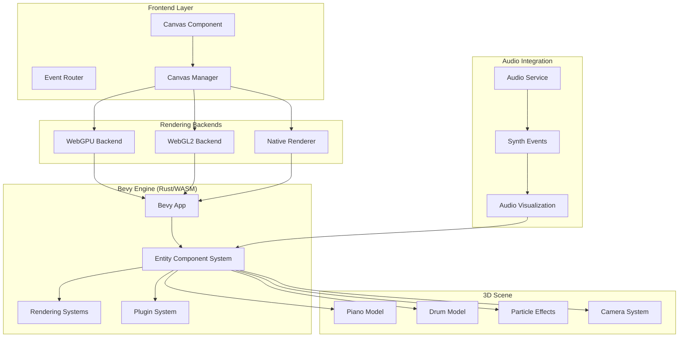

# 3D Rendering

PianoRhythm's 3D rendering system is built on the Bevy game engine, providing high-performance, audio-reactive 3D visualizations that run seamlessly across web and desktop platforms through WebGL2/WebGPU and native rendering backends.

## Architecture Overview



## Core Components

### 1. Canvas3D Component (`src/components/canvas/piano.canvas3D.tsx`)

The main React component that manages 3D rendering:

<augment_code_snippet path="src/components/canvas/piano.canvas3D.tsx" mode="EXCERPT">
````typescript
export default function Canvas3D() {
  const [canvasMounted, setCanvasMounted] = createSignal(false);
  const [useWebGPU, setUseWebGPU] = createSignal(true);
  const [renderer, setRenderer] = createSignal<BevyRenderer>();
  
  function mount3DCanvas(mountedCanvas: HTMLCanvasElement) {
    if (!mountedCanvas || canvasMounted()) return;
    
    setCanvasMounted(true);
    setCanvasID(mountedCanvas.parentElement?.id ?? mountedCanvas.id);
    
    // Determine rendering approach
    let shouldUseOffscreenCanvas = determineCanvasMode();
    
    if (shouldUseOffscreenCanvas) {
      loadViaOffscreenCanvas(mountedCanvas);
    } else {
      loadRenderingEngine(true);
    }
  }
}
````
</augment_code_snippet>

**Key Responsibilities:**
- Canvas lifecycle management
- Rendering backend selection (WebGPU/WebGL2)
- Offscreen canvas coordination
- Event handling setup
- Performance monitoring

### 2. Bevy Rendering Engine

#### Core App Structure

<augment_code_snippet path="pianorhythm_core/bevy_renderer/src/app.rs" mode="EXCERPT">
````rust
pub fn create_app(headless: bool) -> App {
    let mut app = App::new();
    
    app.insert_resource(ClearColor(Color::NONE))
        .add_plugins((default_plugins, MeshPickingPlugin))
        .add_plugins(bevy_sequential_actions::SequentialActionsPlugin)
        .add_plugins(bevy_tweening::TweeningPlugin)
        .add_plugins(crate::core::CorePlugin::default());
    
    #[cfg(debug_assertions)]
    {
        // Development plugins for debugging
    }
    
    app
}
````
</augment_code_snippet>

#### Plugin System

<augment_code_snippet path="pianorhythm_core/bevy_renderer/src/core/mod.rs" mode="EXCERPT">
````rust
impl Plugin for CorePlugin {
    fn build(&self, app: &mut App) {
        app.add_plugins(LookTransformPlugin)
            .add_plugins(OrbitCameraPlugin { override_input_system: true })
            .add_plugins(plugins::stages::StagesPlugin::default())
            .add_plugins(plugins::piano::PianoModelPlugin::default())
            .add_plugins(plugins::drums::DrumsModelPlugin::default());
    }
}
````
</augment_code_snippet>

### 3. Rendering Backend Selection

#### WebGPU vs WebGL2 Detection

<augment_code_snippet path="src/components/canvas/piano.canvas3D.tsx" mode="EXCERPT">
````typescript
async function setupMainThreadRenderer(devicePixelRatio: number) {
  const bevyRenderer = useWebGPU() ? webgpuRenderer : webgl2Renderer;
  logDebug(`Using ${useWebGPU() ? "WebGPU" : "WebGL2"} renderer.`);
  
  if (!bevyRenderer) {
    errorHandler.handleError("Bevy renderer not found");
    throw new Error("Bevy renderer not found.");
  }
  
  await bevyRenderer.default();
  
  if (useWebGPU()) {
    appHandle = bevyRenderer.create_app(false);
    setRendererPtr(appHandle);
    bevyRenderer?.create_window_by_canvas(appHandle, canvasID()!, devicePixelRatio);
    animFram = requestAnimationFrame(enterFrame);
  }
}
````
</augment_code_snippet>

#### Fallback Strategy

```typescript
const initializeRenderingWithFallback = async () => {
  try {
    // Try WebGPU first
    setUseWebGPU(true);
    await loadRenderingEngine(true);
  } catch (webgpuError) {
    console.warn('WebGPU failed, falling back to WebGL2:', webgpuError);
    try {
      // Fallback to WebGL2
      setUseWebGPU(false);
      await loadRenderingEngine(true, true);
    } catch (webglError) {
      console.error('All rendering backends failed:', webglError);
      // Fallback to 2D mode
      setIs2DMode(true);
    }
  }
};
```

## Audio-Reactive Visualization

### 1. Piano Key Animation

<augment_code_snippet path="pianorhythm_core/bevy_renderer/src/plugins/piano/events.rs" mode="EXCERPT">
````rust
pub fn receiving_events(
    mut commands: Commands,
    mut event_reader: EventReader<ECSSynthEventsAction>,
    mut query: Query<(Entity, &MidiID, &mut AnimationState), (With<Mesh3d>, With<PianoKey>)>,
) {
    for my_event in event_reader.read() {
        match &my_event {
            ECSSynthEventsAction::NoteOn(data) if data.channel != DRUM_CHANNEL => {
                for (entity, _, mut state) in query.iter_mut().filter(|(_, midi, ..)| midi.0 == data.note) {
                    commands.entity(entity)
                        .remove::<AnimationDown>()
                        .insert(OnActiveNote(data.clone()));
                    state.is_down = true;
                }
            }
            // ... handle other events
        }
    }
}
````
</augment_code_snippet>

### 2. Real-time Animation Systems

<augment_code_snippet path="pianorhythm_core/bevy_renderer/src/plugins/piano/systems.rs" mode="EXCERPT">
````rust
pub(super) fn on_base_mesh_color_changed(
    mut commands: Commands,
    query: Query<queries::PianoKeyMaterialQuery>,
    mut materials: ResMut<Assets<StandardMaterial>>,
) {
    for item in query.iter() {
        if let Some(material) = materials.get_mut(&item.material_handle.0) {
            // Apply color animation based on audio events
            let tween = Tween::new(
                EaseFunction::QuadraticInOut,
                Duration::from_millis(150),
                StandardMaterialBaseColorLens {
                    start: material.base_color,
                    end: item.base_mesh_color.0,
                },
            );
            
            commands.entity(item.key.entity).insert(AssetAnimator::new(tween));
        }
    }
}
````
</augment_code_snippet>

### 3. Particle Effects System

```rust
// Audio-reactive particle effects (commented code from core/mod.rs)
fn setup_particle_effects(
    mut commands: Commands,
    mut effects: ResMut<Assets<EffectAsset>>,
) {
    let writer = ExprWriter::new();
    
    // Create note-triggered particle effect
    let init_pos = SetPositionSphereModifier {
        center: writer.lit(Vec3::ZERO).expr(),
        radius: writer.lit(2.0).expr(),
        dimension: ShapeDimension::Surface,
    };
    
    let init_vel = SetVelocitySphereModifier {
        center: writer.lit(Vec3::ZERO).expr(),
        speed: writer.lit(5.0).expr(),
    };
    
    let effect = EffectAsset::new(
        32,
        Spawner::rate(3.0.into()),
        writer.finish(),
    )
    .with_name("note-particles")
    .with_alpha_mode(bevy_hanabi::AlphaMode::Blend);
    
    commands.spawn(ParticleEffectBundle {
        effect: ParticleEffect::new(effects.add(effect)),
        transform: Transform::from_translation(Vec3::new(0.0, 1.0, 0.0)),
        ..default()
    });
}
```

## Camera System

### 1. Orbit Camera Setup

<augment_code_snippet path="pianorhythm_core/bevy_renderer/src/components/main_camera.rs" mode="EXCERPT">
````rust
pub fn setup_camera(mut commands: Commands, app_settings: Res<resources::ClientAppSettings>) {
    let mut entity_commands = commands.spawn((
        Camera3d::default(),
        Camera {
            order: 0,
            hdr: app_settings.0.GRAPHICS_ENABLE_HDR,
            ..default()
        },
        Tonemapping::AgX,
        crate::components::MainCamera,
    ));
    
    #[cfg(feature = "desktop")]
    {
        entity_commands
            .insert(bevy::pbr::ClusterConfig::Single)
            .insert(bevy::render::view::NoCpuCulling);
    }
}
````
</augment_code_snippet>

### 2. Smooth Camera Controls

```rust
// Orbit camera with smooth transitions
pub fn setup_orbit_camera(
    mut commands: Commands,
    mut look_transform: ResMut<LookTransform>,
) {
    // Set initial camera position
    look_transform.target = Vec3::new(0.0, 0.0, 0.0);
    look_transform.eye = Vec3::new(0.0, 5.0, 10.0);
    look_transform.up = Vec3::Y;
    
    commands.spawn((
        Camera3dBundle::default(),
        LookTransformBundle {
            transform: *look_transform,
            smoother: Smoother::new(0.9),
        },
        OrbitCameraBundle::new(
            OrbitCameraController::default(),
            Vec3::new(-2.0, 5.0, 5.0),
            Vec3::new(0., 0., 0.),
            Vec3::Y,
        ),
    ));
}
```

## Performance Optimizations

### 1. Offscreen Canvas Support

<augment_code_snippet path="src/components/canvas/piano.canvas3D.tsx" mode="EXCERPT">
````typescript
function loadViaOffscreenCanvas(mountedCanvas: HTMLCanvasElement) {
  if (!supportsOffscreenCanvas()) {
    return loadRenderingEngine(true);
  }
  
  const offscreenCanvas = mountedCanvas.transferControlToOffscreen();
  
  const worker = new Worker('/workers/canvas-worker.js');
  worker.postMessage({
    type: 'init',
    canvas: offscreenCanvas,
    devicePixelRatio: window.devicePixelRatio
  }, [offscreenCanvas]);
  
  setCanvasWorker(worker);
}
````
</augment_code_snippet>

### 2. LOD (Level of Detail) System

```rust
// Dynamic mesh quality based on distance
pub fn update_lod_system(
    mut query: Query<(&Transform, &mut Handle<Mesh>, &LODComponent)>,
    camera_query: Query<&Transform, (With<Camera>, Without<LODComponent>)>,
    mut meshes: ResMut<Assets<Mesh>>,
) {
    if let Ok(camera_transform) = camera_query.get_single() {
        for (transform, mut mesh_handle, lod) in query.iter_mut() {
            let distance = camera_transform.translation.distance(transform.translation);
            
            let lod_level = match distance {
                d if d < 10.0 => LODLevel::High,
                d if d < 50.0 => LODLevel::Medium,
                _ => LODLevel::Low,
            };
            
            if lod.current_level != lod_level {
                *mesh_handle = lod.get_mesh_for_level(lod_level);
            }
        }
    }
}
```

### 3. Frustum Culling

```rust
// Automatic culling of off-screen objects
#[cfg(feature = "desktop")]
entity_commands
    .insert(bevy::pbr::ClusterConfig::Single)
    .insert(bevy::render::view::NoCpuCulling);
```

## Cross-Platform Considerations

### 1. Desktop vs Web Rendering

```typescript
// Platform-specific renderer setup
if (COMMON.IS_DESKTOP_APP) {
  setupDesktopRenderer();
} else if (mainThread) {
  await setupMainThreadRenderer(devicePixelRatio);
} else {
  await setupWorkerRenderer();
}
```

### 2. Mobile Optimization

```rust
// Mobile-specific optimizations
#[cfg(target_os = "android")]
fn setup_mobile_optimizations(app: &mut App) {
    app.insert_resource(MobileSettings {
        max_lights: 4,
        shadow_quality: ShadowQuality::Low,
        particle_count: 16,
    });
}
```

## Error Handling & Recovery

### 1. Rendering Error Recovery

<augment_code_snippet path="src/components/canvas/renderer/canvas-render-error-handler.tsx" mode="EXCERPT">
````typescript
export class RendererErrorHandler {
  handleError(error: string) {
    console.error('Renderer error:', error);
    
    // Attempt recovery strategies
    if (error.includes('WebGPU')) {
      this.fallbackToWebGL();
    } else if (error.includes('WebGL')) {
      this.fallbackTo2D();
    } else {
      this.showErrorMessage(error);
    }
  }
  
  private fallbackToWebGL() {
    setUseWebGPU(false);
    loadRenderingEngine(true, true);
  }
  
  private fallbackTo2D() {
    setIs2DMode(true);
    notificationService.show({
      type: 'warning',
      title: '3D Rendering Unavailable',
      description: 'Falling back to 2D mode due to graphics limitations.'
    });
  }
}
````
</augment_code_snippet>

### 2. Memory Management

```rust
// Automatic cleanup of unused resources
pub fn cleanup_unused_meshes(
    mut commands: Commands,
    query: Query<Entity, (With<Mesh3d>, Without<InUse>)>,
    time: Res<Time>,
) {
    for entity in query.iter() {
        // Remove meshes that haven't been used recently
        commands.entity(entity).despawn_recursive();
    }
}
```

## Testing & Debugging

### 1. Performance Monitoring

```typescript
const monitorRenderingPerformance = () => {
  const stats = {
    fps: 0,
    frameTime: 0,
    drawCalls: 0,
    triangles: 0
  };
  
  // Monitor frame rate
  let lastTime = performance.now();
  const measureFrame = () => {
    const now = performance.now();
    stats.frameTime = now - lastTime;
    stats.fps = 1000 / stats.frameTime;
    lastTime = now;
    
    if (stats.fps < 30) {
      console.warn('Low FPS detected:', stats.fps);
    }
    
    requestAnimationFrame(measureFrame);
  };
  
  measureFrame();
};
```

### 2. Debug Visualization

```rust
// Debug wireframe mode
#[cfg(debug_assertions)]
pub fn toggle_wireframe(
    input: Res<Input<KeyCode>>,
    mut materials: ResMut<Assets<StandardMaterial>>,
) {
    if input.just_pressed(KeyCode::F1) {
        for (_, material) in materials.iter_mut() {
            material.cull_mode = match material.cull_mode {
                Some(Face::Back) => None,
                _ => Some(Face::Back),
            };
        }
    }
}
```

## Next Steps

- **[Audio System](./audio-system)** - Audio processing and synthesis
- **[MIDI Integration](./midi-integration)** - MIDI device handling and Web MIDI API
- **[Core Business Logic](../core/core-business-logic)** - Rust engine deep dive
