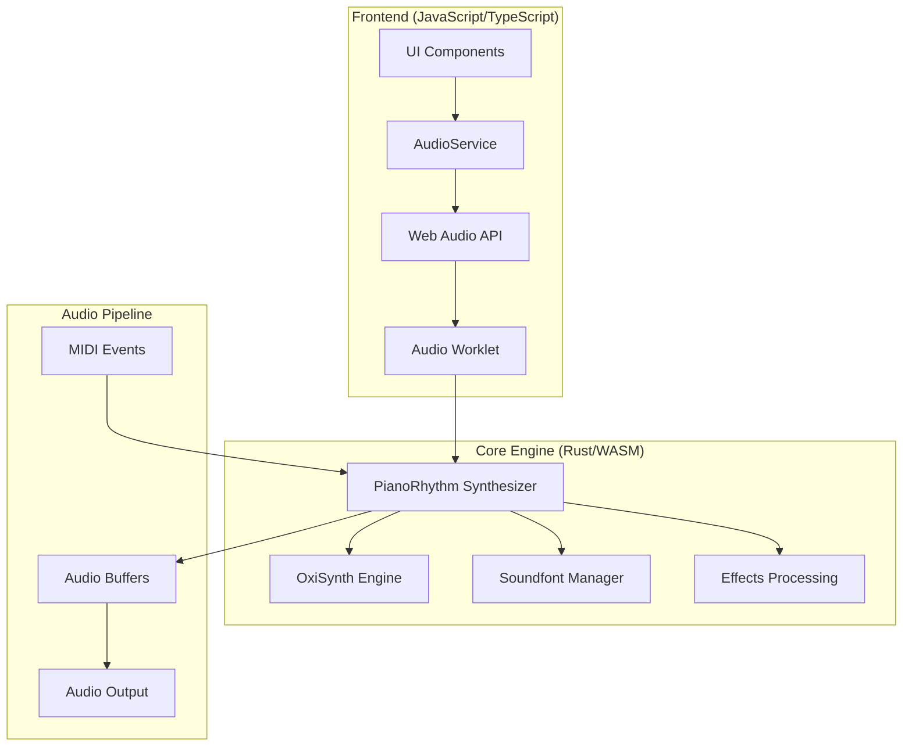
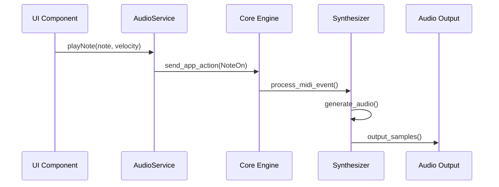

# Audio System

PianoRhythm's audio system is a sophisticated, multi-layered architecture that combines a custom Rust-based synthesizer with Web Audio API integration to deliver low-latency, high-quality audio synthesis for real-time musical collaboration.

## Architecture Overview



## Core Components

### 1. AudioService (`src/services/audio.service.ts`)

The main frontend service that coordinates audio functionality:

```typescript
export default function AudioService() {
  const [initialized, setInitialized] = createSignal(false);
  const [clientAdded, setClientAdded] = createSignal(false);
  const [loadedSoundfontName, setLoadedSoundfontName] = createSignal<string>();
  const [audioContext, setAudioContext] = createSignal<AudioContext>();
  
  const initialize = async () => {
    // Initialize Web Audio API context
    const context = new AudioContext();
    setAudioContext(context);
    
    // Create synthesizer instance
    await createSynthesizer();
    
    // Set up audio worklet if supported
    if (appSettingsService().getSetting("AUDIO_USE_WORKLET")) {
      await setupAudioWorklet(context);
    }
    
    setInitialized(true);
  };
  
  return {
    initialized, clientAdded, loadedSoundfontName,
    initialize, playNote, stopNote, loadSoundfont,
    // ... additional methods
  };
}
```

**Key Responsibilities:**
- Web Audio API context management
- Synthesizer lifecycle management
- Audio worklet coordination
- Soundfont loading and management
- MIDI event processing

### 2. PianoRhythm Synthesizer (Rust)

The core audio engine implemented in Rust:

```rust
pub struct PianoRhythmSynthesizer {
    synth: oxisynth::Synth,
    socket_users: HashMap<u32, PianoRhythmSocketUser>,
    client_socket_id: Option<u32>,
    soundfont_loaded: bool,
    sample_rate: f32,
    audio_channels: usize,
    // ... additional fields
}

impl PianoRhythmSynthesizer {
    pub fn process(&mut self, output: &mut [f32]) {
        let mut chunks = output.chunks_exact_mut(2);
        for chunk in &mut chunks {
            let (mut l, mut r) = self.read_next();
            self.equalize(&mut l);
            self.equalize(&mut r);
            chunk[0] = l;
            chunk[1] = r;
        }
    }
}
```

**Key Features:**
- Multi-user audio synthesis
- Real-time audio processing
- Built-in effects (reverb, chorus, EQ)
- Soundfont support
- Low-latency performance

### 3. OxiSynth Engine

Custom fork of FluidSynth for high-performance synthesis:

```rust
pub struct Synth {
    ticks: usize,
    pub font_bank: FontBank,
    pub channels: ChannelPool,
    pub voices: VoicePool,
    pub reverb: Reverb,
    pub chorus: Chorus,
    pub settings: Settings,
    output: OutputBuffer,
}
```

**Features:**
- SoundFont 2.0 support
- Real-time voice allocation
- Advanced effects processing
- Memory-efficient voice management
- Cross-platform compatibility

## Audio Processing Pipeline

### 1. MIDI Event Flow



### 2. Audio Buffer Management

```typescript
// Audio worklet processor
class WasmAudioProcessor extends AudioWorkletProcessor {
  process(inputs: Float32Array[][], outputs: Float32Array[][]) {
    const output = outputs[0];
    
    // Process audio through WASM synthesizer
    this.wasmProcessor.process_stereo(
      output[0], // Left channel
      output[1]  // Right channel
    );
    
    return true;
  }
}
```

### 3. Real-time Processing

```rust
// High-performance audio processing in Rust
impl PianoRhythmSynthesizer {
    pub fn process_stereo(&mut self, buffer_l: &mut [f32], buffer_r: &mut [f32]) {
        let len = buffer_l.len().min(buffer_r.len());
        
        for i in 0..len {
            let (mut l, mut r) = self.read_next();
            
            // Apply effects processing
            self.equalize(&mut l);
            self.equalize(&mut r);
            
            buffer_l[i] = l;
            buffer_r[i] = r;
        }
    }
}
```

## Soundfont Management

### 1. Dynamic Soundfont Loading

```typescript
const loadSoundfont = async (soundfontUrl: string) => {
  try {
    // Fetch soundfont data
    const response = await fetch(soundfontUrl);
    const soundfontData = await response.arrayBuffer();
    
    // Load into synthesizer
    const result = appService().coreService()?.synth_load_soundfont(
      new Uint8Array(soundfontData)
    );
    
    if (result) {
      setLoadedSoundfontName(extractSoundfontName(soundfontUrl));
      toast.success('Soundfont loaded successfully');
    }
  } catch (error) {
    console.error('Failed to load soundfont:', error);
    // Fallback to default soundfont
    await loadDefaultSoundfont();
  }
};
```

### 2. Soundfont Validation

```rust
pub fn load_soundfont(&mut self, soundfont_data: &[u8]) -> Result<(), String> {
    // Validate soundfont format
    if soundfont_data.len() < 4 {
        return Err("Invalid soundfont data".to_string());
    }
    
    // Check for SF2 magic number
    if &soundfont_data[0..4] != b"RIFF" {
        return Err("Not a valid SF2 soundfont".to_string());
    }
    
    match self.synth.load_soundfont(soundfont_data) {
        Ok(_) => {
            self.soundfont_loaded = true;
            Ok(())
        }
        Err(e) => Err(format!("Failed to load soundfont: {}", e))
    }
}
```

### 3. Fallback System

```typescript
const onLoadClientSoundfont = async (): Promise<boolean> => {
  const soundfontSetting = appSettingsService().getSetting("SOUNDFONT");
  
  // Try user-selected soundfont first
  if (soundfontSetting && soundfontSetting !== "default") {
    const success = await loadSoundfont(soundfontSetting);
    if (success) return true;
  }
  
  // Fallback to default soundfont
  const defaultSoundfont = await getDefaultSoundfontUrl();
  return await loadSoundfont(defaultSoundfont);
};
```

## Effects Processing

### 1. Built-in Effects

```rust
pub struct EffectsChain {
    pub reverb: Reverb,
    pub chorus: Chorus,
    pub equalizer: Equalizer,
}

impl EffectsChain {
    pub fn process(&mut self, left: &mut f32, right: &mut f32) {
        // Apply reverb
        if self.reverb.is_active() {
            self.reverb.process(left, right);
        }
        
        // Apply chorus
        if self.chorus.is_active() {
            self.chorus.process(left, right);
        }
        
        // Apply EQ
        self.equalizer.process(left, right);
    }
}
```

### 2. Real-time Parameter Control

```typescript
const updateReverbLevel = (level: number) => {
  appService().coreService()?.send_app_action(AppStateActions.create({
    action: AppStateActions_Action.SynthAction,
    audioSynthAction: AudioSynthActions.create({
      action: AudioSynthActions_Action.SetReverbLevel,
      floatValue: level
    })
  }));
};
```

### 3. Effect Presets

```typescript
const EFFECT_PRESETS = {
  hall: { reverb: 0.8, chorus: 0.2, eq: [0, 2, 1, 0, -1] },
  room: { reverb: 0.4, chorus: 0.1, eq: [1, 1, 0, 0, 0] },
  studio: { reverb: 0.2, chorus: 0.3, eq: [0, 0, 1, 1, 0] },
  dry: { reverb: 0.0, chorus: 0.0, eq: [0, 0, 0, 0, 0] }
};
```

## Multi-User Audio

### 1. User Channel Management

```rust
pub struct PianoRhythmSocketUser {
    pub socket_id: u32,
    pub channel: u8,
    pub volume: f32,
    pub muted: bool,
    pub instrument: u8,
}

impl PianoRhythmSynthesizer {
    pub fn add_user(&mut self, socket_id: u32) -> Option<u32> {
        let user = PianoRhythmSocketUser {
            socket_id,
            channel: self.get_next_available_channel(),
            volume: 1.0,
            muted: false,
            instrument: 0, // Piano
        };
        
        self.socket_users.insert(socket_id, user);
        Some(socket_id)
    }
}
```

### 2. Audio Mixing

```rust
impl PianoRhythmSynthesizer {
    fn mix_user_audio(&mut self, output: &mut [f32]) {
        for user in self.socket_users.values() {
            if !user.muted {
                let user_audio = self.get_user_audio(user.socket_id);
                for (i, sample) in user_audio.iter().enumerate() {
                    if i < output.len() {
                        output[i] += sample * user.volume;
                    }
                }
            }
        }
    }
}
```

### 3. Volume Control

```typescript
const setUserVolume = (socketId: string, volume: number) => {
  appService().coreService()?.send_app_action(AppStateActions.create({
    action: AppStateActions_Action.SynthAction,
    audioSynthAction: AudioSynthActions.create({
      action: AudioSynthActions_Action.SetUserVolume,
      socketId: socketId,
      floatValue: volume
    })
  }));
};
```

## Performance Optimizations

### 1. Audio Worklet Integration

```typescript
// Register audio worklet
await audioContext.audioWorklet.addModule('/worklet/wasm-processor.worklet.js');

// Create worklet node
const workletNode = new AudioWorkletNode(audioContext, 'wasm-audio-processor', {
  numberOfInputs: 0,
  numberOfOutputs: 1,
  outputChannelCount: [2]
});

// Connect to audio output
workletNode.connect(audioContext.destination);
```

### 2. Buffer Size Optimization

```rust
// Optimized buffer sizes for different scenarios
pub const BUFFER_SIZE_LOW_LATENCY: usize = 64;   // ~1.5ms at 44.1kHz
pub const BUFFER_SIZE_BALANCED: usize = 128;     // ~3ms at 44.1kHz
pub const BUFFER_SIZE_HIGH_QUALITY: usize = 256; // ~6ms at 44.1kHz

impl PianoRhythmSynthesizer {
    pub fn set_buffer_size(&mut self, size: usize) {
        self.buffer_size = size;
        self.output_buffer.resize(size * 2); // Stereo
    }
}
```

### 3. Voice Management

```rust
pub struct VoicePool {
    voices: Vec<Voice>,
    active_voices: usize,
    max_voices: usize,
}

impl VoicePool {
    pub fn allocate_voice(&mut self) -> Option<&mut Voice> {
        if self.active_voices < self.max_voices {
            // Find available voice
            for voice in &mut self.voices {
                if !voice.is_active() {
                    voice.reset();
                    self.active_voices += 1;
                    return Some(voice);
                }
            }
        }
        
        // Voice stealing if no voices available
        self.steal_oldest_voice()
    }
}
```

## Error Handling & Recovery

### 1. Audio Context Recovery

```typescript
const handleAudioContextSuspended = async () => {
  if (audioContext()?.state === 'suspended') {
    try {
      await audioContext()?.resume();
      console.log('Audio context resumed');
    } catch (error) {
      console.error('Failed to resume audio context:', error);
      // Reinitialize audio system
      await initialize();
    }
  }
};
```

### 2. Synthesizer Error Recovery

```rust
impl PianoRhythmSynthesizer {
    pub fn handle_error(&mut self, error: SynthError) -> Result<(), String> {
        match error {
            SynthError::VoiceAllocationFailed => {
                // Clear all voices and restart
                self.reset_all_voices();
                Ok(())
            }
            SynthError::SoundfontCorrupted => {
                // Reload default soundfont
                self.load_default_soundfont()
            }
            SynthError::AudioBufferUnderrun => {
                // Increase buffer size
                self.increase_buffer_size();
                Ok(())
            }
        }
    }
}
```

### 3. Graceful Degradation

```typescript
const initializeAudioWithFallback = async () => {
  try {
    // Try modern audio worklet approach
    await initializeWithWorklet();
  } catch (error) {
    console.warn('Audio worklet not supported, falling back to script processor');
    try {
      // Fallback to script processor
      await initializeWithScriptProcessor();
    } catch (fallbackError) {
      console.error('All audio initialization methods failed');
      // Disable audio features
      setAudioEnabled(false);
    }
  }
};
```

## Testing & Debugging

### 1. Audio Testing

```typescript
describe('AudioService', () => {
  it('should initialize audio context', async () => {
    const service = AudioService();
    await service.initialize();
    
    expect(service.initialized()).toBe(true);
    expect(service.audioContext()).toBeInstanceOf(AudioContext);
  });
  
  it('should handle note events', async () => {
    const service = AudioService();
    await service.initialize();
    
    const spy = vi.spyOn(service, 'playNote');
    service.playNote(60, 127); // Middle C, full velocity
    
    expect(spy).toHaveBeenCalledWith(60, 127);
  });
});
```

### 2. Performance Monitoring

```typescript
const monitorAudioPerformance = () => {
  const startTime = performance.now();
  
  // Process audio
  synthesizer.process(audioBuffer);
  
  const processingTime = performance.now() - startTime;
  
  if (processingTime > AUDIO_DEADLINE) {
    console.warn(`Audio processing took ${processingTime}ms (deadline: ${AUDIO_DEADLINE}ms)`);
  }
};
```

## Next Steps

- **[MIDI Integration](./midi-integration)** - MIDI device handling and Web MIDI API
- **[3D Rendering](./3d-rendering)** - Audio-reactive 3D visualization
- **[Core Business Logic](./core-business-logic)** - Rust engine deep dive
