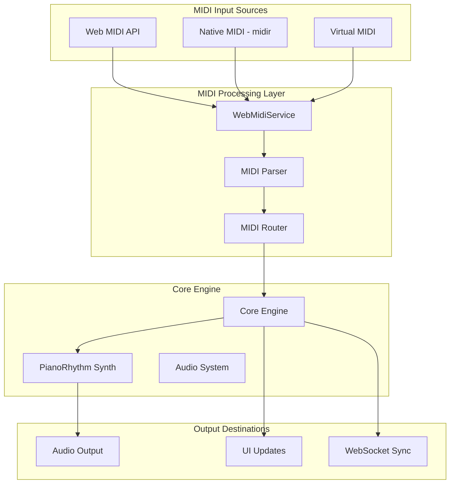

# MIDI Integration

PianoRhythm's MIDI integration provides comprehensive support for MIDI devices across web and desktop platforms, enabling real-time musical input and output through the Web MIDI API and native MIDI libraries.

## Architecture Overview



## Core Components

### 1. WebMidiService (`src/services/webmidi.service.ts`)

The main service that coordinates MIDI functionality across platforms:

```typescript
export default function WebMidiService() {
  const [initialized, setInitialized] = createSignal(false);
  const [hasMidiPermission, setHasMidiPermission] = createSignal(false);
  const [midiInputs, setMidiInputs] = createImmerSignal<WebMidiIO<WebMidi.MIDIInput>[]>([]);
  const [midiOutputs, setMidiOutputs] = createImmerSignal<WebMidiIO<WebMidi.MIDIOutput>[]>([]);
  
  const initialize = async (): Promise<boolean> => {
    if (COMMON.IS_WEB_APP) {
      const midiAccess = await window.navigator.requestMIDIAccess({ sysex: false });
      // Handle MIDI device state changes
      midiAccess.onstatechange = async () => {
        await stateChange();
      };
    }
    // ... platform-specific initialization
  };
}
```

**Key Responsibilities:**
- Cross-platform MIDI device detection
- MIDI permission management
- Device connection state tracking
- MIDI message routing
- Persistent connection preferences

### 2. MIDI Device Management

#### Web Platform (Web MIDI API)

```typescript
// Request MIDI access with proper error handling
const midiAccess = await window.navigator.requestMIDIAccess({ sysex: false });

function stateChange(firstTimeLoad: boolean = false) {
  return onMidiStateChange_Inputs(Array.from(midiAccess.inputs.values()))
    .then(() => onMidiStateChange_Outputs(Array.from(midiAccess.outputs.values()), firstTimeLoad));
}

midiAccess.onstatechange = async () => {
  await stateChange();
};
```

#### Desktop Platform (Native MIDI)

```rust
use midir::{MidiInput, MidiInputConnection, MidiOutput};

pub fn open_midi_input_connection(midi_id: String) -> Result<(), String> {
    let midi_in = MidiInput::new("pianorhythm-input");
    
    let port = midi_in.ports().get(midi_id.parse::<usize>().unwrap_or(0));
    match port {
        Some(port) => {
            let device_id = hash_device_id(midi_id.to_string());
            let midi_in_conn = midi_in.connect(
                &port,
                "midir",
                move |us, message, _| unsafe {
                    if let Some(x) = SYNTH.get_mut() {
                        _ = x.parse_midi_data(message, &None, Some(NoteSourceType::Midi.to_u8()), Some(device_id));
                    }
                },
                (),
            );
        }
        None => Err("No port found at index.".to_string())
    }
}
```

### 3. MIDI Message Processing

#### MIDI Event Types

```typescript
export type WebMidiParseEvent =
  | "note-on" | "note-off"
  | "damper-on" | "damper-off"
  | "bank-select" | "program-change"
  | "volume" | "pitch-bend"
  | "pan" | "expression-controller"
  | "all-sound-off" | "all-notes-off"
  | "mod-wheel" | "reverb-depth";

export enum MIDIChannelMessages {
  noteoff = 0x8,
  noteon = 0x9,
  keyaftertouch = 0xA,
  controlchange = 0xB,
  programchange = 0xC,
  channelaftertouch = 0xD,
  pitchbend = 0xE,
}
```

#### Real-time MIDI Processing

```rust
pub fn handle_ws_midi_message(message: &MidiMessageOutputDto, state: Rc<AppState>) -> Option<Vec<(f64, HandleWsMidiMessageClosure)>> {
    let midi_message = message.clone();
    let message_socket_id = midi_message.get_socketID();
    let socket_id_hash = hash_socket_id(&message_socket_id);
    
    for buffer in midi_message.get_data().into_iter().filter(|buffer| buffer.data.is_some()) {
        match buffer_data.messageType {
            MidiDtoType::NoteOn if buffer_data.has_noteOn() => {
                let event = PianoRhythmWebSocketMidiNoteOn {
                    channel: value.get_channel() as u8,
                    note: value.get_note() as u8,
                    velocity: value.get_velocity() as u8,
                    program: Some(value.get_program() as u8),
                    // ... additional fields
                };
                pianorhythm_synth::synth_ws_socket_note_on(event, socket_id_hash);
            }
            // ... handle other MIDI message types
        }
    }
}
```

## Device Connection Management

### 1. Input Device Handling

```typescript
const toggleMidiInput = async (input: WebMidiIO<WebMidi.MIDIInput>) => {
  if (COMMON.IS_DESKTOP_APP) {
    let command = input.active ? "open_midi_input_connection" : "close_midi_input_connection";
    await invoke(command, { midiId: input.name });
  } else {
    if (input.active) {
      appService().coreService()?.open_midi_input_connection(input.name);
    } else {
      appService().coreService()?.close_midi_input_connection(input.name);
    }
  }
};
```

### 2. Connection State Persistence

```typescript
// Save inactive device preferences
await dbService().put("inactive-midi-inputs", 
  midiInputs().filter(x => !x.active).map(x => x.id), 
  savedConnectionsStore
);

// Restore connection preferences on startup
const inactiveMidiInputs = await dbService().get("inactive-midi-inputs", savedConnectionsStore) || [];
```

### 3. Device Hot-plugging Support

```typescript
// Automatic device detection and reconnection
midiAccess.onstatechange = async (event) => {
  const port = event.port;
  
  if (port.state === 'connected') {
    console.log(`MIDI device connected: ${port.name}`);
    await addMidiDevice(port);
  } else if (port.state === 'disconnected') {
    console.log(`MIDI device disconnected: ${port.name}`);
    await removeMidiDevice(port);
  }
};
```

## MIDI Message Routing

### 1. Channel-based Routing

```rust
pub(crate) fn handle_event(synth: &mut Core, event: MidiEvent, user: &mut PianoRhythmSocketUser) -> Result<(), OxiError> {
    match event.check()? {
        MidiEvent::NoteOn { channel, key, vel } => {
            if channel as usize > MAX_MIDI_CHANNEL {
                return Err(OxiError::ChannelOutOfRange);
            }
            
            let gain = if user.is_client {
                synth.settings.gain
            } else {
                map_f32(user.gain, 0.0, 1.0, 0.0, synth.settings.gain)
            };
            
            if let Ok(user_channel) = synth.channels.get_by_user_id_and_channel_id(user.socket_id, channel as usize) {
                _ = self::noteon(user_channel, &mut synth.voices, /* ... */);
            }
        }
        // ... handle other MIDI events
    }
}
```

### 2. Multi-user MIDI Support

```rust
// Each user gets their own MIDI channel mapping
pub struct PianoRhythmSocketUser {
    pub socket_id: u32,
    pub channel: u8,
    pub volume: f32,
    pub muted: bool,
    pub instrument: u8,
}

// Route MIDI events to appropriate user channels
impl PianoRhythmSynthesizer {
    pub fn route_midi_event(&mut self, event: MidiEvent, device_id: Option<u32>) {
        if let Some(user) = self.get_user_by_device(device_id) {
            self.process_user_midi_event(user, event);
        }
    }
}
```

## Error Handling & Recovery

### 1. Permission Handling

```typescript
const requestMidiAccess = async (): Promise<boolean> => {
  try {
    const midiAccess = await window.navigator.requestMIDIAccess({ sysex: false });
    setHasMidiPermission(true);
    return true;
  } catch (ex) {
    if (typeof ex == "object" && (ex as Error)?.name?.includes("NotAllowedError")) {
      setHasMidiPermission(false);
      notificationService.show({
        type: "warning",
        title: "MIDI Access Denied",
        description: "MIDI functionality will be limited without device access."
      });
    }
    return false;
  }
};
```

### 2. Device Connection Errors

```rust
// Graceful handling of device connection failures
pub fn open_midi_input_connection(midi_id: String) -> Result<(), String> {
    match MidiInput::new("pianorhythm-input") {
        Ok(midi_in) => {
            // Attempt connection with retry logic
            match connect_with_retry(&midi_in, &midi_id, 3) {
                Ok(_) => Ok(()),
                Err(e) => {
                    log::error!("Failed to connect to MIDI device: {}", e);
                    Err(format!("Connection failed: {}", e))
                }
            }
        }
        Err(e) => {
            log::error!("Failed to initialize MIDI input: {}", e);
            Err("MIDI initialization failed".to_string())
        }
    }
}
```

## Next Steps

- **[Audio System](./audio-system)** - Audio processing and synthesis
- **[3D Rendering](./3d-rendering)** - Audio-reactive 3D visualization
- **[Core Business Logic](../core/core-business-logic)** - Rust engine deep dive
