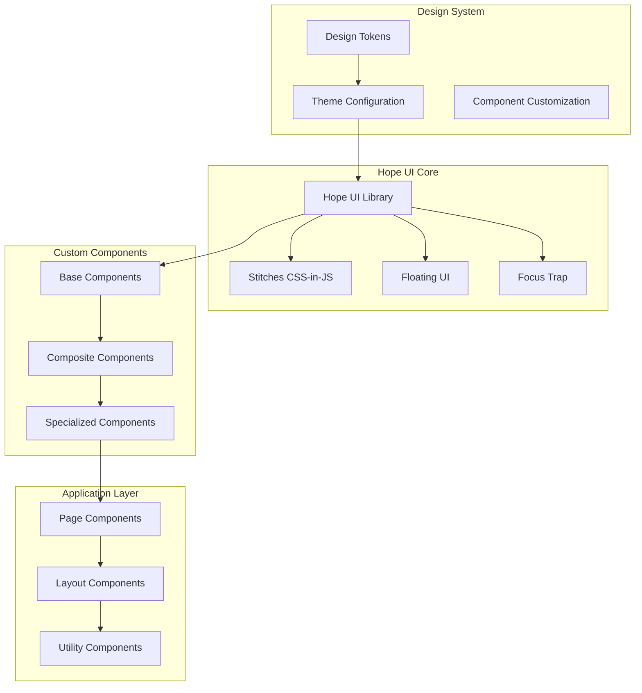

# UI Components & Design System

PianoRhythm uses a custom fork of Hope UI, a comprehensive component library for SolidJS that provides a consistent design system, theming capabilities, and accessible UI components optimized for real-time musical applications.

## Architecture Overview



## Hope UI Integration

### 1. Custom Fork Configuration

<augment_code_snippet path="package.json" mode="EXCERPT">
````json
{
  "dependencies": {
    "@hope-ui/solid": "github:PianoRhythm/hope-ui#main&path:packages/solid"
  }
}
````
</augment_code_snippet>

**Key Features:**
- Custom fork with PianoRhythm-specific modifications
- Enhanced theming capabilities for dark mode
- Optimized for real-time audio applications
- Extended component variants and styling options

### 2. Provider Setup

<augment_code_snippet path="src/app.tsx" mode="EXCERPT">
````typescript
import { HopeProvider } from "@hope-ui/solid";
import ThemeConfig from "./util/theme-config";

export default function App() {
  return (
    <HopeProvider config={ThemeConfig}>
      <ServiceRegistry>
        <I18nProvider>
          {/* Application content */}
        </I18nProvider>
      </ServiceRegistry>
    </HopeProvider>
  );
}
````
</augment_code_snippet>

## Theme System

### 1. Theme Configuration

<augment_code_snippet path="src/util/theme-config.tsx" mode="EXCERPT">
````typescript
const ThemeConfig: HopeThemeConfig = {
  initialColorMode: "dark",
  darkTheme: {
    colors: {
      // Primary color palette
      primary1: "#363942",
      primary2: "#434650",
      primaryDark1: "#1f2126",
      primaryDark2: "#2b2d34",
      
      // Accent colors
      accent1: "#00d1b2",
      accent2: "#15d6b6",
      
      // Semantic colors
      tooltipContent: "#2b2d34",
      tooltipArrow: "#2b2d34",
    }
  },
  components: {
    Button: {
      baseStyle: {
        root: {
          backgroundColor: "$primary1",
          color: "$neutral12",
          transition: "color 0.1s ease, background-color 0.1s ease",
          _hover: {
            color: "$neutral1",
            backgroundColor: "$accent2",
          }
        }
      }
    }
  }
};
````
</augment_code_snippet>

### 2. Dynamic Theme Switching

<augment_code_snippet path="src/services/app.themes.service.ts" mode="EXCERPT">
````typescript
export default function AppThemesService() {
  const [themeColors, setThemeColors] = createStore<AppThemeColors>({
    primary: "#363942",
    accent: "#00d1b2",
    tertiary: "#ef9e08"
  });

  const setTheme = (selectedTheme: AppThemes) => {
    let root = document.querySelector(".hope-ui-dark") as HTMLElement;
    
    switch (selectedTheme) {
      case AppThemes.THEME_1: 
        setThemeColors(setUIThemeColors("#1B2430")); 
        break;
      case AppThemes.THEME_2: 
        setThemeColors(setUIThemeColors("#16213E")); 
        break;
      // ... additional themes
    }
  };
}
````
</augment_code_snippet>

## Core Components

### 1. Layout Components

#### Box & Container
```typescript
import { Box, Container, Center, VStack, HStack } from "@hope-ui/solid";

// Flexible layout building blocks
<Box p="$4" bg="$primary1" borderRadius="$md">
  <VStack spacing="$3">
    <HStack spacing="$2">
      <Box flex="1">Content</Box>
    </HStack>
  </VStack>
</Box>
```

#### Responsive Grid
```typescript
import { SimpleGrid, Grid, GridItem } from "@hope-ui/solid";

<SimpleGrid columns={{ "@initial": 1, "@md": 2, "@lg": 3 }} spacing="$4">
  <Box>Item 1</Box>
  <Box>Item 2</Box>
  <Box>Item 3</Box>
</SimpleGrid>
```

### 2. Form Components

#### Input Components
<augment_code_snippet path="src/util/theme-config.tsx" mode="EXCERPT">
````typescript
Input: {
  baseStyle: {
    input: {
      backgroundColor: "$primary1",
      border: "1px solid var(--hope-colors-neutral9)",
      _hover: {
        border: "1px solid var(--hope-colors-neutral11)",
      },
      _focus: {
        boxShadow: "none",
      },
    }
  }
}
````
</augment_code_snippet>

#### Select Components
```typescript
import { Select, SelectTrigger, SelectContent, SelectOption } from "@hope-ui/solid";

<Select>
  <SelectTrigger>
    <SelectPlaceholder>Choose option</SelectPlaceholder>
    <SelectValue />
    <SelectIcon />
  </SelectTrigger>
  <SelectContent>
    <SelectListbox>
      <SelectOption value="option1">
        <SelectOptionText>Option 1</SelectOptionText>
        <SelectOptionIndicator />
      </SelectOption>
    </SelectListbox>
  </SelectContent>
</Select>
```

### 3. Interactive Components

#### Button System
<augment_code_snippet path="src/util/theme-config.tsx" mode="EXCERPT">
````typescript
Button: {
  baseStyle: {
    root: {
      backgroundColor: "$primary1",
      color: "$neutral12",
      transition: "color 0.1s ease, background-color 0.1s ease",
      _focus: {
        boxShadow: "none",
      },
      _active: {
        transform: "scale(1.025)",
      },
      _hover: {
        color: "$neutral1",
        backgroundColor: "$accent2",
      },
      _disabled: {
        opacity: 0.4,
        pointerEvents: "none"
      }
    }
  }
}
````
</augment_code_snippet>

#### Modal System
<augment_code_snippet path="src/util/theme-config.tsx" mode="EXCERPT">
````typescript
Modal: {
  baseStyle: {
    header: {
      background: "$neutral12",
      color: "$primary1",
      borderTopRadius: 5,
    },
    body: {
      backgroundColor: "$primary1",
    },
    footer: {
      background: "$primary1",
      borderTop: "solid 1px gray",
      borderBottomRadius: 5,
    }
  }
}
````
</augment_code_snippet>

## Custom Components

### 1. Specialized UI Components

#### Tooltip Help Component
<augment_code_snippet path="src/components/tooltip-help.tsx" mode="EXCERPT">
````typescript
interface ToolTipHelpProps extends IconProps {
  tooltipLabel: JSXElement;
  tooltipSize?: string | number;
  tooltipPlacement?: string;
}

const ToolTipHelp_: Component<ToolTipHelpProps> = (props) => {
  return (
    <Box
      __tooltip_title={props.tooltipLabel}
      __tooltip_placement={props.tooltipPlacement ?? "right"}
      __tooltip_open_delay={250}
    >
      <Icon 
        font-size="10px" 
        size={props.tooltipSize || "10px"} 
        cursor="help" 
        as={BsQuestionCircleFill}
      />
    </Box>
  );
};
````
</augment_code_snippet>

#### Button with Tooltip
<augment_code_snippet path="src/components/common.tsx" mode="EXCERPT">
````typescript
const ButtonToolTip_: Component<{
  label: string;
  tooltip?: string;
  loading?: boolean;
  disabled?: boolean;
  onClick?: (evt: MouseEvent) => void;
}> = (props) => {
  return (
    <Tooltip
      closeOnClick
      openDelay={500}
      placement="top"
      disabled={!props.tooltip}
      label={props.tooltip}
      withArrow
      background="$neutral12"
      color="$primary1"
    >
      <Button
        loading={props.loading}
        disabled={props.disabled}
        onClick={props.onClick}
      >
        {props.label}
      </Button>
    </Tooltip>
  );
};
````
</augment_code_snippet>

### 2. Pagination Component
<augment_code_snippet path="src/components/common.tsx" mode="EXCERPT">
````typescript
export const Pagination: Component<{
  currentPage: Accessor<number>;
  totalPages: Accessor<number>;
  handlePage: (page: number) => void;
}> = (props) => {
  return (
    <HStack spacing="$2" class="pagination-container">
      <FaSolidChevronLeft
        __tooltip_title="Go to Previous Page"
        class={props.currentPage() == 1 ? "disabled" : "page-btn"}
        onMouseDown={() => props.handlePage(props.currentPage() - 1)}
      />
      
      <For each={allPages()}>
        {v => (
          <Box
            __tooltip_title={`Go to: Page ${v + 1}`}
            class={clsx([
              "page-item unselectable",
              props.currentPage() === v + 1 && "--active",
            ])}
            onMouseDown={() => props.handlePage(v + 1)}
          >
            {v + 1}
          </Box>
        )}
      </For>
      
      <FaSolidChevronRight
        __tooltip_title="Go to Next Page"
        class={props.currentPage() == props.totalPages() ? "disabled" : "page-btn"}
        onMouseDown={() => props.handlePage(props.currentPage() + 1)}
      />
    </HStack>
  );
};
````
</augment_code_snippet>

## Design Tokens

### 1. Color System

```typescript
// Primary color palette
primary1: "#363942"    // Base primary
primary2: "#434650"    // Lighter primary
primaryDark1: "#1f2126" // Darker primary
primaryDark2: "#2b2d34" // Darkest primary

// Accent colors
accent1: "#00d1b2"     // Primary accent (teal)
accent2: "#15d6b6"     // Secondary accent

// Semantic colors
success: "#48bb78"     // Success states
warning: "#ed8936"     // Warning states
danger: "#f56565"      // Error states
info: "#4299e1"        // Information states
```

### 2. Spacing System

```typescript
// Spacing scale (based on 4px base unit)
$1: "0.25rem"   // 4px
$2: "0.5rem"    // 8px
$3: "0.75rem"   // 12px
$4: "1rem"      // 16px
$5: "1.25rem"   // 20px
$6: "1.5rem"    // 24px
$8: "2rem"      // 32px
$10: "2.5rem"   // 40px
$12: "3rem"     // 48px
```

### 3. Typography Scale

```typescript
// Font sizes
xs: "0.75rem"    // 12px
sm: "0.875rem"   // 14px
base: "1rem"     // 16px
lg: "1.125rem"   // 18px
xl: "1.25rem"    // 20px
"2xl": "1.5rem"  // 24px
"3xl": "1.875rem" // 30px
"4xl": "2.25rem"  // 36px
```

## Responsive Design

### 1. Breakpoint System

```typescript
const breakpoints = {
  "@initial": "0px",
  "@sm": "640px",
  "@md": "768px", 
  "@lg": "1024px",
  "@xl": "1280px",
  "@2xl": "1536px"
};
```

### 2. Responsive Props

```typescript
// Responsive spacing and sizing
<Box 
  p={{ "@initial": "$2", "@md": "$4", "@lg": "$6" }}
  fontSize={{ "@initial": "sm", "@md": "base", "@lg": "lg" }}
>
  Responsive content
</Box>
```

## Accessibility Features

### 1. Focus Management

```typescript
// Automatic focus trap in modals
import { focus-trap } from "@hope-ui/solid";

// Keyboard navigation support
<Button onKeyDown={(e) => {
  if (e.key === 'Enter' || e.key === ' ') {
    handleClick();
  }
}}>
  Accessible Button
</Button>
```

### 2. ARIA Support

```typescript
// Built-in ARIA attributes
<Button 
  aria-label="Close dialog"
  aria-describedby="dialog-description"
  role="button"
  tabIndex={0}
>
  Close
</Button>
```

## Performance Optimizations

### 1. CSS-in-JS Optimization

```typescript
// Stitches provides automatic CSS optimization
// - Dead code elimination
// - Atomic CSS generation
// - Runtime style injection
// - Critical CSS extraction
```

### 2. Component Lazy Loading

```typescript
// Lazy load heavy components
const HeavyModal = lazy(() => import('./HeavyModal'));

<Suspense fallback={<Spinner />}>
  <Show when={showModal()}>
    <HeavyModal />
  </Show>
</Suspense>
```

## Testing Components

### 1. Component Testing

```typescript
import { render, screen } from "@solidjs/testing-library";
import { Button } from "@hope-ui/solid";

test("button renders correctly", () => {
  render(() => <Button>Click me</Button>);
  expect(screen.getByRole("button")).toHaveTextContent("Click me");
});
```

### 2. Theme Testing

```typescript
test("theme colors are applied", () => {
  const { container } = render(() => 
    <HopeProvider config={ThemeConfig}>
      <Box bg="$primary1">Test</Box>
    </HopeProvider>
  );
  
  expect(container.firstChild).toHaveStyle({
    backgroundColor: "rgb(54, 57, 66)"
  });
});
```

## Next Steps

- **[Frontend Architecture](./frontend-architecture)** - Overall frontend structure
- **[Audio System](./audio-system)** - Audio-reactive UI components
- **[Testing Guide](../development/testing-guide)** - Component testing strategies
