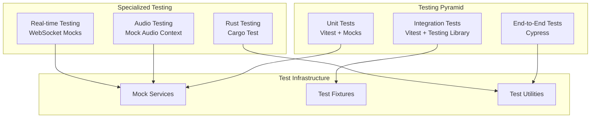

# Testing Guide

PianoRhythm employs a comprehensive testing strategy that ensures reliability, performance, and maintainability across the entire application stack. This guide covers unit testing, integration testing, end-to-end testing, and specialized testing for audio and real-time features.

## Testing Architecture



## Testing Stack

### Core Testing Tools

- **Vitest 2.1.8**: Fast unit test runner with native TypeScript support
- **@solidjs/testing-library 0.8.10**: SolidJS-specific testing utilities
- **Cypress 13.17.0**: End-to-end testing framework
- **@testing-library/jest-dom 6.5.0**: Custom DOM matchers
- **@testing-library/user-event 14.5.2**: User interaction simulation

### Testing Configuration

```typescript
// vitest.config.ts
export default defineConfig({
  test: {
    globals: true,
    setupFiles: [
      '@vitest/web-worker',
      'fake-indexeddb/auto',
      './tests/vitest.setup.ts'
    ],
    server: {
      deps: {
        inline: ["solid-markdown"]
      }
    },
    exclude: [
      '**/pianorhythm_core/**',
      '**/cypress/**',
      '**/build/**',
      '**/node_modules/**'
    ]
  }
});
```

## Unit Testing

### 1. Service Testing

Services are the core business logic units and require comprehensive testing:

```typescript
// Example: AudioService test
import { createRoot } from 'solid-js';
import { describe, it, expect, vi, beforeEach } from 'vitest';
import AudioService from '~/services/audio.service';
import { MockCoreService } from '@test/mocks/service.mocks';

describe('AudioService', () => {
  let audioService: ReturnType<typeof AudioService>;
  
  beforeEach(() => {
    createRoot(() => {
      audioService = AudioService();
    });
  });
  
  it('should initialize audio context', async () => {
    const mockAudioContext = {
      state: 'running',
      sampleRate: 44100,
      destination: {}
    };
    
    global.AudioContext = vi.fn(() => mockAudioContext);
    
    await audioService.initialize();
    
    expect(audioService.initialized()).toBe(true);
    expect(audioService.audioContext()).toBe(mockAudioContext);
  });
  
  it('should handle note events', () => {
    const mockCoreService = MockCoreService();
    const spy = vi.spyOn(mockCoreService, 'send_app_action');
    
    audioService.playNote(60, 127);
    
    expect(spy).toHaveBeenCalledWith(
      expect.objectContaining({
        action: expect.any(Number),
        audioSynthAction: expect.objectContaining({
          action: expect.any(Number),
          note: 60,
          velocity: 127
        })
      })
    );
  });
});
```

### 2. Component Testing

Components are tested for rendering, user interactions, and state management:

```typescript
// Example: UserCard component test
import { render, screen } from '@solidjs/testing-library';
import { ServiceRegistry } from 'solid-services';
import UserCard from '~/components/UserCard';
import { UserStatus } from '~/proto/user-renditions';

describe('UserCard', () => {
  const mockUser = {
    socketID: 'test-socket',
    userDto: {
      usertag: 'testuser',
      username: 'Test User',
      status: UserStatus.Online
    }
  };
  
  it('renders user information correctly', () => {
    render(() => (
      <ServiceRegistry>
        <UserCard user={mockUser} />
      </ServiceRegistry>
    ));
    
    expect(screen.getByText('Test User')).toBeInTheDocument();
    expect(screen.getByText('@testuser')).toBeInTheDocument();
    expect(screen.getByTestId('user-status')).toHaveClass('online');
  });
  
  it('handles user interaction', async () => {
    const onUserClick = vi.fn();
    
    render(() => (
      <ServiceRegistry>
        <UserCard user={mockUser} onUserClick={onUserClick} />
      </ServiceRegistry>
    ));
    
    const userCard = screen.getByRole('button');
    await userEvent.click(userCard);
    
    expect(onUserClick).toHaveBeenCalledWith(mockUser);
  });
});
```

### 3. Utility Testing

Utility functions require focused testing for edge cases:

```typescript
// Example: Utility function test
import { describe, it, expect } from 'vitest';
import { formatDuration, parseZipzon } from '~/util/helpers';

describe('Utility Functions', () => {
  describe('formatDuration', () => {
    it('formats seconds correctly', () => {
      expect(formatDuration(0)).toBe('0:00');
      expect(formatDuration(65)).toBe('1:05');
      expect(formatDuration(3661)).toBe('1:01:01');
    });
    
    it('handles edge cases', () => {
      expect(formatDuration(-1)).toBe('0:00');
      expect(formatDuration(Infinity)).toBe('∞');
      expect(formatDuration(NaN)).toBe('0:00');
    });
  });
  
  describe('parseZipzon', () => {
    it('parses valid zipzon data', () => {
      const data = { test: 'value', number: 42 };
      const compressed = zipson.stringify(data);
      
      expect(parseZipzon(compressed)).toEqual(data);
    });
    
    it('handles invalid data gracefully', () => {
      expect(parseZipzon('invalid')).toBeNull();
      expect(parseZipzon('')).toBeNull();
    });
  });
});
```

## Integration Testing

### 1. Service Integration

Testing how services work together:

```typescript
// Example: Service integration test
import { createRoot } from 'solid-js';
import { describe, it, expect, beforeEach } from 'vitest';
import AppService from '~/services/app.service';
import WebsocketService from '~/services/websocket.service';
import AudioService from '~/services/audio.service';

describe('Service Integration', () => {
  let appService: ReturnType<typeof AppService>;
  let websocketService: ReturnType<typeof WebsocketService>;
  let audioService: ReturnType<typeof AudioService>;
  
  beforeEach(() => {
    createRoot(() => {
      appService = AppService();
      websocketService = WebsocketService();
      audioService = AudioService();
    });
  });
  
  it('should coordinate initialization properly', async () => {
    // Test initialization sequence
    await audioService.initialize();
    expect(audioService.initialized()).toBe(true);
    
    websocketService.initialize();
    expect(websocketService.initialized()).toBe(true);
    
    // Test cross-service communication
    appService.appStateEvents.emit('UserJoined', { socketId: 'test' });
    
    // Verify services respond to events
    expect(audioService.clientAdded()).toBe(true);
  });
});
```

### 2. API Integration

Testing API endpoints with database integration:

```typescript
// Example: API integration test
import { describe, it, expect, beforeEach, afterEach } from 'vitest';
import { Database } from '~/lib/db/db-store';
import { POST } from '~/routes/api/v1/sheet_music/search';

describe('Sheet Music API', () => {
  beforeEach(async () => {
    // Set up test database
    Database.getInstance().init('mongodb://localhost:27017', 'test_db');
    
    // Insert test data
    const collection = Database.getInstance().getDb().collection('sheet_music');
    await collection.insertMany([
      { title: 'Test Song 1', category: 'classical' },
      { title: 'Test Song 2', category: 'jazz' }
    ]);
  });
  
  afterEach(async () => {
    // Clean up test data
    const collection = Database.getInstance().getDb().collection('sheet_music');
    await collection.deleteMany({});
  });
  
  it('should search sheet music correctly', async () => {
    const request = new Request('http://localhost/api/v1/sheet_music/search', {
      method: 'POST',
      headers: { 'Content-Type': 'application/json' },
      body: JSON.stringify({
        query: 'Test',
        limit: 10,
        skip: 0
      })
    });
    
    const response = await POST({ request } as any);
    const data = await response.json();
    
    expect(response.status).toBe(200);
    expect(data.data).toHaveLength(2);
    expect(data.data[0].title).toContain('Test');
  });
});
```

## End-to-End Testing

### 1. Cypress Configuration

```typescript
// cypress.config.ts
export default defineConfig({
  projectId: "j5xw8i",
  video: false,
  screenshotOnRunFailure: false,
  env: {
    "browserPermissions": {
      "notifications": "allow",
      "midi": "allow"
    }
  },
  e2e: {
    baseUrl: 'http://localhost:4000',
    setupNodeEvents(on, config) {
      // Custom commands and plugins
      on('task', {
        protobufEncode: ({ fixtureBody, message, protoFilePath }) => {
          // Protocol buffer encoding for tests
        }
      });
    }
  }
});
```

### 2. User Journey Testing

```typescript
// cypress/e2e/user-journey.cy.ts
describe('Complete User Journey', () => {
  beforeEach(() => {
    cy.visit('/');
    cy.mockAudioContext();
    cy.mockWebSocket();
  });
  
  it('should complete full user flow', () => {
    // Login
    cy.get('[data-testid="login-button"]').click();
    cy.get('[data-testid="guest-login"]').click();
    
    // Wait for app initialization
    cy.get('[data-testid="app-loading"]').should('be.visible');
    cy.get('[data-testid="app-loading"]').should('not.exist', { timeout: 30000 });
    
    // Join room
    cy.get('[data-testid="room-list"]').should('be.visible');
    cy.get('[data-testid="room-item"]').first().click();
    
    // Interact with piano
    cy.get('[data-testid="piano-key-60"]').click();
    cy.get('[data-testid="audio-visualizer"]').should('be.visible');
    
    // Send chat message
    cy.get('[data-testid="chat-input"]').type('Hello, world!{enter}');
    cy.get('[data-testid="chat-messages"]').should('contain', 'Hello, world!');
    
    // Leave room
    cy.get('[data-testid="leave-room"]').click();
    cy.get('[data-testid="room-list"]').should('be.visible');
  });
});
```

### 3. Custom Cypress Commands

```typescript
// cypress/support/commands.ts
declare global {
  namespace Cypress {
    interface Chainable {
      mockAudioContext(): Chainable<void>;
      mockWebSocket(): Chainable<void>;
      loginAsGuest(): Chainable<void>;
    }
  }
}

Cypress.Commands.add('mockAudioContext', () => {
  cy.window().then((win) => {
    win.AudioContext = class MockAudioContext {
      state = 'running';
      sampleRate = 44100;
      destination = {};
      
      createGain() {
        return { connect: cy.stub(), gain: { value: 1 } };
      }
      
      resume() {
        return Promise.resolve();
      }
    };
  });
});

Cypress.Commands.add('mockWebSocket', () => {
  cy.window().then((win) => {
    win.WebSocket = class MockWebSocket {
      readyState = 1;
      onopen = null;
      onmessage = null;
      onclose = null;
      onerror = null;
      
      constructor(url: string) {
        setTimeout(() => this.onopen?.({}), 100);
      }
      
      send(data: string) {
        // Mock WebSocket send
      }
      
      close() {
        setTimeout(() => this.onclose?.({}), 100);
      }
    };
  });
});
```

## Specialized Testing

### 1. Audio Testing

```typescript
// Audio-specific testing utilities
import { describe, it, expect, vi, beforeEach } from 'vitest';

describe('Audio System Testing', () => {
  beforeEach(() => {
    // Mock Web Audio API
    global.AudioContext = vi.fn(() => ({
      state: 'running',
      sampleRate: 44100,
      destination: {},
      createGain: vi.fn(() => ({
        connect: vi.fn(),
        gain: { value: 1 }
      })),
      createOscillator: vi.fn(() => ({
        connect: vi.fn(),
        start: vi.fn(),
        stop: vi.fn(),
        frequency: { value: 440 }
      }))
    }));
    
    // Mock AudioWorklet
    global.AudioWorkletNode = vi.fn();
  });
  
  it('should handle audio latency requirements', async () => {
    const audioService = AudioService();
    await audioService.initialize();
    
    const startTime = performance.now();
    audioService.playNote(60, 127);
    const endTime = performance.now();
    
    // Audio processing should be under 10ms
    expect(endTime - startTime).toBeLessThan(10);
  });
});
```

### 2. Real-time Testing

```typescript
// WebSocket and real-time feature testing
describe('Real-time Communication', () => {
  it('should handle WebSocket message flow', async () => {
    const mockWebSocket = {
      send: vi.fn(),
      close: vi.fn(),
      readyState: 1
    };
    
    const websocketService = WebsocketService();
    websocketService.setWebSocket(mockWebSocket);
    
    // Test message sending
    websocketService.emitServerCommand(['JoinRoom', 'test-room']);
    
    expect(mockWebSocket.send).toHaveBeenCalledWith(
      expect.any(ArrayBuffer)
    );
  });
  
  it('should handle connection failures gracefully', async () => {
    const websocketService = WebsocketService();
    
    // Simulate connection failure
    const errorSpy = vi.spyOn(console, 'error').mockImplementation(() => {});
    
    await expect(
      websocketService.connect('invalid-identity')
    ).rejects.toThrow();
    
    expect(errorSpy).toHaveBeenCalled();
    errorSpy.mockRestore();
  });
});
```

### 3. Rust Testing

```rust
// pianorhythm_core/core/src/lib.rs
#[cfg(test)]
mod tests {
    use super::*;
    
    #[test]
    fn test_synthesizer_creation() {
        let options = PianoRhythmSynthesizerDescriptor::default();
        let synth = PianoRhythmSynthesizer::new(options, None, None, None);
        assert!(!synth.has_soundfont_loaded());
    }
    
    #[test]
    fn test_audio_processing() {
        let mut synth = create_test_synthesizer();
        let mut output = vec![0.0f32; 128];
        
        // Process audio
        synth.process(&mut output);
        
        // Verify output is within expected range
        for sample in output {
            assert!(sample >= -1.0 && sample <= 1.0);
        }
    }
    
    #[test]
    fn test_midi_event_handling() {
        let mut synth = create_test_synthesizer();
        
        // Send note on event
        synth.send_midi_event(MidiEvent::NoteOn {
            channel: 0,
            note: 60,
            velocity: 127
        });
        
        // Verify note is active
        assert!(synth.is_note_active(60));
    }
}
```

## Test Data Management

### 1. Mock Services

```typescript
// tests/mocks/service.mocks.ts
export const MockAppService = () => ({
  clientLoaded: vi.fn().mockReturnValue(true),
  getSocketID: vi.fn().mockReturnValue('mock-socket-id'),
  currentRoom: vi.fn().mockReturnValue(null),
  setCurrentRoom: vi.fn(),
  appStateEvents: MockEventBus(),
  coreService: vi.fn().mockReturnValue(MockCoreService())
});

export const MockAudioService = () => ({
  initialized: vi.fn().mockReturnValue(true),
  clientAdded: vi.fn().mockReturnValue(true),
  loadedSoundfontName: vi.fn().mockReturnValue('default'),
  initialize: vi.fn().mockResolvedValue(undefined),
  playNote: vi.fn(),
  stopNote: vi.fn()
});
```

### 2. Test Fixtures

```typescript
// tests/fixtures/user.fixtures.ts
export const createMockUser = (overrides: Partial<UserClientDomain> = {}): UserClientDomain => ({
  socketID: 'test-socket-id',
  userDto: {
    usertag: 'testuser',
    username: 'Test User',
    status: UserStatus.Online,
    roles: ['user'],
    ...overrides.userDto
  },
  currentRoomID: 'test-room',
  isTyping: false,
  lastSeen: new Date(),
  ...overrides
});

export const createMockRoom = (overrides: Partial<RoomDto> = {}): RoomDto => ({
  id: 'test-room-id',
  name: 'Test Room',
  type: RoomType.Public,
  activeUsers: [],
  maxUsers: 16,
  settings: {},
  createdAt: new Date(),
  updatedAt: new Date(),
  ...overrides
});
```

## Performance Testing

### 1. Load Testing

```typescript
// Performance testing for critical paths
describe('Performance Tests', () => {
  it('should handle rapid note events', async () => {
    const audioService = AudioService();
    await audioService.initialize();
    
    const startTime = performance.now();
    
    // Simulate rapid note playing
    for (let i = 0; i < 100; i++) {
      audioService.playNote(60 + (i % 12), 127);
    }
    
    const endTime = performance.now();
    const duration = endTime - startTime;
    
    // Should handle 100 notes in under 100ms
    expect(duration).toBeLessThan(100);
  });
  
  it('should maintain frame rate during audio processing', async () => {
    const audioService = AudioService();
    await audioService.initialize();
    
    let frameCount = 0;
    const startTime = performance.now();
    
    const processFrame = () => {
      frameCount++;
      if (performance.now() - startTime < 1000) {
        requestAnimationFrame(processFrame);
      }
    };
    
    requestAnimationFrame(processFrame);
    
    // Wait for 1 second
    await new Promise(resolve => setTimeout(resolve, 1000));
    
    // Should maintain at least 30 FPS
    expect(frameCount).toBeGreaterThan(30);
  });
});
```

## Continuous Integration

### 1. GitHub Actions Workflow

```yaml
# .github/workflows/test.yml
name: Test Suite
on: [push, pull_request]

jobs:
  test:
    runs-on: ubuntu-latest
    steps:
      - uses: actions/checkout@v3
      
      - name: Setup Node.js
        uses: actions/setup-node@v3
        with:
          node-version: '19'
          
      - name: Setup Rust
        uses: actions-rs/toolchain@v1
        with:
          toolchain: nightly
          target: wasm32-unknown-unknown
          
      - name: Install dependencies
        run: pnpm install
        
      - name: Build core
        run: |
          cd pianorhythm_core
          ./build-core-wasm-debug.cmd
          
      - name: Run unit tests
        run: pnpm test
        
      - name: Run Rust tests
        run: |
          cd pianorhythm_core
          cargo test
          
      - name: Run E2E tests
        run: |
          pnpm cy:vite &
          pnpm cy:run
```

## Best Practices

### 1. Test Organization

- **Arrange-Act-Assert**: Structure tests clearly
- **Single Responsibility**: One test per behavior
- **Descriptive Names**: Test names should explain what they verify
- **Independent Tests**: Tests should not depend on each other

### 2. Mock Strategy

- **Mock External Dependencies**: APIs, databases, third-party services
- **Keep Mocks Simple**: Don't over-engineer mock implementations
- **Verify Interactions**: Test that mocks are called correctly
- **Reset Mocks**: Clean up between tests

### 3. Coverage Goals

- **Unit Tests**: 90%+ coverage for services and utilities
- **Integration Tests**: Cover critical user flows
- **E2E Tests**: Cover main user journeys
- **Performance Tests**: Cover audio and real-time features

## Next Steps

- **[Development Setup](./development-setup.md)** - Set up testing environment
- **[Frontend Architecture](./frontend-architecture.md)** - Understand component structure
- **[Audio System](./audio-system.md)** - Learn audio testing specifics
